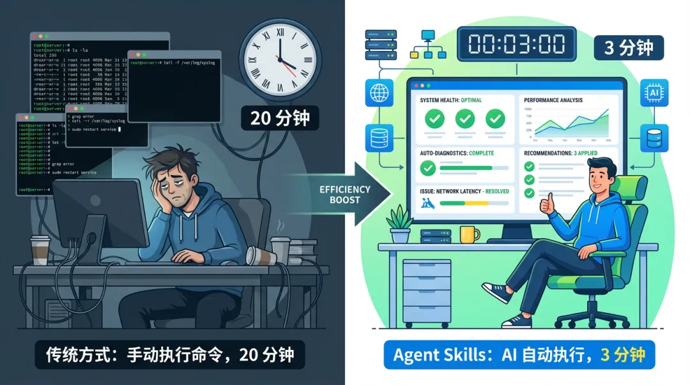
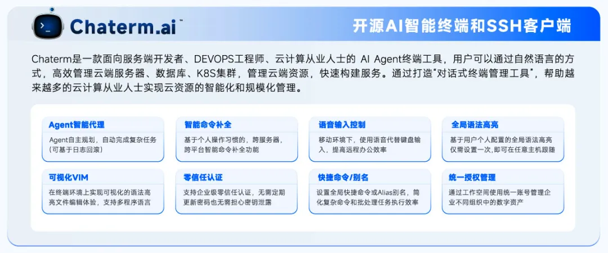
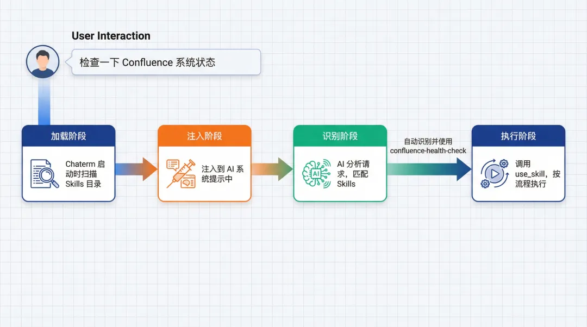
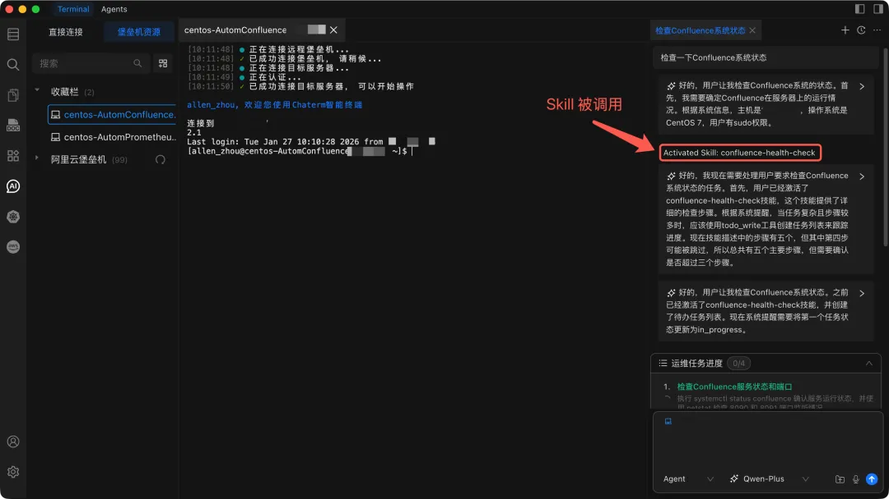
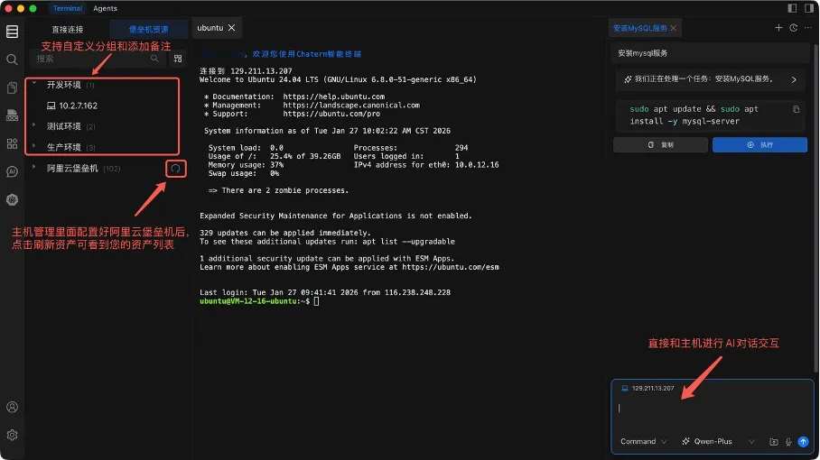

通过深度集成千问大模型，Chaterm 的 Agent Skills 可以将运维经验"打包"成可执行技能，让AI助手自动执行标准流程。

依托Qwen模型强大的语义理解、可靠的命令生成和智能的Agent任务规划能力，Chaterm为使用者提供更加智能和新颖的运维体验，将日常需要20分钟的任务缩短到3分钟，并在故障发生时基于以往经验快速排查和恢复。本文从 Skills 的概念、工作原理、技术实现，到实战案例，让其成为你专属的"AI运维专家"。

---

## 一个真实的凌晨3点

上周三的凌晨3点，我被云监控系统的告警信息叫醒。

“【Confluence系统】 http://192.168.0.1:8090/pages/#all-updates 无法访问！”

我迷迷糊糊打开电脑，通过Chaterm连上云服务器，开始敲命令：netstat -nplut、top、systemctl status confluence、tail -f… 看着满屏的输出，我一边揉眼睛一边分析，花了 20 分钟才找到问题：凌晨系统负载过高导致异常停止，其中又因自动备份的 gzip 进程一直占用资源，导致系统服务一直重启失败。

【内心OS】如果当时我有个 Skill，可能 3 分钟就搞定了。



这就是今天要聊的 Skills。它不是另一个 AI 概念，而是一个真正能帮你把运维经验"打包"成可执行技能的工具。今天我们就从 Skills 是什么、怎么工作，一路聊到怎么写好一个 Skill，最后在 Chaterm 里实际落地一个基于阿里云的运维场景。

## Chaterm Skills简介

### 什么是Chaterm

Chaterm 是一款开源AI智能终端和SSH客户端。旨在通过自然语言交互重构传统的命令行操作体验。它的目标是成为您的DevOps智能副驾驶。目前已支持 Mac/Windows/Linux/iOS/安卓等多个环境。Chaterm旨在解决大规模云环境下运维工作中批量化操作、故障排查复杂和安全管控困难等痛点。它将 AI Agent能力直接嵌入终端，通过打造“对话式终端管理工具”，帮助服务端开发者、DEVOPS工程师、云计算从业人士实现云资源的智能化和规模化管理。



### 什么是Skills

**Skills** 这个概念最早由 Anthropic 公司提出，简单来说，它让用户可以把专业知识、操作步骤、最佳实践封装成 Skills，让 AI 自动识别并执行。

随着这套做法越来越成熟，并被社区广泛接受，Skills 如今已成为大多数  AI Coding 和 AI。

工具都支持的一种标准扩展规范。从Claude Code、Qoder、Cursor到 Chaterm，很多AI工具都基于这个规范实现了自己的Skills 系统。

Chaterm 也不例外。它基于这个规范，让运维工程师可以把在阿里云上日常的检查清单、应用/数据库部署流程、故障排查流程、性能优化步骤等，都封装成 Skills。这样，AI 助手就不再是**通用助手**，而是真正懂你业务的**专家助手**。

### Skills的标准结构

一个 Skill 通常以一个文件夹的形式存在，里面主要包含三样东西：

一份说明书（SKILL.md）、操作脚本（Script）、以及参考资料（Reference）。

| 内容 | 作用 |
| --- | --- |
SKILL.md | 通过自然语言清晰描述（使用场景、使用方式、使用步骤及注意事项等上下文补充信息）
Script 脚本 | Agent 可以执行的具体脚本代码
Reference 引用 | 参考文档、引用的模板、相关关联上下文的文件信息

你可以把一个 Skill 想象成一个打包好的"技能包"。它把完成某个特定任务所需的领域知识、操作流程、要用到的工具以及最佳实践全都封装在了一起。当 AI 面对相应请求时，就能像一位经验丰富的专家那样，有条不紊地自主执行。

一句话总结：如果把 Agent 比作一个有很大潜力的大脑，那 Skills 就像是给这个大脑的一套套能反复使用的"技能手册"。有了它，Agent 能从一个"什么都略知一二"的通才，变成在特定领域"得心应手"的专家。

每个 SKILL.md 文件遵循以下格式：

```
---
name: skill-name
description: Skill description
---

# Skill Title

## Workflow Step
[详细的工作流程和命令]
```

就这么简单。AI 看到这个 Skill，就知道怎么做了。

### Chaterm Skills是怎么工作的？



在 Chaterm 里，Skills 的工作流程是这样的：

**1. 加载阶段：** Chaterm 启动时，会扫描 Skills 目录，读取所有 SKILL.md 文件；

**2. 注入阶段：** 启用的 Skills 会被注入到 AI 的系统提示中，告诉 AI 有哪些技能可用；

**3. 识别阶段：** 当你提出需求时，AI 会分析你的请求，判断是否需要使用某个 Skill；

**4. 执行阶段：** 如果匹配，AI 会调用 use_skill 工具，获取完整的 Skill 内容，然后按照流程执行；

整个过程对用户是透明的。你只需要说**检查一下阿里云ECS上的 Confluence 系统状态**，AI 会自动识别并使用 Confluence-health-check Skill。

### 为什么Chaterm Skills适合运维场景


运维工作有几个特点，让 Skills 特别有价值：

### 1. 标准化程度高

系统健康检查、应用中间件/数据库等服务部署、日志分析、故障排查，这些都有相对标准的流程。一个资深运维的操作手册，往往能覆盖 80% 的场景。

### 2. 重复性操作多

你每天可能都要检查系统状态、部署服务、分析日志、排查问题。每次都重新描述一遍流程，太累了。Skills 让你"一次写好，永久使用"。

### 3. 经验难以传承

团队里老王的排查经验，新来的小李怎么快速学会？写文档？看代码？都不如直接给他一个 Skills，让他跟着 AI 做一遍。

### 4. 错误成本高

生产环境操作错了，可能造成严重后果。Skills 把最佳实践固化下来，减少人为错误。


## 用Chaterm Skills落地一个阿里云上的运维场景

理论说再多，不如实操一遍。下面我从Skill创建到使用，和大家一起走一遍完整流程。

### 场景：创建一个"Confluence 系统异常检查" Skill

假设你在阿里云ECS上部署了 Confluence ，经常遇到系统异常的问题，想创建一个专门的 Skill 来检查和处理。

### 步骤 1：规划 Skill

首先想清楚：

**名称：** confluence-health-check；

**描述：** 检查 Confluence 系统状态，包括服务状态、服务端口、CPU、内存、磁盘、日志；

### 步骤 2：设计SKILL.md的工作流程

```
---
name: confluence-health-check
description: 检查 Confluence 系统状态，包括服务状态、服务端口、CPU、内存、磁盘、日志
---

# Confluence 系统检查

## 工作流程

### 第一步：检查服务状态和端口

# 切换到root权限
sudo su -
# 服务状态
systemctl status confluence
netstat -nplut | grep 8090
netstat -nplut | grep 8091


### 第二步：检查系统资源

# CPU 和内存
top -bn1 | head -20
free -h
uptime

# 内存使用情况
free -h

# 磁盘使用情况
df -h


### 第三步：检查进程和日志

# 进程状态
ps aux | grep confluence | grep -v grep


### 第五步：检查系统日志
查看系统日志和 Confluence 日志中的错误信息：

# 系统日志中的 Confluence 相关错误
journalctl -u confluence -p err --no-pager | tail -20

# Confluence 应用日志
tail -50 /var/atlassian/application-data/confluence/log/atlassian-confluence.log 2>/dev/null

# 检查最近的错误
grep -i "error\|exception\|fail" /var/atlassian/application-data/confluence/log/*.log 2>/dev/null | tail -30

## 收集数据后，按以下标准进行分析：
### 1. 服务状态
- 正常状态：`systemctl status` 显示 `active (running)`
- 异常状态：如果显示 `inactive`、`failed` 或 `dead`，需要立即处理

### 2. 端口状态
- 8090 端口：必须处于 `LISTEN` 状态
- 8091 端口：如果启用了 HTTPS，必须处于 `LISTEN` 状态

### 3. CPU 使用情况
- 负载平均值：应该小于 CPU 核心数
- CPU 使用率：正常运行时应该在 50% 以下

### 4. 内存使用情况
- 可用内存：应该大于总内存的 10%

### 5. 磁盘使用情况
- 系统盘（/）：可用空间应该大于 10%
- 数据目录（/data）：可用空间应该大于 10%

### 6. 进程状态
- 进程数量：通常应该有多个 Java 进程（主进程 + 工作进程）
- 进程资源占用：如果单个进程占用过高，可能存在内存泄漏或性能问题

### 7. 日志分析
- 错误日志：检查是否有重复的错误模式
- 异常信息：关注 `OutOfMemoryError`、`ConnectionException` 等关键异常
```

### 步骤 3：在 Chaterm 中创建 Skill

**方法 A：通过 UI 创建**

1. 打开 Chaterm

2. 点击左侧设置图标 → 选择 “Skills”

3. 点击右上角 “创建技能” 按钮

4. 填写表单：

**名称：** confluence-health-check

**描述：** 检查 Confluence 系统状态，包括服务状态、服务端口、CPU、内存、磁盘

**内容：** 复制上面完整的 Skill 内容（从 --- 开始）

5. 点击 “创建”


**方法 B：直接创建文件**

1. 在 Skills 页面点击 “打开文件夹” 按钮

2. 创建新文件夹 confluence-health-check

3. 在该文件夹中创建 SKILL.md 文件

4. 将 Skill 内容复制到文件中

5. 返回 Chaterm，点击 “重新加载” 按钮

### 步骤 4：使用 Skill
创建完成后，在 Chaterm 的对话窗口中，你可以直接描述需求：

```检查一下阿里云ECS上的 Confluence 系统状态```

AI 会自动识别并使用 confluence-health-check Skill，按照工作流程执行操作。



### 步骤 5：优化和迭代

使用几次后，你可能会发现：

- 某些命令执行太慢，需要优化

- 缺少某些执行命令项，需要补充

- 执行的步骤不完整，需要调整

这时候你可以：

1. 编辑 Skill 文件（在 Skills 目录中直接修改文件）

2. 重新加载 Skills

3. 再次测试

这就是 Skills 的优势：可以持续优化，越用越好。

## Chaterm Skills的技术实现

这里我们来看下Chaterm的技术实现。

**Chaterm Skills：**

Skills 的存储结构

在 Chaterm 中，Skills 存储在用户数据目录下：

```
~/Library/Application Support/Chaterm/skills/
├── confluence-health-check/
│   └── SKILL.md
├── log-analyzer/
│   └── SKILL.md
└── mysql-deploy/
    ├── SKILL.md
    ├── scripts/
    │   └── db_init.py
    └── references/
        └── workflow.md
```

每个 Skill 是一个文件夹，里面必须有一个 SKILL.md 文件。还可以放一些资源文件，比如脚本、模板等。

**Skills 的加载机制**

Chaterm 启动时会：

1. 解析每个 SKILL.md 文件：

- 提取 frontmatter（名称、描述）

- 读取完整内容

- 扫描资源文件

2. 注册到系统：

- 存储到内存的 Map 中

- 从数据库加载启用状态

- 注入到 AI 的系统提示

**Skills 的触发机制**

当 AI 收到你的请求时：

**1. 分析任务：** 理解你要做什么

**2. 匹配 Skills：** 看看可用的 Skills 中，哪个的描述和你的需求匹配

**3. 调用工具：** 如果匹配，调用 use_skill 工具，传入 Skill 名称

**4. 获取内容：** 系统返回完整的 Skill 内容（包括工作流程、分析指南等）

**5. 执行流程：** AI 按照 Skill 中的步骤，调用其他工具（如 execute_command）完成任务

整个过程是自动的，你不需要手动指定使用哪个 Skill。

### Chaterm集成Qwen大模型：

千问大模型是阿里巴巴集团自主研发的超大规模语言模型，具备强大的语言理解、多语言支持、代码生成与逻辑推理能力。其作为最大的全球开源模型家族，被全球数十万开发者广泛采用。Qwen 多次入选Gartner、IDC、Forrester及Omdia等多家国际权威评测榜单前列，综合性能达到国际先进水平。

当前千问大模型与Chaterm 强强联合，在Chaterm的Chat、Command、Agent三种模式下均将千问大模型的Qwen-Plus与Qwen-Turbo作为推荐模型进行集成。提供的AI Agent能力直接嵌入终端并结合千问大模型强大的能力打造“对话式终端管理工具”，帮助服务端开发者、DEVOPS工程师、云计算从业人士实现云资源的智能化和规模化管理，开启云上运维新范式。


千问近期还推出了最新的旗舰推理模型Qwen3-Max-Thinking，在事实知识、复杂推理、指令遵循、人类偏好对齐以及智能体能力得到了显著提升。在19项权威基准测试中，其性能可媲美 GPT-5.2-Thinking、Claude-Opus-4.5 和 Gemini 3 Pro 等顶尖模型。Qwen3-Max-Thinking现已上线阿里云百炼平台和Qwen Chat，可供大家快速体验。


## 通过Chaterm实现阿里云堡垒机资产一键直连


除了Agent Skills， Chaterm还能让你告别传统方式，实现真正的"一键直连"。

传统方式需要：

- 打开阿里云控制台 → 找到资产 → 复制IP → 配置SSH → 输入密码 → 连接...

现在，**Chaterm 支持一键直连**。


**功能特性：**

刷新同步资产列表，管理更高效

点击资产即可直连，无需手动配置

安全凭证自动管理，告别重复输入

**配置方式：**

1. 在 Chaterm 中配置阿里云堡垒机认证信息

2. 刷新同步堡垒机资产列表

3. 点击资产，快速连接

**Chaterm 让阿里云堡垒机资产管理更简单高效。**



## 如何用好Chaterm Skills

写 Skills 不是从零开始，有很多现成的资源可以参考。

### Skills 标准规范

Skills 遵循一个开放的标准规范。了解规范有助于写出兼容性更好的 Skills。

**核心要求：**

必须包含 frontmatter（name 和 description）

支持资源文件（脚本、引用参考文档等）

### Skills社区资源

Anthropic 提供的 Skills 示例：https://github.com/anthropics/skills

Chaterm 提供了运维场景的 Skills 示例：https://github.com/chaterm/terminal-skills

Github还有很多仓库提供了 Skills 示例，这里就不一一列举了。

这些示例你可以：

1. 直接复制到 Chaterm 中使用

2. 基于它们修改成自己的版本

3. 学习它们的结构和写法

### 总结：Chaterm Agent Skills 改变了什么？


回到开头那个凌晨 3 点的场景。

**以前：**

- 手动执行命令

- 从一堆输出中找问题

- 依赖个人经验

- 容易遗漏关键检查项

- 每次都要重新来一遍

**现在：**

- AI自动执行标准流程

- 生成结构化的诊断报告

- 遵循团队最佳实践

- 检查项完整，不会遗漏

- 一次写好，永久使用

Skills 不是要替代运维工程师，而是让 AI 助手真正成为你的"专家助手"。它把你的经验固化下来，让团队共享，让新人快速上手。

最重要的是，Skills 是开放的、可定制的。你可以根据自己的需求，创建属于自己的 Skills。从解决实际问题开始，逐步建立你的 Skills 库。

### 下一步行动

1. **体验 Chaterm：** 如果还没用过，去 https://chaterm.cn/download/ 下载体验

2. **查看示例：** 在 GitHub 上查看官方的 Skills 示例

3. **创建第一个 Skill：** 从你最常用的操作开始，写一个简单的 Skill

4. **分享交流：** 在社区分享你的 Skills，或者从别人那里学习

Skills 的价值在于使用，请开始写你的第一个 Skill 吧！！！


### 相关网站：

Chaterm 官网：https://chaterm.ai

阿里云百炼官网：https://www.aliyun.com/product/bailian

Qwen Chat：https://chat.qwen.ai

GitHub 仓库：https://github.com/chaterm/Chaterm

Skills 示例：https://github.com/chaterm/terminal-skills