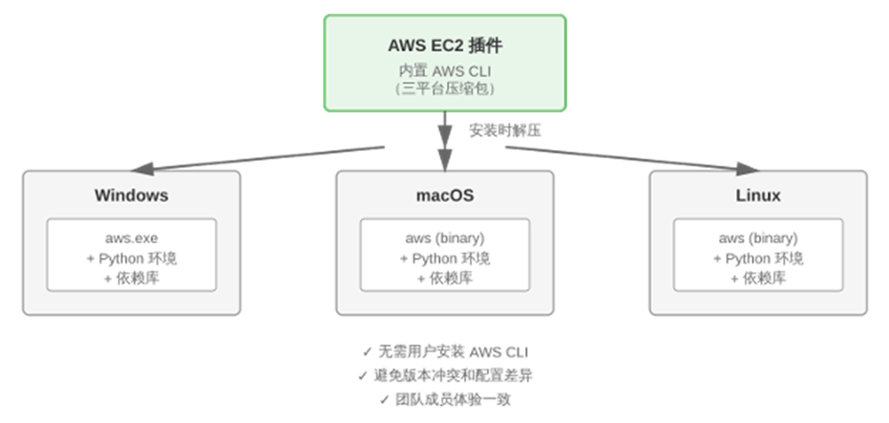
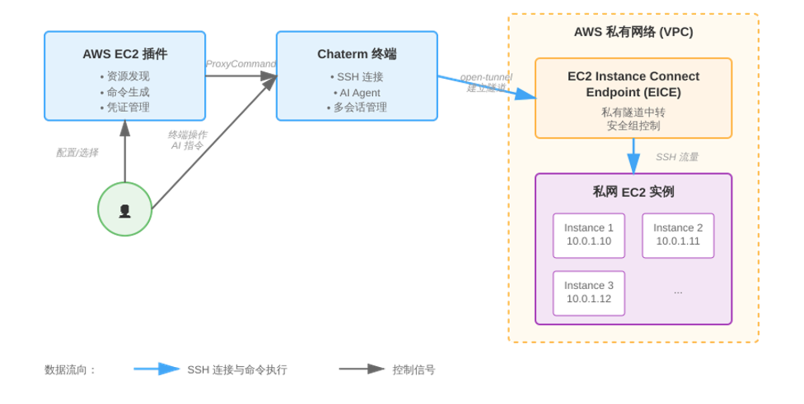
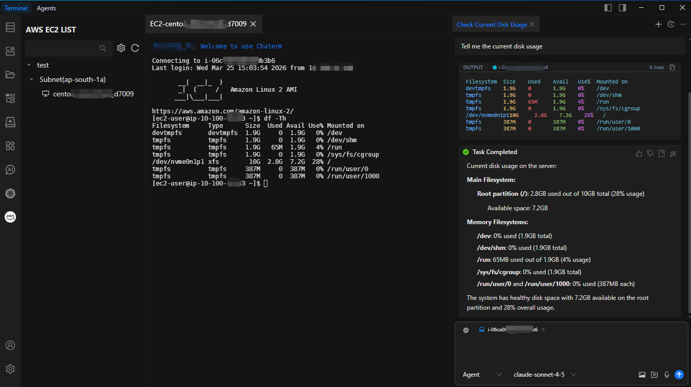

本文介绍了Chaterm智能终端工具与AWS EC2 Instance Connect Endpoint (EICE)的集成方案，用于解决私有子网运维难题。传统方案需要VPN或跳板机，而EICE通过IAM身份认证实现无公网IP的安全连接。

Chaterm封装了EICE能力，提供跨平台自动适配和可视化操作界面，更重要的是内置AI Agent可直接对私网EC2进行智能巡检、故障诊断和批量管理，大幅提升运维效率和安全性。

---

## 1. 前言

在构建企业级 AWS 架构时，我们通常遵循“安全分层”的最佳实践：将数据库、中间件及核心应用服务器部署在 私有子网（Private Subnet） 中，且不分配公网 IP。

然而，这种高安全性的架构设计，往往给日常运维带来了“最后一公里”的难题：

- **连接繁琐：** 运维人员要么配置复杂的 VPN，要么搭建和维护专门的 EC2 跳板机（Bastion Host）。
- **环境割裂：** 团队成员的本地 OS 不同（Windows/Mac/Linux），导致 SSH 密钥管理混乱，AWS CLI 版本不一致，新人上手成本高。
- **智能化受阻：** 在 AIOps 时代，许多本地运行的 AI 辅助工具因为无法穿透复杂的网络隧道，难以直接对私有子网内的实例进行智能诊断。
我们将介绍一款深度集成 AWS 原生能力的开源智能终端工具——Chaterm，并展示它如何结合 AWS EC2 Instance Connect Endpoint (EICE)，在不暴露公网端口的前提下，实现对私有资源的“一键直连”与 AI 赋能。

## 2. 什么是 Chaterm？

Chaterm 是合合信息（IntSig）旗下的开源智能终端工具。与传统 SSH 客户端不同，它的核心理念是 “Chat with Terminal”。它不仅仅是一个连接工具，更内置了强大的 AI Agent，能够理解终端上下文，帮助开发者解释报错、生成命令甚至自动编写脚本。

在最新的版本中，Chaterm 推出了 AWS EC2 插件，通过底层集成 AWS 的现代化连接技术，彻底改变了私有云资源的运维体验。

## 3. AWS EC2 Instance Connect Endpoint 原理解析

### 为什么说这个方案比传统跳板机更先进？

AWS 于 2023 年推出的 EC2 Instance Connect Endpoint (EICE) 功能，将连接的控制权从“网络层”提升到了“身份层”。

- **无需公网 IP：** EICE 是部署在用户 VPC 内的一个逻辑接口（Endpoint）。它就像一个“隐形网关”，允许 SSH 流量通过 AWS 私有网络隧道直接到达目标实例。
- **身份即防线：** 传统的连接依赖 IP 白名单或 SSH Key 分发，而 EICE 依赖 AWS IAM (Identity and Access Management) 进行认证。这意味着所有的连接请求都会经过 IAM 的权限校验，并被 CloudTrail 审计记录。
- **零信任架构：** EC2 实例的安全组不再需要对公网（0.0.0.0/0）开放 22 端口，只需允许来自 EICE 所在子网的流量即可。

## 4. 解决方案：Chaterm + AWS EICE 的双重优势

Chaterm 的 AWS 插件将 EICE 的强大能力封装在了简洁的 UI 背后，主要解决了以下问题：

### 4.1 连接更简单，环境自适配

传统使用 EICE 需要记忆冗长的 AWS CLI 命令（如 aws ec2-instance-connect open-tunnel）。Chaterm 插件内置了跨平台（Windows/macOS/Linux）的 AWS CLI 环境，用户安装插件时自动完成依赖适配。

配置好 AWS 凭证（Access Key / Secret Key）后，插件会自动通过 AWS API 发现资源。用户只需在可视化列表中点击实例，插件便会在后台自动生成 SSH ProxyCommand 并建立加密隧道。



### 4.2 打通 AI 运维的“任督二脉”

这是该方案最大的亮点。在以往，连接私网 EC2 后，本地的 AI 工具往往“鞭长莫及”。

由于 Chaterm 建立的是透明隧道，其内置的 AI Agent 可以像操作本地机器一样操作私网 EC2。连接成功后，Chaterm 的完整 AI 能力立即生效：

- **智能巡检：** 你可以直接问 AI：“帮我看看磁盘使用情况”。AI 会自动执行 df -h 并将输出格式化呈现。
- **故障排查：** 描述症状（如“Web服务响应慢”），AI 会自动执行 top、ps、netstat 等一系列诊断命令，并生成分析报告。相比人工一条条敲命令，效率提升显著。
- **批量操作：** 利用 Chaterm 的多会话功能，你可以同时选中 10 台私网服务器，让 AI 协助批量分发配置更新。



## 5. 实战指南：如何配置

为了确保安全性，我们将遵循 AWS 的最小权限原则 (Least Privilege) 进行配置。

### 5.1 第一步：AWS 侧配置（一次性工作）

#### 5.1.1 创建 EC2 Instance Connect Endpoint

在 VPC 控制台或使用 CLI 创建 EICE，确保选择目标私有子网：

```
aws ec2 create-instance-connect-endpoint \
--region cn-north-1 \
--subnet-id subnet-xxxxxx \
--security-group-ids sg-xxxxxx \
--preserve-client-ip
```

### 5.1.2 配置安全组

修改目标 EC2 的安全组，仅允许来自 EICE 安全组 ID 的 SSH (端口 22) 流量。

### 5.1.3 创建专用 IAM 用户与策略

我们强烈建议不要直接使用管理员权限的 AK/SK。请创建一个专用 IAM 用户，并仅授予以下精细化权限（限制了 Tunnel 的建立仅限于特定资源和端口）：

```
{
    "Version": "2012-10-17",
    "Statement": [
        {
            "Effect": "Allow",
            "Action": [
                "ec2:DescribeInstances",
                "ec2:DescribeSubnets",
                "ec2:DescribeInstanceConnectEndpoints"
            ],
            "Resource": "*"
        },
        {
            "Effect": "Allow",
            "Action": "ec2-instance-connect:OpenTunnel",
            "Resource": "arn:aws:ec2:*:*:instance-connect-endpoint/*",
            "Condition": {
                "NumericEquals": {
                    "ec2-instance-connect:remotePort": "22"
                }
            }
        }
    ]
}
```

### 5.2 第二步：Chaterm 侧配置（仅需 2 分钟）

- 打开 Chaterm，在插件市场搜索并安装 “AWS EC2“。
- 进入插件设置，填入上一步创建的 IAM 用户的 Access Key (AK)、Secret Key (SK) 以及目标 Region（如 cn-north-1）。
- 回到主界面，你的私网实例列表将自动加载。选择实例，点击“连接”。



## 6. 总结

通过深度集成 AWS EC2 Instance Connect Endpoint，Chaterm 为开发者提供了一种既符合企业安全合规（无公网 IP、IAM 审计），又具备极佳使用体验（无跳板机、AI 赋能）的连接方案。

如果您正在寻找一种更安全、更智能的方式来管理您的 AWS 私有子网资源，Chaterm 无疑是当下的最佳实践之一。


## 原文链接

https://aws.amazon.com/cn/blogs/china/bastion-using-aws-eice-ec2-instance-connect-endpoint-chaterm-implement-subnet-security-intelligent/