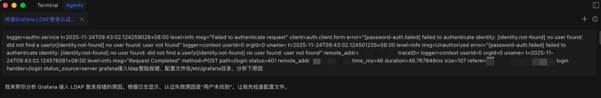
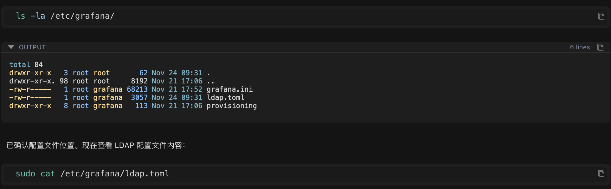
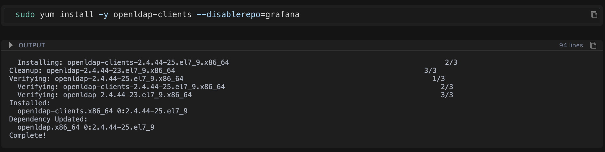
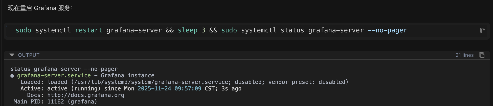

本文通过一个真实案例，展示 Chaterm 如何在 10 分钟内解决一个 Grafana 的LDAP 复杂配置问题。

详细介绍 AI 如何系统化排查：从问题定位、配置分析、连接测试，到精准修复配置错误，最终实现支持多种登录格式的优化方案。通过对比手动排查和 AI辅助，展示 Chaterm 在提升效率、降低排查成本、增强问题解决能力方面的技术优势。

---


> “凌晨 2 点，你还在对着满屏的错误日志发愁...”

配置改了，重启了，日志看了，还是登不进去... 搜索引擎前 10 页的方案试了个遍，问题依然存在。

相信每个搞运维的朋友，都经历过这种 “被配置支配的绝望时刻” 。尤其是涉及到 LDAP 接入这种玄学配置，常常一卡就是一整夜。

今天，我就给大家分享一个前几天发生的真实案例。我一个搞运维快八年的朋友，被一个 **Grafana 接入 LDAP** 的小问题折腾了 **3 小时**。最后，他试了一个我们内部在用的 **AI 辅助排查工具，10 分钟**，问题根源被揪了出来！

咱们不聊产品，只聊排查思路和技术干货。

### 朋友小丰的案例

**任务：** 配置 Grafana 接入公司 LDAP，方便同事能统一登录

按照文档一步步配置，检查了 3 遍，确认没问题。输入用户名密码，点击登录...

**❌ 登录失败！**

查看日志报错：

```bash
[password-auth.failed] failed to authenticate identity:
[identity.not-found] no user found: did not find a user
```

日志显示找不到 ldap 用户，小丰立刻开始了**标准排查流程**：

1. **配置自查**：文件路径、LDAP 地址、端口号，全部核对，ldap.toml 看起来没问题。
2. **网络测试**：telnet、nc 一顿操作，端口通，网络没问题。
3. **日志深挖**：发现 Grafana 默认日志太简洁，根本看不出它到底用什么字段去查用户。
4. **各种搜索**：发现大部分方案都围绕着 bind_dn 或 search_filter 打转，但改了都没用。

时间一点一点过去了，小丰的心态也一点一点崩塌了...夜深了，他决定先放弃。

第二天，小丰决定换个思路。他找来了我们内部用来做辅助排查的工具 Chaterm，把昨晚的错误日志、Grafana 配置路径，以及一句 “帮我看看” 扔了进去。

**10 分钟后，AI 给出了完美的修复方案。**

接下来，我们来看下这个 AI Agent 是如何一步步找到问题的，这套思路非常值得我们学习。

## 实战开始

### 🎯 第一步：核心问题定位

复制错误日志，粘贴给 Chaterm

```bash
logger=authn.service ... error="[password-auth.failed] failed to authenticate identity:
[identity.not-found] no user found: did not find a user"
grafana接入ldap登陆报错，配置文件在/etc/grafana目录，分析下原因
```

Chaterm 的回应：

> "...认证失败原因是'用户未找到'。让我先检查配置文件。"



于是锁定了核心问题：认证失败不在于密码错误，而在于 Grafana 压根没找到这个用户。

### 🔍 第二步：系统化排查

就像侦探破案一样，Chaterm 按步骤来，每一步都清晰可见：

#### 2.1 确认配置文件位置：

```bash
ls -la /etc/grafana/
```

找到了 `ldap.toml` 配置文件

#### 2.2 读取并分析核心配置内容：

```bash
sudo cat /etc/grafana/ldap.toml
```



**AI 发现了 3 个可疑点（这就是问题所在！）：**

1. **错误 1：** `search_filter = "(sAMAccountName=%s)"`

   - **问题：** 这个属性可能不存在（这是 Windows AD 专用的，标准 LDAP 没有）
   - **影响：** 系统用这个属性找用户，当然找不到！

2. **可疑 2：** `username = "sn"`

   - **问题：** 用姓氏当用户名？有点奇怪
   - **影响：** 可能导致用户名格式不匹配

3. **可疑 3：** `bind_dn = "cn=ldap@email.com,ou=user,dc=email,dc=com"`
   - **问题：** 格式看起来不太标准
   - **影响：** 可能连接失败

**这就是 AI 的厉害之处：** 一眼就能看出配置中的潜在问题，就像经验丰富的运维专家！你手动检查可能要花 30 分钟，AI 秒懂！

#### 2.3 测试连接

AI 自动测试网络连接：

```bash
timeout 5 bash -c "echo > /dev/tcp/192.168.1.1/3893"
```

**结果：** 网络连接正常，端口 3893 能通

**结论：** 网络没问题，问题在配置！

#### 2.4 查看"案发记录"（日志信息）

AI 自动查看详细日志：

```bash
sudo tail -100 /var/log/grafana/grafana.log | grep -i "ldap\|authn"
```

发现： 日志太简单了，看不到具体的搜索过程，需要更详细的调试信息。

AI 判断： 需要深入调查，直接测试 LDAP 连接！

### 🧰 第三步：深入调查，启动专业工具

#### 3.1 自动安装 LDAP 客户端工具：

```bash
sudo yum install -y openldap-clients --disable repo=grafana
```



#### 3.2 测试不同的连接方式

AI 自动试错，尝试不同的连接格式，看哪个能成功：

**尝试 1：标准格式（失败）**

```bash
ldapsearch -x -H ldap://192.168.1.1:3893 \
-D "cn=ldap,ou=user,dc=email,dc=com" \
-w password -b "dc=email,dc=com" \
"(objectClass=person)" dn

# 结果：❌ ldap_bind: Invalid credentials (49) - 认证失败
```

**尝试 2：原始格式（成功！）**

```bash
ldapsearch -x -H ldap://192.168.1.1:3893 \
-D "cn=ldap@email.com,ou=user,dc=email,dc=com" \
-w password -b "dc=email,dc=com" \
"(objectClass=*)" dn
```

**结果：** 找到了用户列表！发现用户的格式是 `cn=用户名@email.com`

**AI 发现：** 连接格式需要带 `@email.com` 后缀！

#### 3.3 查看"用户档案"（实际属性）

AI 查看一个具体用户的完整信息：

```bash
ldapsearch -x -H ldap://192.168.1.1:3893 \
-D "cn=ldap@email.com,ou=user,dc=email,dc=com" \
-w password -b "dc=email,dc=com" \
"(cn=zhang_san@email.com)"
```

**关键发现（这就是问题所在！）：**
AI 通过 ldapsearch 命令查看了一个用户的完整属性：

```
dn: cn=zhang_san@email.com,ou=user,dc=email,dc=com
cn: zhang_san@email.com
uid: zhang_san@email.com ← 🔴 注意：uid是完整邮箱格式！
sn: zhang_san ← 这是用户名前缀
```


**真相大白！问题找到了：**

| 实际情况                                | 配置中的设置                        | 结果                    |
| --------------------------------------- | ----------------------------------- | ----------------------- |
| LDAP 中的 uid 是：`zhang_san@email.com` | 搜索过滤器用：`(sAMAccountName=%s)` | ❌ 这个属性根本不存在！ |
| 用户登录输入：`zhang_san`               | 配置用：`username = "sn"`           | ❌ 格式不匹配！         |

简单来说：

- 小丰输入‘zhang_san’登录
- 系统用 `sAMAccountName` 属性去找（但这个属性不存在）
- LDAP 中实际存储的是 `uid=zhang_san@email.com`（完整邮箱格式）
- 所以找不到用户！

就像你要找"张三"，但系统在找"张 sAMAccountName"，当然找不到！

### 🛠️ 第四步：一键修复

确定根源后，AI 开始执行修复。

**运维好习惯**： 修改前先备份，避免误操作（这点很重要！）

#### 4.1 备份（安全第一）

自动备份配置文件：

```bash
sudo cp /etc/grafana/ldap.toml /etc/grafana/ldap.toml.backup
```


💡 如果你不记得，**Chaterm 会自动备份**。万一改错了，还能恢复！

#### 4.2 修复核心问题

**问题：** 用了不存在的属性 `sAMAccountName`（这是 Windows AD 专用的）

**解决：** 改成实际存在的 `uid`

AI 自动修改配置：

```bash
# 修改前：search_filter = "(sAMAccountName=%s)" ❌
# 修改后：search_filter = "(uid=%s)" ✅
sudo sed -i 's/^search_filter = "(sAMAccountName=%s)"/search_filter = "(uid=%s)"/' /etc/grafana/ldap.toml
```


#### 4.3 修复用户名映射

**问题：** 用姓氏 `sn` 当用户名（格式不对）

**解决：** 改成用户 ID `uid`

AI 自动修改：

```bash
# 修改前：username = "sn" ❌
# 修改后：username = "uid" ✅
sudo sed -i 's/^username = "sn"/username = "uid"/' /etc/grafana/ldap.toml
```

#### 4.4 开启调试日志（方便以后排查）

AI 自动开启详细日志：

```bash
sudo sed -i '/^\[log\]/a filters = ldap:debug' /etc/grafana/grafana.ini
```

**好处：** 以后出问题，日志会更详细，容易定位。

#### 4.5 重启服务（让配置生效）

AI 自动重启服务：

```bash
sudo systemctl restart grafana-server
```



完成！所有修改都是 **Chaterm**自动完成的，你只需确认结果。

### 🔄 第五步：还有问题？Chaterm 继续深挖

重启后，你再次尝试登录，还是失败。

你告诉 Chaterm： "还是登不进去"

Chaterm 立即查看调试日志（现在有详细日志了）：

```bash
sudo tail -50 /var/log/grafana/grafana.log | grep -i "ldap"
```

**新的发现：**

```bash
logger=ldap ... msg="LDAP SearchRequest"
searchRequest="Filter:(|(uid=zhang_san)) ..." ← 🔴 搜索的是 zhang_san
logger=ldap ... msg="unable to login with LDAP"
error="can't find user in LDAP" ← ❌ 还是找不到
```

**问题找到了：**

- 系统搜索的是：`uid=zhang_san`（你输入的用户名）
- 但 LDAP 中实际存储的是：`uid=zhang_san@email.com`（完整邮箱格式）
- **格式不匹配！**

**就像你要找"张三"，但系统在找"张三"（没有后缀），而实际存储的是"张三@公司.com"**

#### 5.1 再次验证（确认问题）

Chaterm 再次验证，确认用户的 uid 确实是完整邮箱格式：

```bash
ldapsearch ... "(uid=zhang_san@email.com)" dn uid
```

**结果：** 确认用户的 uid 确实是完整邮箱格式

#### 5.2 终极解决方案：支持多种登录方式

Chaterm 的思路： 让搜索过滤器支持多种格式，用户怎么输入都能找到！

```bash
# 修改为支持三种登录方式：
# 1. 输入完整邮箱：zhang_san@email.com → 直接匹配
# 2. 输入用户名：zhang_san → 匹配sn属性
# 3. 自动追加域名：zhang_san → 匹配uid=zhang_san@email.com
sudo sed -i 's#^search_filter = "(uid=%s)"#search_filter = "(|(uid=%s)(uid=%s@email.com)(sn=%s))"#' /etc/grafana/ldap.toml
```

**最终配置（万能搜索）：**

```toml
search_filter = "(|(uid=%s)(uid=%s@email.com)(sn=%s))"
```


这是最亮眼的一步，为了解决用户输入格式不一致的问题，Chaterm 并没有让小丰去改登录习惯，而是优化了搜索逻辑。

**这个配置有多强？**

- 用户输入 `zhang_san@email.com` → 直接匹配 `uid=zhang_san@email.com`
- 用户输入 `zhang_san` → 匹配 `sn=zhang_san` 或 `uid=zhang_san@email.com`

**至此，无论用户怎么输入，都能被找到。**

**最终配置**

```toml
# LDAP服务器配置
host = "192.168.1.1"
port = 3893
bind_dn = "cn=ldap@email.com,ou=user,dc=email,dc=com"
bind_password = 'password'

# 搜索过滤器 - 支持多种格式
search_filter = "(|(uid=%s)(uid=%s@email.com)(sn=%s))"
search_base_dns = ["ou=user,dc=email,dc=com"]

# 属性映射
[servers.attributes]
name = "givenName"
surname = "sn"
username = "uid" # 关键：使用uid而不是sn
member_of = "memberOf"
email = "mail"
```

### 总结：Chaterm 带来的技术提升

整个排查和修复过程，Chaterm 耗时 10 分钟。对比小丰自己摸索的 3 小时，这效率提升是颠覆性的。

| 步骤 | 操作             | 结果                    | 耗时   |
| ---- | ---------------- | ----------------------- | ------ |
| 1    | 检查配置文件     | 发现使用了错误的属性    | 1 分钟 |
| 2    | 测试 LDAP 连接   | 确认 bind_dn 格式正确   | 1 分钟 |
| 3    | 查看用户实际属性 | 发现 uid 是完整邮箱格式 | 2 分钟 |
| 4    | 修改搜索过滤器   | 支持多种登录格式        | 1 分钟 |
| 5    | 启用调试日志     | 便于后续排查            | 1 分钟 |
| 6    | 验证修复         | 问题解决 ✅             | 4 分钟 |

我们从这个案例中看到的，不只是工具的快速，更是它系统化的思维模式：

1. **避免知识盲区：** 它能瞬间识别出不同技术栈（AD vs. LDAP）的配置差异，这是最容易让人卡壳的地方。
2. **先验证数据，后修改配置：** 它不是盲目地尝试配置，而是先用 ldapsearch 验证了 LDAP 服务器实际存储的数据格式，再回过头来修改配置，这是最高效的排查逻辑。
3. **不止于修复，更要优化：** Chaterm 最终给出的万能过滤器，考虑到了用户体验，避免了未来因登录习惯不同而引发的再次故障。

#### Chaterm 的优势：为什么能 10 分钟解决 3 小时的问题？

通过这个案例，我们可以看到 Chaterm 相比传统排查方式的优势：

##### 1. 系统化排查

**传统方式：** 你可能忘记某个步骤，或者顺序不对

**Chaterm：**

- 不会遗漏关键步骤
- 按照逻辑顺序逐步排查
- 根据结果自动调整方向

**就像有经验的运维专家，知道每一步该做什么！**

##### 2. 知识丰富

**传统方式：** 你需要查文档、搜百度，可能还找不到答案

**Chaterm：**

- 知道需要安装什么工具（自动帮你装）
- 了解 LDAP 的各种配置格式（一眼看出问题）
- 理解不同 LDAP 类型的差异（知道 Windows AD 和标准 LDAP 的区别）

**就像有个知识库在脑子里，随时调用！**

##### 3. 执行高效

**传统方式：** 你需要手动输入每个命令，复制粘贴，容易出错

**Chaterm：**

- 自动执行命令，无需手动输入
- 实时查看结果，快速定位问题
- 提供修复方案，直接可用

**你只需看结果，不用动手！**

##### 4. 安全可靠

**传统方式：** 你可能忘记备份，改错了就麻烦了

**Chaterm：**

- 修改前自动备份（帮你记得）
- 验证修改结果（确保改对了）
- 提供回滚方案（万一有问题还能恢复）

**安全第一，AI 帮你考虑到了！**

#### 运维人员能学到什么？（实用干货）

##### 1. LDAP 排查的标准流程

```
检查配置 → 测试连接 → 查看用户属性 → 修改配置 → 验证修复
```

**关键点：** 先确认配置，再测试连接，最后看实际数据，这样不会走弯路！

##### 2. 关键排查命令

```bash
# 测试LDAP连接（最重要！）
ldapsearch -x -H ldap://服务器:端口 \
-D "bind_dn" -w "密码" \
-b "搜索基础DN" "(搜索过滤器)"

# 查看用户完整属性（看看到底存了什么）
ldapsearch ... "(cn=用户名)"

# 启用Grafana LDAP调试日志（出问题时很有用）

# 在grafana.ini中添加：
[log]
filters = ldap:debug
```

**提示：** 这些命令 AI 会自动帮你执行，但了解原理有助于你理解问题！

##### 3.  常见 LDAP 配置错误（避坑指南）

| 错误类型     | 示例                                         | 正确做法                | 为什么错？                      |
| ------------ | -------------------------------------------- | ----------------------- | ------------------------------- |
| 属性不存在   | `sAMAccountName` (标准 LDAP)                 | 使用 `uid` 或 `cn`      | Windows AD 专用，标准 LDAP 没有 |
| 格式不匹配   | 用户输入 `user`，LDAP 存储 `user@domain.com` | 使用多条件搜索过滤器    | 输入格式和存储格式不一致        |
| 属性映射错误 | `username = "sn"` (姓氏)                     | 使用 `username = "uid"` | 姓氏不是唯一标识，可能重复      |

记住这些，以后配置 LDAP 时就能避免踩坑！

#### 快速上手 Chaterm

##### 使用场景（这些场景都能用）

1. **故障排查** - 粘贴错误日志，自动分析（就像这个案例）
2. **配置检查** - 描述问题，自动检查配置（不用手动看配置文件）
3. **性能优化** - 提供系统信息，获得优化建议（帮你找性能瓶颈）
4. **知识查询** - 询问技术问题，获得专业解答（24 小时在线专家）

##### 使用技巧（让 AI 更懂你）

1. **提供完整信息** - 错误日志、配置文件路径、问题描述（信息越多，AI 越准确）
2. **描述已尝试的操作** - 避免重复排查（告诉 AI 你试过什么，它就不会再试）
3. **及时反馈结果** - 告诉 Chaterm 哪些方案有效/无效（帮助 AI 调整方向）
4. **查看执行过程** - 学习排查思路和命令（边用边学，提升自己）

**简单说：** 就像和运维专家聊天，你描述问题，它帮你解决！

#### 总结：AI 工具改变了什么？

通过这个真实案例，我们看到：

**Chaterm 能够像经验丰富的运维专家一样工作：**

- **系统化排查** - 不会遗漏关键步骤
- **智能分析** - 一眼看出问题所在
- **精准修复** - 不仅找问题，还帮你改配置

**大大提升排查效率：**

| 传统方式     | Chaterm    |
| ------------ | ---------- |
| 3 小时+      | 10 分钟    |
| 手动执行命令 | 自动执行   |
| 试错成本高   | 精准定位   |
| 可能遗漏步骤 | 系统化排查 |

**时间就是金钱，效率就是生命！**

**适合各种水平的运维人员：**

- **新手：** 学习标准排查流程（跟着 AI 学，快速成长）
- **老手：** 快速定位问题，节省时间（把时间用在更重要的事情上）

#### 核心价值

**不是替代你，而是让你更强大！**

- AI 帮你做重复性工作（执行命令、检查配置）
- 你专注于思考和决策（理解问题、验证方案）
- 边用边学，提升技能（看 AI 怎么排查，学习思路）

---

如果你也遇到过类似的 LDAP 配置问题，或者想体验 Chaterm 的强大功能，欢迎在评论区分享你的经历！

或者，直接去试试 Chaterm，看看它能不能帮你解决下一个问题！ 🚀

#### 相关资源

- [Grafana LDAP 配置官方文档](https://grafana.com/docs/grafana/latest/setup-grafana/configure-security/configure-authentication/ldap/)
- [LDAP 搜索过滤器语法](https://ldap.com/ldap-filters/)
- [Chaterm 使用指南](https://chaterm.ai/cn/docs/)

#### 写在最后

**温馨提示：** 修改生产环境配置前，请务必先备份！通常 Chaterm 会自动帮你备份，但养成好习惯总是没错的 😊

**核心观点：** AI 工具不是要替代运维人员，而是要让我们更高效、更专业。把重复性工作交给 AI，把时间用在更有价值的事情上。

---

如果你觉得这篇文章有用，欢迎点赞、转发、收藏！

如果你也有类似的排查经历，欢迎在评论区分享！

如果你试用了 Chaterm，欢迎分享你的使用体验！
