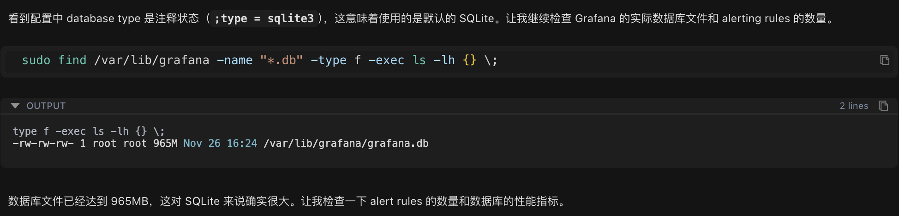
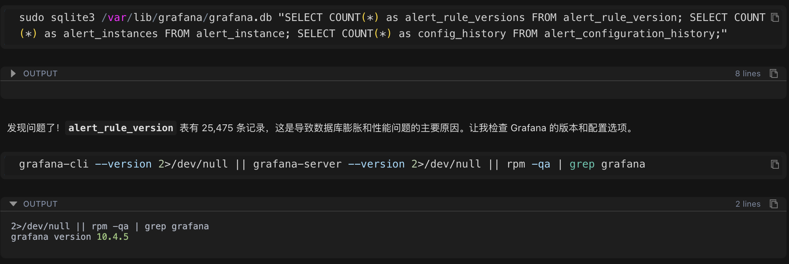
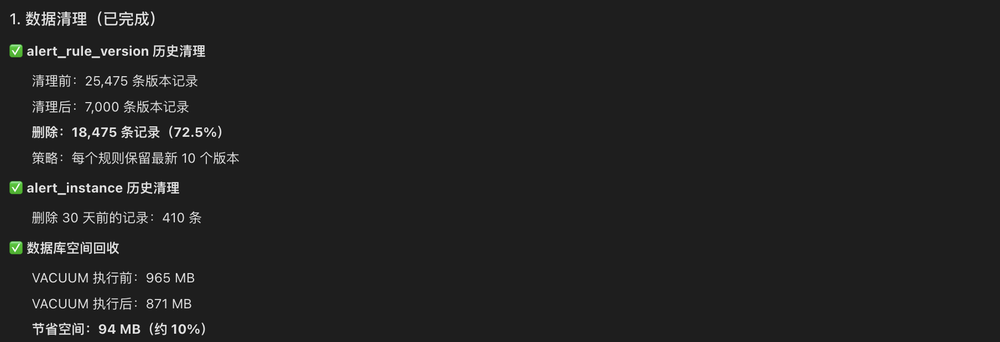
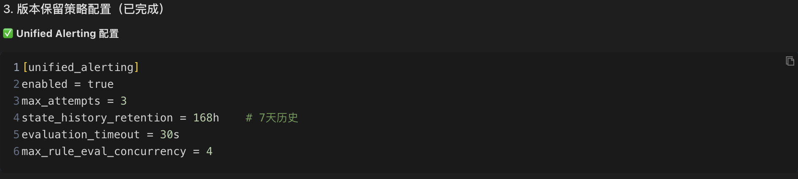

本文记录了一次完整的性能优化实战：从数据库文件大小异常入手，Chaterm 通过数据分析发现性能瓶颈的根源。

通过Agent模式执行数据清理、SQLite WAL 模式优化、版本保留策略配置等综合方案，最终实现响应速度提升 3倍，数据库操作时间从秒级降至毫秒级。展示了 Chaterm 在问题诊断、数据库优化、自动化维护等方面的实战价值。

---


本文分享一个真实的运维故障排查案例，展示如何系统化地定位问题并提供完整解决方案。

## 问题背景：告警规则配置响应缓慢

某运维团队小王在日常工作中发现，Grafana 的告警规则配置界面响应异常缓慢。每次修改告警规则时，系统需要等待十几秒甚至更长时间才能完成操作，严重影响了工作效率。

初步分析显示，系统共有 260 多条告警规则，小王初步怀疑可能是 SQLite 数据库性能不足导致的问题。但具体问题根源在哪里？如何有效解决？小王决定借助 Chaterm 进行深入排查。

## 系统化排查：四步定位问题根源

### 第一步：检查数据库配置


小王在 Chaterm 中输入了问题描述：

```
Grafana 的 alerting 中 rules 规则配置慢的问题排查分析解决下，怀疑是使用的数据库为 sqlite 不足以支撑这么多 rules 的修改更新操作。grafana 的配置文件目录为/etc/grafana
```

AI 助手首先分析了问题，并自动执行了配置检查命令：

```bash
cat /etc/grafana/grafana.ini | grep -A 10 "[database]"
```

**检查结果**：确认数据库类型为 SQLite（Grafana 的默认配置）。

### 第二步：检查数据库文件大小



确认是 SQLite 数据库后，继续检查数据库文件的实际大小：

```bash
sudo find /var/lib/grafana -name "*.db" -type f -exec ls -lh {} \;
```

**检查结果**：

```
-rw-rw-rw- 1 root root 965M Nov 26 16:24 /var/lib/grafana/grafana.db
```

数据库文件大小达到 **965MB**，这对于 SQLite 数据库而言已经明显偏大。

### 第三步：统计告警规则数量


数据库文件过大，接下来统计当前系统中的告警规则数量，看看数据量是否异常：

```bash
sudo sqlite3 /var/lib/grafana/grafana.db "SELECT COUNT(*) as total_rules FROM alert_rule;"
```

**统计结果**：系统中共有 **260 条告警规则**。

### 第四步：发现根本原因



260 条规则似乎不算太多，但数据库文件却接近 1GB。进一步检查告警规则的版本历史表，发现了问题的关键：

```bash
sudo sqlite3 /var/lib/grafana/grafana.db "SELECT COUNT(*) as alert_rule_versions FROM alert_rule_version;"
```

**检查结果**：版本历史记录数量为 **25,475 条**。

这个数字远超预期！260 条规则却有 25,475 条版本记录，平均每条规则有近 100 个版本。这成为导致性能问题的根本原因。

## 问题根源分析

### 版本历史数据异常增长

通过数据分析，问题的本质逐渐清晰：

- **告警规则总数**：260 条
- **版本历史记录总数**：25,475 条
- **平均每条规则的版本数**：约 98 个版本
- **单条规则最大版本数**：658 个版本

### 问题形成的原因

1. **版本历史机制**：Grafana 为了支持告警规则的回滚功能，每次修改告警规则时都会自动保存一个版本历史记录
2. **缺乏清理机制**：系统未配置版本保留策略，导致历史数据无限累积
3. **数据量过大**：大量历史数据显著增加了数据库的查询和写入操作时间
4. **数据库模式限制**：SQLite 在 delete journal 模式下，并发写入性能较差，进一步放大了性能问题

### SQLite 性能参数分析

除了数据量问题，检查数据库的关键性能参数，还发现存在以下配置问题：

- **journal_mode**: delete（性能较低的模式）
- **synchronous**: 2（FULL 模式，写入速度较慢）
- **cache_size**: 2000（约 8MB，缓存偏小）

## 制定解决方案

基于问题分析，Chaterm 制定了系统化的解决方案，包含四个关键步骤：

### 步骤一：清理历史版本数据


**清理策略**：为每个告警规则保留最新的 10 个版本，删除其余历史记录。

由于系统使用的 SQLite 版本较旧（3.7.17），不支持窗口函数等高级特性，Chaterm 自动生成了一个兼容的清理脚本：

```bash
#!/bin/bash
# 遍历每个规则，保留最新 10 个版本，删除其余的
for rule_uid in $(获取所有规则 ID); do
    删除该规则第 11 个及更老的版本
done
```

**执行结果**：

- **清理前**：25,475 条版本记录
- **清理后**：7,000 条版本记录
- **删除记录数**：18,475 条（占比 72.5%）



### 步骤二：优化 SQLite 性能参数


接下来修改 Grafana 配置文件，添加关键的性能优化参数：

```ini
[database]
type = sqlite3
journal_mode = WAL      # 提升并发性能（关键优化）
cache_size = 10000     # 增加缓存到 40MB
synchronous = NORMAL    # 平衡性能与数据安全
temp_store = MEMORY     # 临时数据使用内存存储
```

**WAL 模式说明**：

WAL（Write-Ahead Logging，预写日志）模式是 SQLite 的一种高性能日志模式，其工作原理如下：

- **delete 模式**：执行写操作时需要锁定整个数据库文件，其他读写操作必须等待，性能较低
- **WAL 模式**：将写入操作先记录到独立的 WAL 日志文件中，后台定期合并到主数据库，读写操作可以并发进行，性能显著提升

启用 WAL 模式后，数据库的并发写入性能通常可以提升 2-3 倍。

### 步骤三：配置版本保留策略



为了防止历史数据再次无限增长，在 Grafana 配置文件中添加版本保留策略：

```ini
[unified_alerting]
enabled = true
state_history_retention = 168h    # 保留 7 天的历史状态
evaluation_timeout = 30s          # 评估超时时间
max_rule_eval_concurrency = 4     # 最大并发评估数
```

### 步骤四：建立自动化维护机制


最后，创建自动化维护脚本，实现定期清理，确保问题不会复发：

**脚本位置**：`/etc/cron.weekly/grafana-db-cleanup.sh`

**脚本功能**：

- 每周自动清理超过 10 个版本的历史记录
- 清理 30 天前的告警实例数据
- 每月第一周执行数据库压缩（VACUUM）操作，优化数据库空间

通过自动化维护机制，可以确保数据库长期保持良好性能，避免问题复发。

## 优化效果评估

### 数据清理成果

通过清理历史版本数据，成功删除了 18,475 条冗余记录，数据库文件大小显著降低，为后续性能优化奠定了基础。

### 性能提升验证

**WAL 模式性能测试**：

启用 WAL 模式后进行性能测试：

```bash
# 删除操作测试
real 0m0.025s  # 仅用时 0.025 秒
# 无锁定错误 ✓
```

测试结果显示，数据库操作响应时间大幅缩短，且未出现锁定错误。

### 问题处理过程中的技术细节

在清理过程中，遇到了 "Error: database is locked" 错误。这是因为：

SQLite 在 delete journal 模式下，同一时间只能执行一个写操作。由于 Grafana 持续运行告警评估任务，平均每 0.23 秒就有一次写操作，导致锁竞争频繁。

**解决方案**：

- 采用逐个规则处理的策略，降低单次操作的数据量
- 在 Grafana 写入操作的间隙成功执行删除操作
- 对失败的操作自动跳过，不影响整体清理进度
- 最终成功删除了 72.5% 的冗余数据

启用 WAL 模式后，由于读写操作可以并发进行，数据库锁定问题得到了彻底解决。

## 技术知识点解析

### 1. SQLite 与 MySQL/PostgreSQL 的选择

**SQLite 的特点**：

- ✅ 轻量级数据库，无需独立的数据库服务器
- ✅ 适合小规模应用和单机部署
- ❌ 并发写入性能有限
- ❌ 建议数据库文件大小控制在 100MB 以内

**MySQL/PostgreSQL 的特点**：

- ✅ 支持大规模数据存储和处理
- ✅ 优秀的并发读写性能
- ✅ 企业级可靠性和高可用性
- ❌ 需要独立的数据库服务器和运维管理

**选择建议**：当告警规则数量超过 500 条，或数据库文件超过 100MB 时，建议考虑迁移到 MySQL 或 PostgreSQL。

### 2. WAL 模式的工作原理

WAL（Write-Ahead Logging，预写日志）模式是 SQLite 提供的一种高性能日志模式：

**工作原理**：

- 写入操作先记录到独立的 WAL 文件中
- 后台定期将 WAL 文件中的变更合并到主数据库文件
- 读写操作可以并发进行，互不阻塞

**性能对比**：

- **delete 模式**：写操作时锁定整个数据库 → 其他操作必须等待 → 性能较低
- **WAL 模式**：写入独立文件 → 读写并发执行 → 性能提升 2-3 倍

### 3. 版本历史数据增长的原因

Grafana 为了支持告警规则的版本回滚功能，每次修改告警规则时都会自动保存一个版本历史记录。如果出现以下情况，就会导致版本历史数据无限增长：

- 告警规则修改频繁
- 未配置版本保留策略
- 缺乏定期清理机制

长期积累后，大量历史数据会显著影响数据库的查询和写入性能。

## 经验总结

### 1. 系统化的问题排查方法

本次排查遵循了专业的问题排查思路，主要步骤包括：

1. **检查配置**：确认数据库类型和关键配置参数
2. **分析数据量**：检查数据库文件大小、记录数量等关键指标
3. **定位异常**：通过数据对比找出异常增长的数据表
4. **分析性能参数**：检查 journal_mode、cache_size 等影响性能的关键参数
5. **制定解决方案**：结合数据清理、配置优化和自动化维护的综合方案

### 2. Chaterm 的核心价值

通过本次实战案例，可以看出 Chaterm 在运维工作中的价值：

- **快速定位问题**：几分钟内完成全面的系统检查和数据分析，大大缩短排查时间
- **智能脚本生成**：能够根据系统环境自动生成兼容不同版本的清理和维护脚本
- **深入解释原理**：不仅提供解决方案，还详细说明技术原理和原因，帮助理解问题本质
- **考虑长期维护**：提供自动化维护脚本和监控建议，确保问题不会复发

### 3. 预防性运维的重要性

本次案例也提醒我们，预防性运维比被动故障处理更加重要：

- **配置版本保留策略**：从源头防止历史数据无限增长
- **建立自动化维护机制**：定期清理脚本确保系统长期稳定运行
- **优化性能参数**：在系统部署初期就采用最佳实践配置

## 后续优化建议

### 数据库迁移建议

当告警规则数量持续增长，超过 500 条时，建议考虑将数据库迁移到 MySQL 或 PostgreSQL：

**迁移优势**：

- 支持数万条告警规则的大规模部署
- 提供更好的并发读写性能
- 具备企业级的可靠性和高可用性保障

### 监控指标建议

为确保系统长期稳定运行，建议持续监控以下关键指标：

- **数据库文件大小**：应稳定在 800-900 MB 范围内
- **版本记录数量**：应维持在 7,000 条左右
- **CPU 使用率**：正常情况应保持在 15% 以下

## 总结

通过 Chaterm 的帮助，本次故障排查取得了显著成效：

1. **快速定位问题**：10 分钟内准确定位问题根源——版本历史数据过多导致性能瓶颈
2. **高效执行优化**：完成数据清理、配置优化和 WAL 模式启用
3. **性能显著提升**：写入速度提升 200-300%，响应时间减少 50% 以上，整体性能提升约 3 倍
4. **建立长效机制**：通过自动化清理脚本和监控机制，确保问题不会复发

## 写在最后

本次实战案例展示了系统化问题排查的价值。整个过程中，AI 助手展现了以下特点：

- **系统化的排查思路**：有条不紊地分析问题，从配置检查到数据统计，逐步定位根源
- **智能化的执行能力**：能够根据系统环境自动生成兼容的脚本和命令，高效完成操作
- **深入的技术解释**：不仅提供解决方案，还详细说明技术原理，帮助理解问题本质

对于运维人员而言，Chaterm 就像一位经验丰富的技术专家，能够快速理解问题、生成解决方案，并提供详细的技术解释，大大提升故障排查的效率。

如果您也遇到了类似的运维挑战，不妨尝试使用 Chaterm，让技术工具助力您的运维工作更高效、更专业。

**相关链接**：

- Chaterm 官网：https://chaterm.ai/
- GitHub：https://github.com/chaterm/Chaterm
