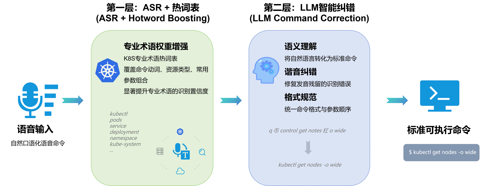
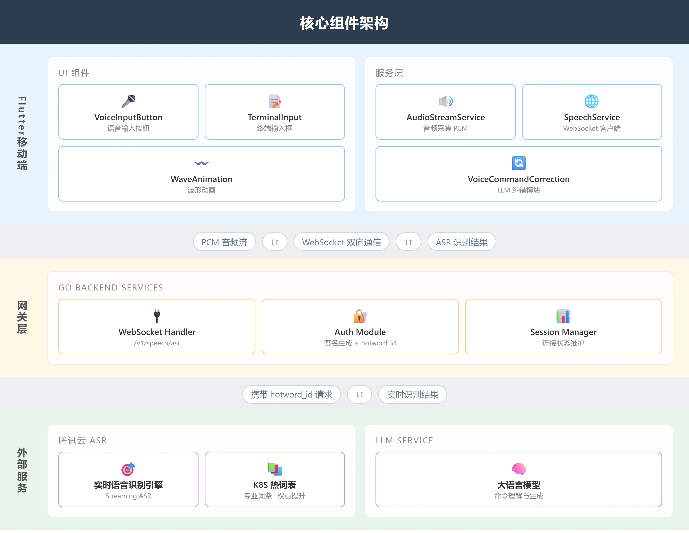
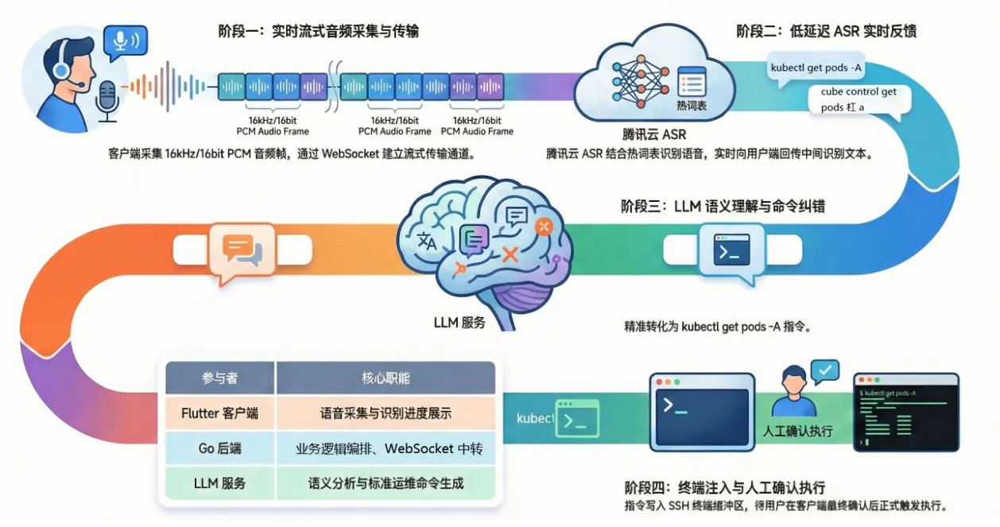
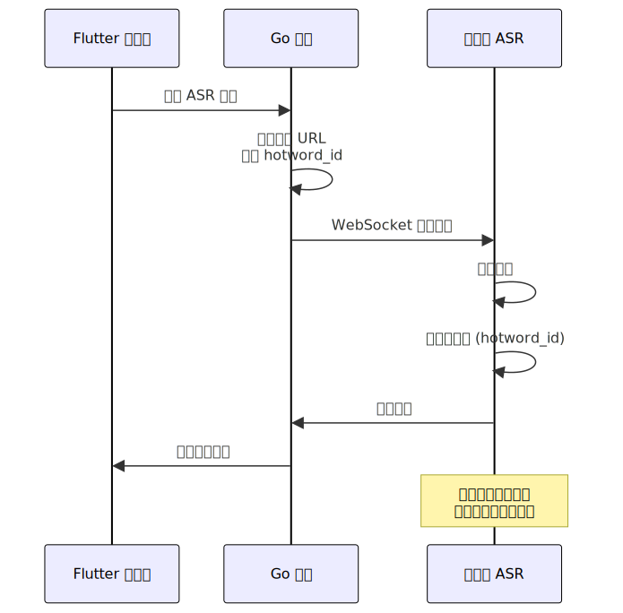
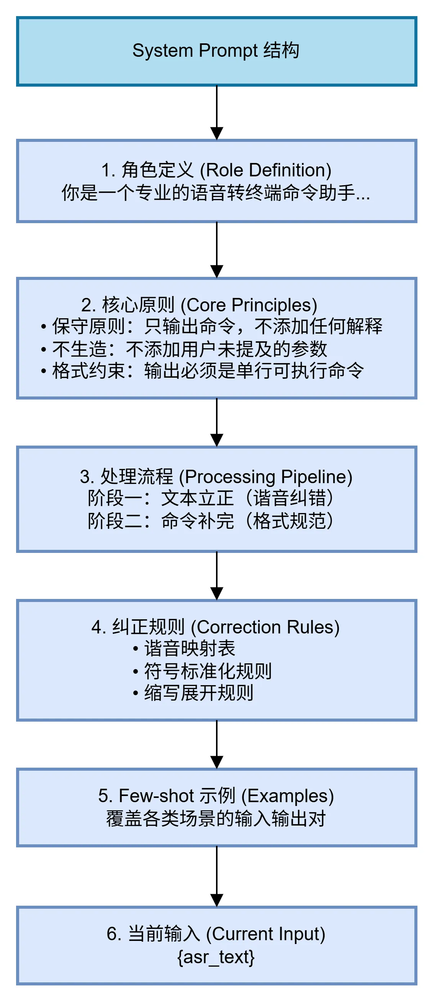
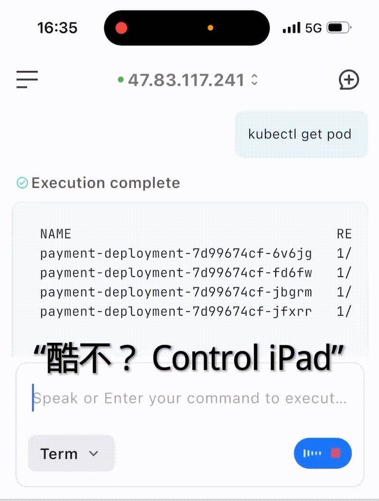

本文介绍 Chaterm 如何通过 ASR 热词表 + LLM 纠错 的双层架构，在移动端实现各种终端操作和 Kubernetes 命令的高精度识别，从而提升移动端的命令输入效率。

并介绍 Chaterm 提示词工程的设计范式包括：明确的角色定义（Role Definition）、清晰的任务边界约束、结构化的处理流程，以及 Few-shot 示例。来提升模型输出的准确性和一致性。

---

<br>
作为程序员，幸幸苦苦忙碌一年，春节回家也未必轻松，赶火车回家团圆，参加爸妈安排的相亲，同学的婚礼随份子， 被七大姑问候工资，然而最恐怖的却是突如其来的 --  <font style="color:red;">「[P0 级报警] 核心交易服务响应超时！」</font>

身为一个程序员，每每看到类似的场景我都感同身受


为了过个好年，我们打造了一个能够在极端环境下 <font style="color:red;">单手完成生产系统的救火工具！</font>

然而，碰到的第一个挑战就是，如何让传统的语音识别，能够100%准确的转化成各个云平台API，或者K8S，Linux的操作指令？


---

## 一：K8S 命令语音识别的技术挑战
### 1.1 问题背景
首先要解决的是，工程师经常需要在移动端通过语音快速执行各种命令，各种参数，比如 kubectl 等等。在移动端，这个过程面临一个显著的体验问题：**在手机虚拟键盘上输入复杂的 Kubernetes 命令极其痛苦，而且效率低下**。


**语音输入**是一个自然的解决方案。然而，传统 ASR（Automatic Speech Recognition，自动语音识别）系统在处理 K8S 命令时面临严峻挑战：

| 挑战类型 | 具体表现 | 示例 |
| --- | --- | --- |
| **专有名词识别** | 命令动词被识别为谐音词 | `kubectl` → "酷 B 控制"、"cube ctl" |
| **参数组合复杂** | 长命令参数丢失或错位 | `kubectl get pods -n default -o wide` → "kubectl get pods default wide" |
| **资源类型混淆** | 缩写与全称混用导致歧义 | `svc` vs `services`、`deploy` vs `deployments` |
| **命名空间参数** | 短参数容易被忽略 | `-n`、`--namespace` 被吞噬或误识别 |
| **特殊字符处理** | 符号无法正确识别 | `-`、`--`、`/` 等符号丢失 |


### 1.2 传统方案的局限性
传统语音识别方案主要存在以下问题：

1. **通用模型泛化能力不足**：ASR 模型基于海量通用语料训练，对垂直领域专业术语覆盖有限
2. **OOV（Out-of-Vocabulary）问题**：`kubectl`、`namespace`、`deployment` 等词汇不在常规词表中
3. **上下文理解缺失**：无法理解命令语义，难以进行智能补全和纠错
4. **中英文混合识别困难**：K8S 命令涉及大量英文术语与中文口语混合

### 1.3 Chaterm 的解决思路
**Chaterm 通过双层架构设计，实现了 K8S 命令接近 100% 的精准识别率：**

****



---

## 二、系统架构设计
### 2.1 核心组件架构
在核心组件的实现层面，整体架构遵循「客户端 → 网关 → 外部服务」的设计模式，其中各层级之间通过WebSocket协议进行双向数据交互。





**Flutter 移动端：** 架构分为**用户界面（UI）组件**与**服务层**两大模块。在UI层面，VoiceInputButton 组件为用户提供了一个语音输入的接口，并通过WaveAnimation 实时反馈用户的操作状态；而在服务层面上，AudioStreamService 负责处理PCM格式的音频流采集工作，SpeechService 则封装了基于WebSocket协议的数据传输逻辑，同时，VoiceCommandCorrection 模块封装了精心设计的Prompt，实现了对大型语言模型(LLM)进行调用来完成语音命令的纠正功能。

  
**网关层：** 采用了Go语言构建后端服务，其核心组成部分包括WebSocket处理器和认证模块。特别地，在建立连接的过程中，会附加一个名为`hotword_id`的参数，这使得自动语音识别(ASR)系统能够加载相应的热词列表，从而实现“一次握手，全程优化”的效果。

  
**外部服务体系：** 主要集成了两方面的关键能力：一是利用腾讯云提供的实时语音识别引擎，该引擎支持热词表、替换词、权重增强等音频处理能力；二是集成LLM服务以提供高级别的语义理解和指令生成能力。这两项技术相互配合，共同提升了系统的整体性能。

### 2.2 语音执行执行全流程解析



<br>

**语音驱动运维指令执行：** 以 kubectl get pods -A 为例

该流程演示了当用户直接口述技术命令时，系统如何处理识别误差并最终精准执行：

**1. 阶段一：实时语音采集与传输**
- **指令输入：** 用户在 Flutter 客户端按下按钮，口述指令：“kubectl get pods -A”。
- **音频处理：** 客户端 AudioStreamService 实时采集 16khz/16bit 的 PCM 音频帧。

**2. 阶段二：低延迟 ASR 实时反馈**
- **通信链路：** Flutter 客户端通过 WebSocket 接口（/v1/speech/asr）连接 Go 后端，后端同步建立与腾讯云 ASR 的连接，并携带 hotword_id（热词表）以增强专业术语识别。
- **识别挑战：** 由于“kubectl”等词汇在非运维语境下容易被误识别，系统通过挂载运维热词表（hotword_id）来增强准确性。
- **实时预览：** ASR 实时返回中间识别结果，由后端推送到客户端，用户可以在界面上看到实时返回的识别文字，例如：“q... q币... cube control...”。

**3. 阶段三：LLM 语义纠错（核心环节）**
- **原始文本获取：** 语音识别结束，ASR 返回的最终文本可能存在严重偏差，例如：“cube control get pods 杠 a”（将 kubectl 误听为 cube control，将 -A 误听为“杠 a”）。
- **调用 LLM：** 调用 VoiceCommandCorrection 接口。
- **纠错输出：** LLM 结合运维知识库进行语义分析，将上述混乱的文本精准修正为标准的：kubectl get pods -A。

**4. 阶段四：终端写入与人工确认**
- **终端写入：** 纠错后的标准指令被发送至输入框。
- **最终把关：** 为了安全起见，指令不会立即运行，而是等待用户在客户端二次确认后，才正式在终端环境中触发执行。


---

## 三、第一层：ASR 热词表精准识别
### 3.1 热词表技术原理
**热词表（Hotword List）** 是 ASR 系统提供的一种领域适配机制，通过提升特定词汇在解码过程中的先验概率，显著提高目标词汇的识别准确率。

#### 3.1.1 为什么需要热词表
通用 ASR 模型基于海量日常语料训练，对专业术语覆盖不足，存在 **OOV（Out-of-Vocabulary）问题**。当用户说 "kubectl" 时，模型倾向于输出训练时见过的近音词（如"酷B控制"），而非低频专业术语。

#### 3.1.2 工作原理
ASR 解码时，会计算每个候选词的输出概率。**热词表通过对特定词汇施加概率加成来改变解码结果：**

```plain
无热词表：                      有热词表（kubectl 权重100）：
─────────────────────          ─────────────────────
"酷B控制" P=0.35 ← 选中        "kubectl" P=0.15×5=0.75 ← 选中
"kubectl" P=0.15               "酷B控制" P=0.35
```

数学表达：`P'(热词) = P(热词) × boost_factor`

权重越高，boost_factor 越大，热词在同音竞争中获胜概率越高。

#### 3.1.3 热词权重设置
腾讯云 ASR 支持 1-11,100 的权重范围：

| 权重范围 | 适用场景 | 说明 |
| --- | --- | --- |
| 1-10 | 常规业务词汇 | 轻度提升，避免过拟合 |
| 11 | 专业术语 | 中度提升，平衡准确率与泛化 |
| 100 | 核心关键词 | 强制识别，适用于 OOV 词汇 |


**K8S 命令场景采用权重 100**，确保 `kubectl`、`namespace` 等核心词汇被优先识别。

### 3.2 K8S 热词表设计
我们构建了包含 K8S 专用热词表，覆盖以下类别：

#### 3.2.1 核心命令动词
```latex
kubectl|100
kubectl get|100
cube control|100
```

#### 3.2.2 资源类型词汇
```latex
pods|100
pod|100
services|100
```

#### 3.2.3 常用参数组合
```latex
杠n|100
杠n default|100
杠杠 namespace|100
```

#### 3.2.4 完整命令模板
```latex
kubectl get pods|100
kubectl get pods -A|100
kubectl get pods -n default|100
```

### 3.3 热词表集成流程
<!-- 这是一个文本绘图，源码为：sequenceDiagram
    participant Client as Flutter 客户端
    participant Backend as Go 后端
    participant ASR as 腾讯云 ASR

    Client->>Backend: 请求 ASR 连接
    Backend->>Backend: 生成签名 URL<br/>携带 hotword_id
    Backend->>ASR: WebSocket 连接请求
    ASR->>ASR: 验证签名
    ASR->>ASR: 加载热词表 (hotword_id)
    ASR->>Backend: 连接成功
    Backend->>Client: 返回连接就绪

    Note over ASR: 后续所有识别请求<br/>自动应用热词表权重 -->



## 四、第二层：LLM 智能纠错
### 4.1 LLM 纠错的必要性
尽管热词表显著提升了专业术语的识别率，但 ASR 输出仍可能存在以下问题：

1. **残留谐音错误**：部分词汇仍被识别为近音词（如 "kube ctl"）
2. **自然语言表达**：用户可能说 "查看所有 pod" 而非 "kubectl get pods -A"
3. **参数顺序混乱**："-n default" 可能出现在命令中间
4. **格式不规范**：缺少必要的空格、连字符等

**LLM 层的作用**：作为语义理解层，将 ASR 的原始输出（自然语言、谐音词、不完整命令）转换为**标准的、可执行的 K8S 命令**。

### 4.2 Prompt Engineering 设计
业界对**Prompt Engineering（提示词工程）**普遍采用的设计范式包括：明确的角色定义（Role Definition）、清晰的任务边界约束、结构化的处理流程，以及高质量的 **Few-shot 示例**。一个设计良好的 Prompt 能显著提升模型输出的准确性和一致性。

在 Chaterm 的语音命令纠错场景中，我们遵循上述原则，设计了如下 System Prompt 结构：

+ **角色定义**：将模型定位为「语音转终端命令助手」，明确其职责边界——只做命令转换，不做额外解释或建议。
+ **核心原则**：强调保守策略，即「不生造」——不添加用户未提及的参数，避免模型过度推理导致的错误命令。
+ **处理流程**：分为两个阶段执行，先完成ASR残留的谐音纠错（文本矫正），再进行K8s命令格式规范化（结构补全）。
+ **纠正规则**：通过不断调试，进一步内置谐音映射表、符号标准化规则、缩写展开规则等领域知识，为模型提供明确的转换依据。
+ **Few-shot 示例**：覆盖谐音纠错、自然语言转换、参数规范化等典型场景，通过示例引导模型输出符合预期的格式。



### 4.3 LLM 纠错效果
#### 典型场景纠错示例
| 场景 | ASR 原始输出 | LLM 纠错输出 |
| --- | --- | --- |
| 谐音纠错 | "酷 B 控制 get 跑的" | kubectl get pods |
| 自然语言转换 | "查看所有 pod" | kubectl get pods -A |
| 参数规范化 | "kubectl get pods 杠 n default" | kubectl get pods -n default |
| 混合纠错 | "kube ctl describe 的 ployment nginx" | kubectl describe deployment nginx |
| 资源操作 | "删除 default 下面的 nginx" | kubectl delete pod nginx -n default |


---

## 五、实际案例展示
### 案例 ：使用语音输入恢复payment-deployment服务



---

## 六、总结
通过 **ASR与热词增强 + LLM 纠错** 的双层架构，Chaterm 实现了 K8S 命令接近 100% 的精准识别：

1. **热词表**： K8S 命令热词，权重 增强，确保专有词识别准确率
2. **LLM 纠错**：将自然语言、同音词、不完整命令转换为标准 K8S 命令
3. **端到端优化**：从语音输入到命令执行，全链路保障准确率 
4. **未来优化方向**：对短命令、高置信度场景支持跳过 LLM 调用实现本地规则快速修正，根据用户习惯优化热词表进行命令历史学习，支持保存常用命令模板等


---

## Reference
- 官网：https://chaterm.ai/
- 文档：https://chaterm.ai/docs/
- Github：https://github.com/chaterm/Chaterm