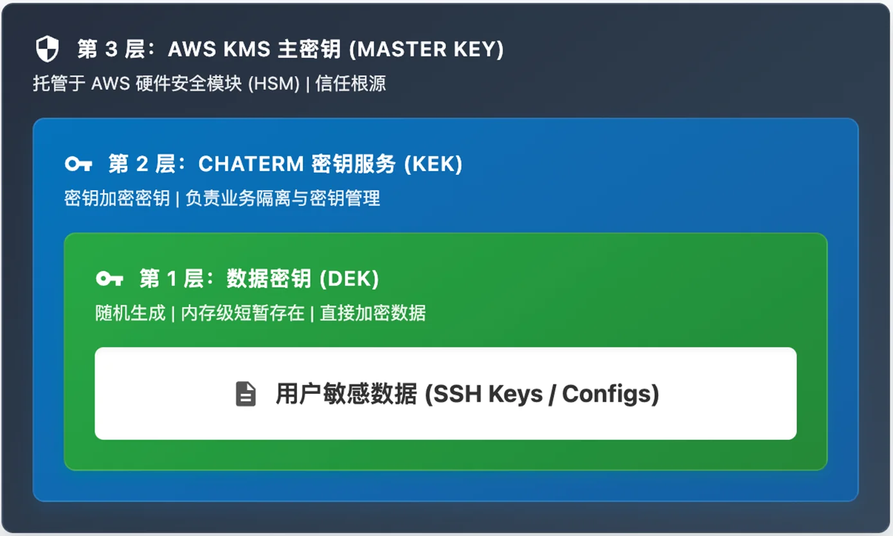
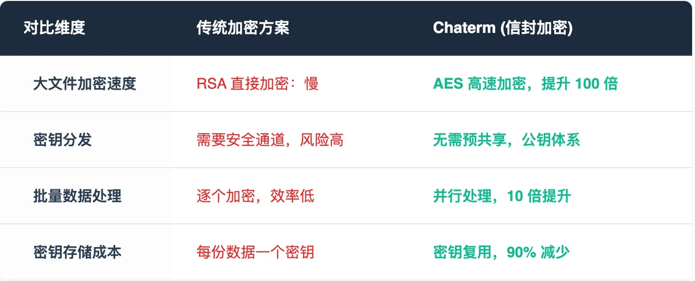
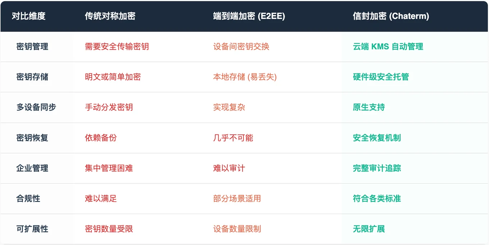
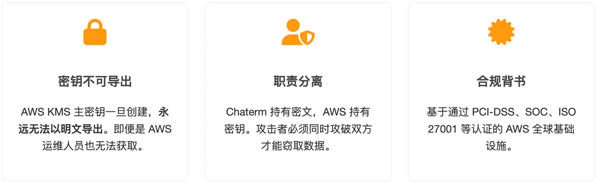
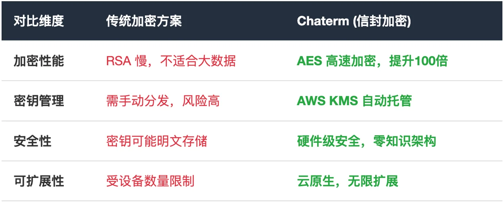
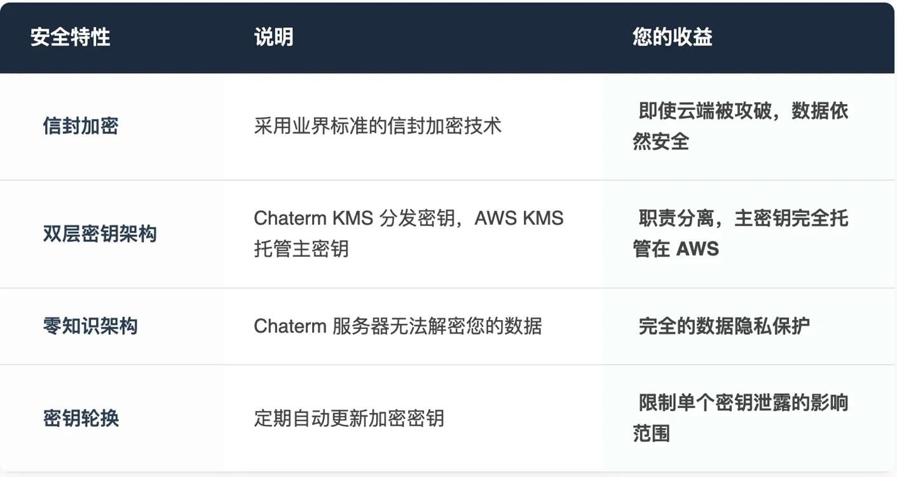

本文档深入介绍 Chaterm 如何使用了 亚马逊云科技 KMS (Key Management Service) 以及信封加密 (Envelope Encryption) 这一现代企业级数据保护技术的核心原理和安全优势。

我们将展示 Chaterm 是如何运用这些技术构建三层密钥架构，实现数据的端到端安全，为用户的 SSH 密钥、服务器配置等敏感数字资产提供银行级别的安全保护。

---

## 1. 为什么数据安全如此重要
在现代IT运维和开发工作中，SSH密钥、服务器密码、数据库连接信息等都是极其敏感的数字资产。这些信息一旦泄露，后果不堪设想：

- **企业核心系统被入侵**
- **重要数据被窃取或勒索**
- **业务服务长时间中断**
- **品牌声誉遭受不可逆的损害**

传统的终端管理工具通常采用简单的密码加密或将数据明文存储在云端，这些方案都存在严重的安全隐患。即使采用了加密，如果密钥管理不当，依然可能被攻破。 **因此，我们需要更加安全、可靠的数据保护技术来应对这些挑战**。

为了解决这个问题，Chaterm 没有选择传统的自建加密方案，而是采用了亚马逊云科技 **KMS 结合 信封加密** 架构。这不仅是一个技术选择，更是一种安全承诺——通过架构设计，将数据的“所有权”与“管理权”彻底分离，确保没有任何一方（包括Chaterm自己）能够单方面访问您的敏感信息。

## 2. 什么是信封加密
信封加密（Envelope Encryption）是一种被亚马逊云科技等主流云服务商广泛采用的企业级加密技术。这个名字的由来很形象：就像将一封重要信件放入信封，然后将信封锁进保险箱一样，您的数据经过了双重保护。

### 技术背景
传统的加密方案面临一个困境：

- **对称加密（如AES）：** 加密速度快，适合大量数据，但密钥分发困难
- **非对称加密（如RSA）：** 密钥管理安全，但加密速度慢，不适合大数据量

信封加密巧妙地结合了两者的优点，避开了各自的缺点，成为现代云服务的标准加密方案。

### 核心原理详解

**三层密钥保护体系：** 信封加密的核心是多层密钥隔离，像俄罗斯套娃一样层层保护：

- **数据密钥（DEK）** – 直接加密您的数据，一次性使用后销毁
- **密钥加密密钥（KEK）** – 保护数据密钥，在后端服务中处理
- **主密钥（Master Key）** – 根密钥，托管在亚马逊云科技 KMS中

这种分层设计确保即使某一层被攻破，攻击者也无法获得您的数据。每层密钥都有独立的访问控制，实现了真正的纵深防御。

### 信封加密工作流程

**关键安全点：**

- **密钥分离：** 数据密钥（DEK）与主密钥分离，DEK仅在使用时短暂存在于内存
- **云端保护：** 主密钥由云服务商（如亚马逊云科技）安全托管，企业级安全保障
- **零知识架构：** 云端服务器永远无法获得解密数据的能力

### 安全性深度分析

**多重安全保障**

安全防护体系建立在四个核心维度之上。在密码学安全层面，我们采用AES-256加密算法，即使动用全球所有计算机进行暴力破解也需要数十亿年时间，同时配合GCM模式提供数据机密性和完整性的双重保护，并使用密码学安全的随机数生成器确保密钥的不可预测性。在物理安全方面，主密钥完全托管在云服务商的安全基础设施中，享受通过多项国际安全认证的硬件级保护，包括防侧信道攻击的专业防护措施。访问控制机制通过多因素身份验证确保请求者身份的真实性，实施细粒度的权限管理，并对所有密钥操作进行完整的审计日志记录和实时监控。最后，**前向保密性设计确保即使未来主密钥发生泄露，历史数据依然保持安全**，这得益于每个会话都使用独立的数据密钥，以及定期的密钥轮换机制来限制潜在泄露的影响范围。

### 技术优势详解

**性能优势**

**安全性保证**

在这个过程中，您的SSH私钥获得了多重保护：

- **Chaterm无法读取：** 我们的服务器只能看到密文
- **黑客无法破解：** 没有主密钥无法解密
- **内部人员无法访问：** 主密钥由云服务商管理，Chaterm无法接触
- **您完全掌控：** 只有您的设备能请求解密

并不是简单的将数据丢给 亚马逊云科技 加密，我们设计了严密的双重验证机制：

**信封加密（服务端保护）：** 数据的密文存储在 Chaterm 数据库中，即便黑客拖库，没有 亚马逊云科技 KMS 的主密钥也无法解密。

**用户密钥派生（客户端保护）：** 哪怕是 Chaterm 系统本身，也只能协助您获取加密后的数据密钥（DEK）。解密的最后一步动作发生且仅发生在您的设备内存中。这意味着，如果没有您的主密码参与验证，就连 亚马逊云科技 KMS 和 Chaterm 联手也无法还原您的原始数据。这就是我们所说的“零信任”——我们不信任包括自己在内的任何中间人。

### 与其他加密方案对比

**加密方案对比**

## 3. 什么是 亚马逊云科技 KMS？

在深入了解加密细节之前，我们需要先认识一下 Chaterm 安全架构的核心组件——亚马逊云科技 KMS。

亚马逊云科技 Key Management Service (亚马逊云科技 KMS) 是 亚马逊云科技 提供的一项完全托管的密钥管理服务。如果把您的数据比作珍贵的“信件”，那么 亚马逊云科技 KMS 就是那个全天候由武装押运看守的“中央金库”。

它不仅仅是一个存储密码的地方，更是一个极其严密的加密控制中心，主要具备以下特性：

**集中化管理：** 它允许用户在一个安全的中心位置创建和控制加密密钥，统一管理密钥的生命周期。

**完全托管的基础设施：** 亚马逊云科技 KMS 屏蔽了复杂的底层物理安全细节，用户无需自建昂贵的物理加密机房，即可直接享用通过了国际高标准认证的安全基础设施。

**云原生集成：** 作为 亚马逊云科技 安全生态的核心，它与 亚马逊云科技 的各项服务深度集成，确保了密钥操作的标准化和安全性。

正是基于这样稳固的“信任锚点”，Chaterm 才能构建出后续的信封加密体系。

## 4. 为什么选择 亚马逊云科技 KMS？

Chaterm 之所以将信任的锚点建立在 亚马逊云科技 KMS 之上，是因为它提供了自建方案无法比拟的安全深度：

**1. 密钥的不可导出性（Non-exportable）**

亚马逊云科技 KMS 的设计哲学是“逻辑隔离”。托管在 KMS 中的主密钥（Master Key）一旦创建，根据系统底层设计，永远无法以明文形式导出。

这意味着，即便是 Chaterm 的最高权限管理员，甚至 亚马逊云科技 的运维人员，也无法通过任何 API 或物理手段“提取”出这把根密钥。由于无法拿到根密钥，存储在 Chaterm 数据库中的所有密文数据对任何人来说都只是毫无意义的乱码。

**2. 职责分离（Separation of Duties）**

通过集成 亚马逊云科技 KMS，Chaterm 实现了完美的职责分离：

Chaterm：负责持有加密后的数据（密文）。

亚马逊云科技：负责持有解密的根密钥。

攻击者要想窃取您的数据，必须同时攻破 Chaterm 的服务器防护以及 亚马逊云科技 的全球安全基础设施，并骗过严格的身份验证系统。这种攻击成本在工程学上几乎是不可估量的。

**3. 亚马逊云科技 全球基础设施的合规背书**
数据安全不仅仅是算法问题，更是物理设施问题。亚马逊云科技 KMS 运行在 亚马逊云科技 全球的高安全性数据中心内。这些设施通过了包括 PCI-DSS（支付卡行业数据安全标准）、SOC、ISO 27001 等全球最严苛的合规认证。

选择 Chaterm，意味着您的 SSH 密钥保护水平直接继承了 亚马逊云科技 这种金融级别的安全标准，这远非普通企业自建机房所能企及。

**看得见的防御：CloudTrail 审计与 IAM 权限控制**

除了加密本身，安全还意味着“可知”与“可控”。Chaterm 结合 亚马逊云科技 的管理工具，提供了额外的安全屏障。

**1. 细粒度的权限控制 (IAM)**
通过 亚马逊云科技 Identity and Access Management (IAM)，我们对密钥的使用权限进行了极小化配置。只有经过严格认证的 Chaterm 核心服务进程，在特定的时间窗口内，才有权限向 亚马逊云科技 KMS 发起解密请求。任何未经授权的进程或人员（包括内部开发人员）的访问尝试都会被 亚马逊云科技 直接拒绝。

**2. 完整的审计追踪 (CloudTrail)**
在安全领域，“黑盒”是不可信的。亚马逊云科技 KMS 的每一次 API 调用（无论是加密还是解密），都会被亚马逊云科技 CloudTrail 自动记录下来。

- **谁在调用密钥？**
- **在什么时间？**
- **来自哪个 IP 地址？**  

这些日志是不可篡改的。这意味着任何异常的解密行为（例如非正常时段的批量访问）都会留下永久的数字痕迹。这种透明度是建立用户信任的关键一环。

## 5. Chaterm 如何保护您的数据

**核心安全特性**

- **信封加密：** 数据密钥加密数据，主密钥加密数据密钥，双重保护
- **零信任架构：** 服务端永远无法接触明文数据
- **三层协同密钥架构：** 亚马逊云科技 KMS负责主密钥（Master Key）的安全托管，Chaterm密钥服务负责密钥加密密钥（KEK）的轮换以及数据密钥（DEK）的生成与安全分发
- **密钥隔离：** 密钥管理与数据存储物理分离，主密钥托管在亚马逊云科技基础设施中

**技术创新点**
Chaterm在标准信封加密基础上进行了多项技术增强。首先，我们集成了**零知识架构技术**，能够在验证用户身份的同时完全不暴露密码信息，确保服务器无法获取任何明文数据。其次，采用**分布式密钥生成机制**，通过多方参与的方式生成密钥，有效避免了单点故障对整体安全性的影响。在前沿技术探索方面，我们正在预研同态加密技术，未来将支持在密文状态下直接进行计算操作，进一步提升数据隐私保护水平。最后，针对企业用户需求，我们提供了完善的密钥托管解决方案，既满足了合规性要求，又提供了可靠的灾难恢复机制。

**安全保障措施**

## 6. 用户体验与安全的完美平衡

使用Chaterm时，所有的加密操作都在后台自动完成：

- **无感知加密：** 您正常使用终端功能，系统自动使用亚马逊云科技 KMS加密所有敏感数据
- **快速同步：** 亚马逊云科技 KMS 专为高并发场景设计，解密请求的响应时间通常在毫秒级别。
- **离线可用：** 本地缓存确保断网时也能正常工作
- **多设备支持：** 在任何设备上都能安全访问您的配置
- **本地优化：** 由于大量数据使用的是“信封加密”产生的本地数据密钥进行处理，只有在建立会话的握手阶段才需要调用 亚马逊云科技 KMS。

## 7. 适用场景

Chaterm的信封加密技术特别适合以下场景：

**个人开发者**
- 在家庭和办公室电脑间同步SSH配置
- 保护个人服务器和云服务的访问凭证
- 防止笔记本丢失导致的密钥泄露

**运维团队**
- 团队成员安全共享服务器访问权限
- 集中管理但分散控制的密钥体系
- 满足安全审计和合规要求

## 8. 结语：将信任交给专业架构

在网络安全日益严峻的今天，仅仅依靠“承诺”已不足以取信于人。Chaterm 通过引入 亚马逊云科技 KMS 信封加密技术，将数据安全建立在**数学算法、职责分离架构以及亚马逊云科技 经过验证的基础设施之上**。

我们坚信，最好的安全架构是让平台方“无权作恶”。通过 亚马逊云科技 KMS，Chaterm 做到了这一点：您的钥匙属于您，您的数据属于您，而我们，只是那个帮您守护保险箱的、值得信赖的守夜人。

## 9. 常见问题

**Q: 如果Chaterm的服务器被攻击了，我的数据安全吗？**

A: 安全的。由于采用信封加密，服务器上只存储加密后的数据，且无法访问解密密钥。即使服务器被完全控制，攻击者也无法解密您的数据。

**Q: 如果我忘记了账户主密码怎么办？**

A: 出于安全考虑，我们无法帮您恢复密码。建议使用密码管理器妥善保管，或通过邮箱、第三方登录后，进行用户密码恢复操作。

**Q: 信封加密会影响性能吗？**

A: 几乎没有影响。现代加密算法经过高度优化，加密/解密操作在毫秒级完成。

**Q: Chaterm员工能看到我的数据吗？**

A: 不能。采用零知识架构，所有数据在您的设备上加密，我们只能看到无意义的密文。

## 10. 参考文献

想深入了解信封加密技术？推荐以下资源：

- https://en.wikipedia.org/wiki/Envelope_encryption

- https://docs.aws.amazon.com/kms/latest/developerguide/concepts.html

## 原文链接

https://aws.amazon.com/cn/blogs/china/chaterm-aws-kms-envelope-encryption-for-zero-trust-security/