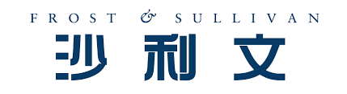

Frost&Sullivan 2025 年 12 月可灵 AI 与 合合信息 Chaterm AI 获评 2025 年生成式 AI 最佳实践案例。

沙利文联合头豹研究院发布了《2025 年中国生成式AI行业最佳应用实践》，报告指出，得益于人工智能研究的持续火热，人工智能论文发表总量持续增长，人工智能在严苛比较基准测试中的性能持续提升，并且实现特定性能水平的推理成本已显著下降。

---

 

  

## Frost and Sullivan 报告: 2025 年中国生成式 AI 行业最佳实践

沙利文联合头豹研究院发布了《2025 年中国生成式AI行业最佳应用实践》，报告指出，得益于人工智能研究的持续火热，人工智能论文发表总量持续增长，人工智能在严苛比较基准测试中的性能持续提升，并且实现特定性能水平的推理成本已显著下降。生成式 AI（GenAI）极大地提升了内容生成的效率和质量，Agentic AI 正在进一步通过引入自主性、目标导向和多步骤执行能力，在生成式 AI 的基础上创造了全新的、更深层次的价值。报告分析了海外的优质生成式 AI 案例，并通过四个维度评选出了来自八个行业的 2025 年中国生成式 AI 最佳实践案例。

## 报告链接

 [https://aws.amazon.com/cn/resources/analyst-reports/china-brand-awareness-content-download-25-frost-sullivan-ardm-best-practice-of-generative-ai-across-industries-in-china-report-learn/](https://aws.amazon.com/cn/resources/analyst-reports/china-brand-awareness-content-download-25-frost-sullivan-ardm-best-practice-of-generative-ai-across-industries-in-china-report-learn/)