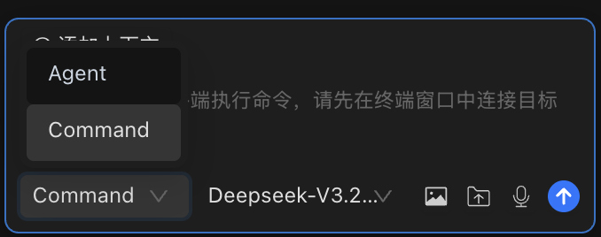

# AI 对话

AI 对话面板是您与 AI 交互的核心枢纽 -- 生成命令、规划复杂任务、自动化多主机操作。



## 两种模式，适应各种工作流

Chaterm 提供两种不同的对话模式，每种模式对应不同层级的 AI 参与度。根据您的任务选择合适的模式。

### Command 模式

**AI 为当前活跃终端生成命令 -- 执行前需要您的确认。**

在 Command 模式下，AI 会分析您的请求并生成一条或多条终端命令。每条命令都会展示给您审核，您可以在执行前批准、编辑或拒绝。

**对话示例：**

> **您：** 查找 /var/log 下所有大于 100MB 的日志文件并压缩它们。
>
> **AI：** 以下是查找并压缩这些文件的命令：
>
> ```bash
> find /var/log -name "*.log" -size +100M -exec gzip {} \;
> ```
>
> **[批准]** **[拒绝]**

::: warning
在 Command 模式下，命令会在您**当前活跃的终端**中运行。请在批准前确认您连接的是正确的主机。
:::

---

### Agent 模式

**AI 自主执行跨一台或多台主机的多步骤任务。**

Agent 模式赋予 AI 规划、执行、观察结果并自适应调整的能力。它可以通过 `@` 提及语法在多台主机上操作。AI 会持续工作直到任务完成或需要您的输入。

**对话示例：**

> **您：** @web-server-01 @web-server-02 检查两台主机的磁盘使用情况。如果任何分区使用率超过 80%，查找并列出最大的 10 个文件。
>
> **AI：** 正在 2 台主机上启动任务...
>
> _[在 web-server-01 上执行 `df -h`]_ -- 所有分区均低于 80%，无需操作。
>
> _[在 web-server-02 上执行 `df -h`]_ -- `/data` 使用率为 87%。
>
> _[在 web-server-02 上执行 `du -ah /data | sort -rh | head -10`]_ -- 以下是最大的 10 个文件...

::: tip
在 Agent 模式下，在输入框中输入 `@` 可以查看可用主机列表。您可以选择多台主机进行跨服务器操作。
:::

---

## 上传文件和图片

您可以在任何消息中附加文件和图片，为 AI 提供额外的上下文信息。

| 类型         | 支持的格式                                                                                                                                                          | 最大大小 | 如何附加                           |
| ------------ | ------------------------------------------------------------------------------------------------------------------------------------------------------------------- | -------- | ---------------------------------- |
| **图片**     | `.png`, `.jpg`, `.jpeg`, `.webp`                                                                                                                                    | 5 MB     | 拖拽到输入框，或点击上传按钮       |
| **文本/代码文件** | `.txt`, `.md`, `.js`, `.ts`, `.py`, `.java`, `.cpp`, `.c`, `.html`, `.css`, `.json`, `.xml`, `.yaml`, `.yml`, `.sql`, `.sh`, `.bat`, `.ps1`, `.log`, `.csv`, `.tsv` | 1 MB     | 拖拽到输入框，或点击上传按钮       |

代码文件会根据其扩展名自动包裹在语法高亮的代码块中。

---

## 历史记录管理

每段对话都会自动保存。您可以回顾、搜索和整理过去的对话。

### 查看和恢复历史记录

1. 点击 AI 对话面板左上角的**菜单按钮**。
2. 使用搜索栏按标题**浏览或搜索**历史记录。
3. 点击任意历史记录条目即可**恢复**该对话。

### 整理历史记录

- **收藏**对话：点击星标图标 -- 收藏的对话会显示在列表顶部。
- **重命名**对话：点击标题并输入新名称。
- **删除**对话：点击历史记录条目上的删除图标。

历史记录支持**分页**功能，即使对话数量很多也能轻松浏览。

---

## 布局切换

Chaterm 提供两种界面布局，让您可以将焦点放在需要的地方。

| 布局             | 说明                                             | 最佳适用场景                           |
| ---------------- | ------------------------------------------------ | -------------------------------------- |
| **Terminal 布局** | 终端占据主区域；AI 侧边栏为辅助面板             | 以终端为中心的工作流，AI 辅助协作     |
| **Agents 布局**  | AI 对话占据主区域；终端为辅助面板               | 以 AI 驱动的工作流，终端负责执行     |

**使用快捷键即时切换布局：**

- **macOS：** `Cmd + E`
- **Windows / Linux：** `Ctrl + E`

您也可以在 [通用设置](/docs/settings/general/) 中更改布局。更改立即生效，无需重启。

---

## 相关文档

- [AI 设置](/docs/ai/settings/) -- 配置提供商、模型和创建新对话
- [AI 偏好设置](/docs/ai/preferences/) -- 调整推理深度、自动执行和安全策略
- [模型配置](/docs/ai/llms/) -- 添加和管理 AI 模型提供商
