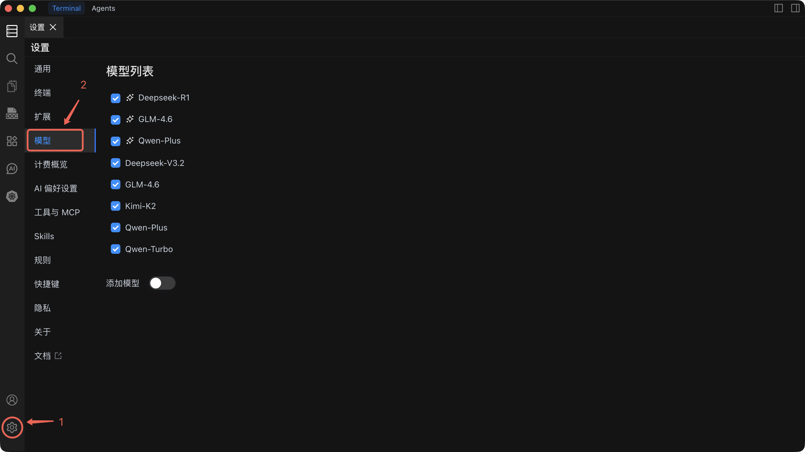

# 模型列表

Chaterm 开箱即支持多种 AI 模型提供商，您还可以添加自定义提供商以获得最大灵活性。

## 内置模型

Chaterm 内置了多个高质量的预配置模型，开箱即用，无需额外设置。只需在任何 AI 对话中从模型下拉菜单选择即可。

## 快速开始：添加您的第一个自定义模型

按照以下步骤添加自定义模型提供商。下面以 OpenAI 为例，其他提供商的流程类似。

1. 点击右上角齿轮图标打开**设置**。
2. 在左侧菜单中导航到**"模型"**选项卡。
3. 点击**"添加模型"**。
4. 从提供商列表中选择 **OpenAI**（或您偏好的提供商）。
5. 输入 **API 端点 URL**（例如 `https://api.openai.com/v1`）。
6. 粘贴您的 **API 密钥**。
7. 输入或选择**模型名称**（例如 `gpt-5`）。
8. 点击**"测试连接"** -- 显示成功消息表示一切正常。
9. 点击**"保存"** -- 该模型现在会出现在所有 AI 对话的模型下拉菜单中。

::: tip 推荐首次设置
如果您是 Chaterm AI 功能的新用户，建议从 **DeepSeek** 或 **OpenAI** 开始。两者都只需要一个 API 密钥，设置简单直观，并且提供强大的通用模型，适合命令生成和 Agent 任务。
:::

---

## 提供商参考

### 1. LiteLLM

通过统一的 LiteLLM 网关连接多种模型提供商。

| 配置项       | 说明                                           | 是否必需 |
| ------------ | ---------------------------------------------- | -------- |
| **URL 地址** | LiteLLM 服务端点                               | 是       |
| **API Key**  | LiteLLM 网关的访问密钥                         | 是       |
| **模型名称** | 模型标识符（例如 `gpt-5`、`claude-sonnet-4-6`） | 是       |

**最适合：** 已经运行 LiteLLM 代理、通过统一端点访问多个提供商的团队。

---

### 2. OpenAI

直接连接 OpenAI 或任何 OpenAI 兼容的 API。

| 配置项              | 说明                                                              | 是否必需 |
| ------------------- | ----------------------------------------------------------------- | -------- |
| **OpenAI URL 地址** | API 端点（默认：`https://api.openai.com/v1`）                     | 是       |
| **OpenAI API Key**  | 您的 OpenAI API 密钥                                              | 是       |
| **模型名称**        | 使用的模型（例如 `gpt-5`、`claude-sonnet-4-6`、`claude-opus-4-5`） | 是       |

**最适合：** 直接使用 OpenAI 模型，或连接到提供 OpenAI 兼容 API 的第三方服务。

---

### 3. Amazon Bedrock

使用 AWS Bedrock 获得企业级 AI 服务，具备 AWS 安全性和合规性。

| 配置项              | 说明                               | 是否必需 |
| ------------------- | ---------------------------------- | -------- |
| **AWS Access Key**  | IAM 访问密钥 ID                    | 是       |
| **AWS Secret Key**  | IAM 秘密访问密钥                   | 是       |
| **AWS Session Token** | 临时会话令牌（用于角色扮演）     | 否       |
| **AWS 区域**        | 服务区域（例如 `us-east-1`）       | 是       |
| **自定义 VPC 端点** | 基于 VPC 访问的私有端点            | 否       |
| **跨区域推理**      | 启用跨多个区域的推理               | 否       |
| **模型名称**        | Bedrock 模型标识符                 | 是       |

**最适合：** 已投入 AWS 生态、需要企业级安全、合规控制和私有网络访问的组织。

---

### 4. DeepSeek

连接 DeepSeek API，获得强大的推理和编码能力。

| 配置项               | 说明                                                   | 是否必需 |
| -------------------- | ------------------------------------------------------ | -------- |
| **DeepSeek API Key** | 您的 DeepSeek API 密钥                                 | 是       |
| **模型名称**         | 使用的模型（例如 `deepseek-chat`、`deepseek-reasoner`） | 是       |

**最适合：** 以高性价比获取具有强大推理和代码生成能力的模型。

---

### 5. Ollama（本地部署）

在本地运行模型，实现最大隐私保护和离线访问。

| 配置项              | 说明                                                            | 是否必需 |
| ------------------- | --------------------------------------------------------------- | -------- |
| **Ollama URL 地址** | 本地服务地址（默认：`http://localhost:11434`）                   | 是       |
| **模型名称**        | 本地已安装的模型（例如 `llama3`、`codellama`、`mistral`）        | 是       |

**最适合：** 气隙环境、对数据敏感的工作负载，或无需 API 费用的实验性使用。

::: tip
测试连接前请确保 Ollama 服务正在运行。您可以使用 `ollama serve` 启动服务，使用 `ollama pull <模型名称>` 拉取模型。
:::

---

## 配置技巧

- **每次修改后测试** -- 修改任何提供商配置后，请务必点击"测试连接"。
- **多模型支持** -- 您可以同时配置多个提供商和模型，然后按对话切换使用。
- **API 密钥安全** -- Chaterm 将凭证存储在本地。请定期向您的提供商轮换密钥。
- **性能考量** -- 关注响应时间。本地模型（Ollama）没有网络延迟，但取决于您的硬件性能。云端模型在强大的服务器上更快，但会增加网络往返时间。

---

## 相关文档

- [AI 设置](/docs/ai/settings/) -- 逐步创建对话和配置提供商
- [AI 偏好设置](/docs/ai/preferences/) -- 调整推理深度、自动执行和安全策略
