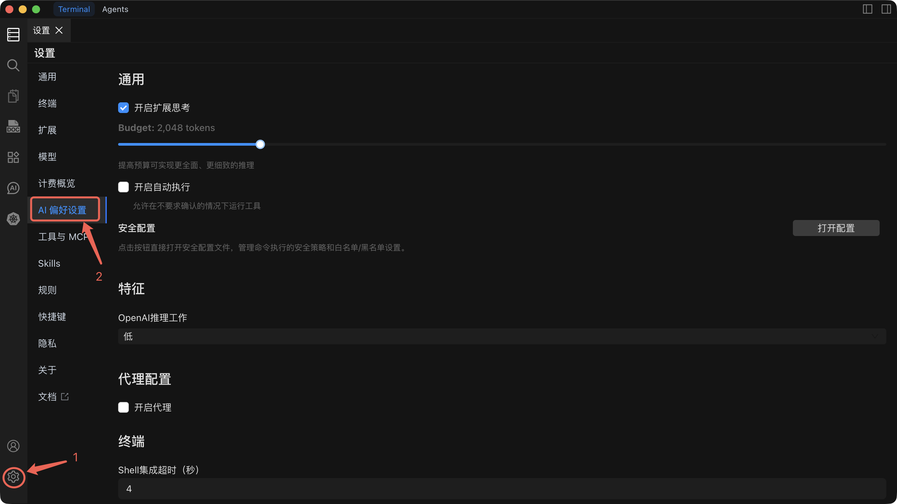

# AI 偏好设置

微调 AI 助手的行为方式，从推理深度到命令执行策略。

## 设置参考

| 设置项                   | 默认值 | 功能说明                                                                                                                               | 何时调整                                                                                                                      |
| ------------------------ | ------ | -------------------------------------------------------------------------------------------------------------------------------------- | ----------------------------------------------------------------------------------------------------------------------------- |
| **扩展思考**             | 开启   | 为 AI 分配一个 token 预算，在回复前进行逐步推理。更高的预算能产生更全面、更准确的回答。                                                | 复杂的多步骤任务时增加预算。简单问题需要更快响应时减少（或关闭）预算。                                                        |
| **自动执行只读命令**     | 关闭   | 所有会话中的只读命令（如 ls、cat、grep）将自动执行，无需确认。                                                                         | 仅在熟悉 AI 的行为后再启用。                                                                                                 |
| **自动执行**             | 关闭   | 启用后，Agent 模式会自动执行命令，无需等待您的批准。                                                                                   | 仅在熟悉 AI 的行为并已配置安全规则阻止危险命令后再启用。                                                                     |
| **安全配置**             | --     | 定义策略，防止 AI 执行危险或破坏性命令（例如 `rm -rf /`、`DROP DATABASE`）。                                                           | 在启用自动执行前进行配置。每当环境或风险容忍度发生变化时进行审查和更新。                                                      |
| **OpenAI 推理级别**      | 低     | 控制 OpenAI 模型的推理强度：**低**（快速，成本低）、**中**（均衡）、**高**（深度推理，准确性最高）。                                    | 复杂故障排查或规划任务时提升至中或高。日常操作保持低级别以节省成本和延迟。                                                    |
| **代理配置**             | 关闭   | 通过 HTTP/SOCKS 代理路由 AI API 流量。可配置协议、主机名、端口和可选的身份认证。                                                       | 当您的网络需要代理才能访问外部 API 端点时启用。使用 Ollama 等本地模型时不需要。                                               |
| **Shell 集成超时**       | 4 秒   | 执行命令时终端等待 Shell 集成初始化的最大时间。                                                                                        | 在慢速连接或负载较重的主机上出现超时错误时增加。在无响应的主机上希望更快失败时减少。                                          |

---

## 扩展思考

扩展思考为 AI 提供了一个专门的推理阶段，在生成回复之前进行思考。您可以控制分配给该阶段的 token 预算。

- **更高预算** = 更全面的推理，复杂任务的准确性更好，但响应更慢。
- **更低预算** = 更快的响应，对于简单问题已经足够。

在偏好设置面板中调整预算滑块，找到适合您工作流的平衡点。

---

## 自动执行

::: warning 安全影响
启用自动执行后，AI 将**无需您的确认**即可运行命令。这对自动化来说功能强大，但也带有风险。错误的提示或意外的 AI 行为可能会执行破坏性命令。

**启用自动执行前：**

1. 配置**安全规则**以阻止危险命令。
2. 在手动模式下用您的常用提示测试 AI 的行为。
3. 先在非生产环境中使用。
:::

关闭时（默认状态），AI 生成的每条命令都需要您明确批准后才会执行。

---

## 安全配置

安全配置允许您定义命令或模式的黑名单，无论自动执行设置如何，AI 都不允许执行这些命令。

- 为危险操作添加模式（例如 `rm -rf`、`mkfs`、`shutdown`、`DROP TABLE`）。
- 规则同时适用于 Command 模式和 Agent 模式。
- 随着环境的变化，定期审查您的安全规则。

---

## OpenAI 推理级别

此设置仅影响 OpenAI 兼容的模型。它控制模型投入多少推理能力：

| 级别   | 响应速度 | 准确性                 | 成本   |
| ------ | -------- | ---------------------- | ------ |
| **低** | 最快     | 适合日常任务           | 最低   |
| **中** | 适中     | 适合较复杂的问题       | 适中   |
| **高** | 最慢     | 适合复杂推理任务       | 最高   |

---

## 代理配置

如果您的网络需要代理才能访问外部 AI API，请在此处配置。代理默认为关闭状态。

- **协议** -- HTTP、HTTPS 或 SOCKS5
- **主机名** -- 代理服务器地址
- **端口** -- 代理服务器端口
- **用户名 / 密码** -- 可选的身份认证凭证

::: tip
代理设置全局应用于所有 AI API 流量。如果您通过 Ollama 使用本地模型，发往 `localhost` 的流量会绕过代理。
:::

---

## Shell 集成超时

Shell 集成超时控制 Chaterm 在执行命令时等待终端 Shell 初始化集成钩子的最长时间。如果超时，命令执行将被中止以防止阻塞。

默认的 **4 秒**适用于大多数连接。对于高延迟或负载较重的远程主机，请适当增加。

---

## 相关文档

- [AI 对话](/docs/ai/dialogs/) -- 了解 Command 和 Agent 模式
- [AI 设置](/docs/ai/settings/) -- 配置提供商、模型和创建新对话
