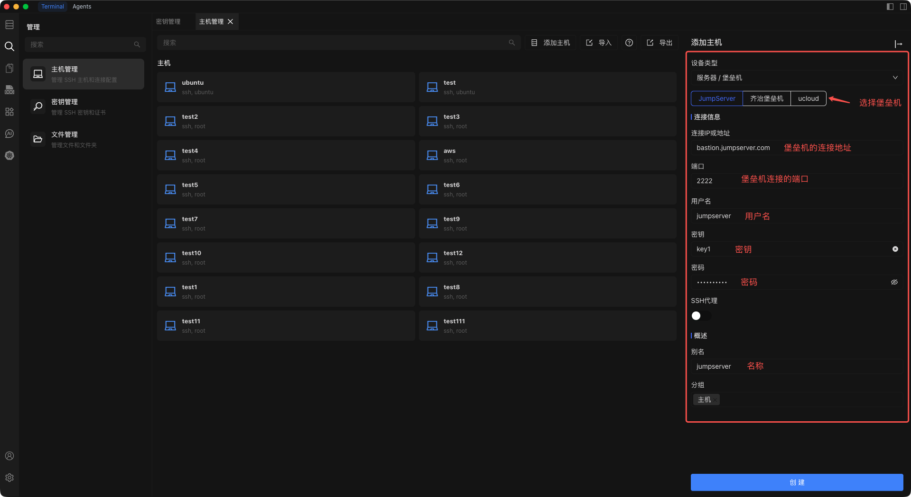
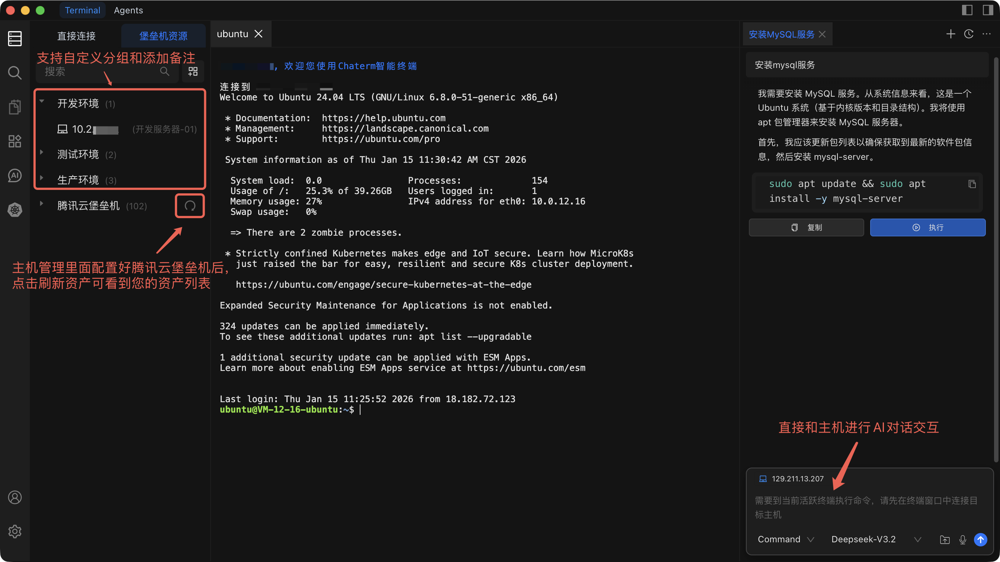

# 添加堡垒机

将堡垒机添加到 Chaterm，以访问从集中式堡垒机（跳板服务器）系统同步的企业级资产。

::: info 什么是堡垒机？
堡垒机（也称跳板服务器）是一台加固的网关服务器，位于您的本地机器和需要管理的内部服务器之间。您无需直接连接每台服务器，而是通过堡垒机进行连接，堡垒机负责执行访问控制、审计和安全策略。企业使用堡垒机来集中管理谁可以访问哪些服务器，并维护所有会话的完整审计记录。
:::

## 前置条件

添加堡垒机之前，请确保您已准备好：

- **Chaterm 已安装** 并正在运行。如果尚未安装，请参阅 [下载](/docs/start/downloads/)。
- **堡垒机凭据** -- 通常是 SSH 密钥和密码的组合，具体取决于您组织的堡垒机系统要求。
- **连接地址** -- 堡垒机的 IP 地址或域名，以及 SSH 端口。
- 由组织管理员授予的通过堡垒机连接的 **访问权限**。

## 操作步骤

1. 从左侧边栏打开 **主机管理** 页面。
2. 点击主机管理页面右上角的 **添加主机** 按钮。
3. 在打开的 **添加主机** 侧边栏中，将 **设备类型** 设为 **服务器/堡垒机**。
4. 填写下表所述的其余配置项。
5. 点击 **创建** 保存堡垒机。

## 配置项说明

| 配置项 | 说明 | 必填 |
| --- | --- | --- |
| **设备类型** | 选择 **服务器/堡垒机** 表示这是堡垒机资源。 | 是 |
| **连接 IP/URL** | 堡垒机的 IP 地址或域名（如 `bastion.corp.example.com`）。 | 是 |
| **端口** | 堡垒机上的 SSH 服务端口，默认值为 `22`。 | 是 |
| **用户名** | 堡垒机系统分配给您的 SSH 登录用户名。 | 是 |
| **密钥** | 选择堡垒机要求的 SSH 认证密钥。密钥可在 [密钥管理](/docs/manage/keys/) 中管理。 | 是 |
| **密码** | 堡垒机要求的认证密码。某些堡垒机系统同时要求密钥和密码以实现双因素认证。 | 是 |
| **SSH 代理** | 如果堡垒机本身需要通过中间代理服务器才能访问，请在此配置代理详情。直接连接时留空。 | 否 |
| **别名** | 便于在主机列表中识别此堡垒机的显示名称（如 `生产堡垒机`）。 | 是 |
| **分组** | 将堡垒机分配到分组以便于管理（如 `bastion`、`production`）。可选择现有分组或输入新名称。 | 否 |

## 同步堡垒机资产

添加堡垒机后，Chaterm 会在堡垒机资源页面显示它以及通过它可访问的内部资产列表。

要使用堡垒机系统的最新信息更新资产列表：

1. 在工作区中导航到 **堡垒机资源** 标签。
2. 找到您要刷新的堡垒机条目。
3. 点击堡垒机旁边的 **刷新** 按钮以手动同步最新资产数据。

同步完成后，内部资产将像个人主机一样显示在列表中。点击任意资产即可建立 SSH 连接。您也可以右键点击资产将其添加到收藏夹、添加备注或分配到自定义分组。

## 自定义分组管理

您可以创建自定义分组，以适合您团队的方式组织堡垒机资产：

1. 在工作区中，选择 **堡垒机资源** 标签。
2. 点击右上角的 **自定义分组** 按钮。
3. 填写分组详情：
   - **分组名称** -- 简短的描述性名称（如 `Web 服务器`、`数据库层`）。
   - **分组描述** -- 可选的备注，说明该分组包含的内容。
4. 点击 **保存** 创建分组。

要编辑或删除现有自定义分组，在堡垒机资源页面右键点击该分组，从右键菜单中选择相应操作。

## 相关页面

- [密钥管理](/docs/manage/keys/) -- 导入和管理用于堡垒机认证的 SSH 密钥。
- [连接到主机](/docs/hosts/connect) -- 了解连接到堡垒机资产时可用的终端功能。
- [编辑、克隆与删除](/docs/hosts/edit-clone-delete) -- 修改或删除堡垒机条目。
