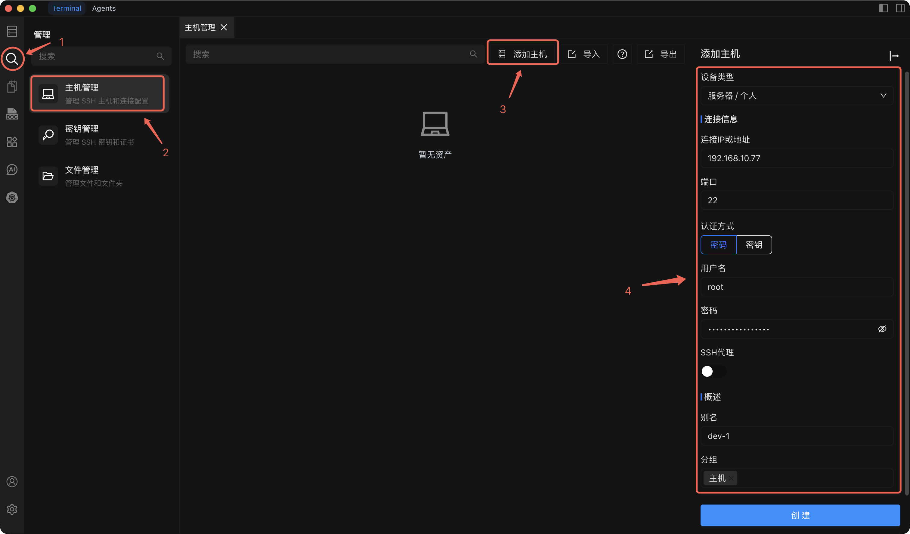

# 添加个人主机

将个人服务器添加到 Chaterm，以便您可以直接从工作区通过 SSH 连接。

## 前置条件

添加个人主机之前，请确保您已准备好以下内容：

- **Chaterm 已安装** 并在您的机器上运行。如果尚未安装，请参阅 [下载](/docs/start/downloads/)。
- 目标服务器的 **SSH 凭据** -- 密码或 SSH 私钥。
- **服务器 IP 地址**（或主机名）和 SSH 端口号（默认 `22`）。

## 操作步骤

1. 从左侧边栏打开 **主机管理** 页面。
2. 点击主机管理页面右上角的 **添加主机** 按钮。
3. 在打开的 **添加主机** 侧边栏中，将 **设备类型** 设为 **服务器/个人**。
4. 填写下表所述的其余配置项。
5. 点击 **创建** 保存主机。

## 配置项说明

| 配置项 | 说明 | 必填 |
| --- | --- | --- |
| **设备类型** | 选择 **服务器/个人** 表示这是个人服务器。 | 是 |
| **连接 IP 或地址** | 目标服务器的 IP 地址或主机名（如 `192.168.1.100` 或 `dev.example.com`）。 | 是 |
| **端口** | 目标服务器上的 SSH 服务端口，默认值为 `22`。仅在服务器使用非标准端口时才需修改。 | 是 |
| **用户名** | SSH 登录用户名（如 `root`、`ubuntu`、`deploy`）。 | 是 |
| **认证方式** | 选择 **密码** 或 **SSH 密钥**。参见下方提示了解详情。 | 是 |
| **SSH 代理** | 如果服务器位于防火墙或 NAT 之后，可配置 SSH 代理通过中间服务器路由连接。直接连接时留空。 | 否 |
| **别名** | 便于识别的显示名称，帮助您在主机列表中快速找到该主机（如 `开发 API 服务器`）。 | 是 |
| **分组** | 将主机分配到分组以便于管理（如 `development`、`production`）。可选择现有分组或输入新分组名称。 | 否 |

## 认证方式说明

::: tip 选择认证方式
- **密码认证** 是最简单的选项。输入指定用户名的 SSH 密码即可。
- **密钥认证** 更安全，推荐用于生产服务器。选择已在 [密钥管理](/docs/manage/keys/) 中导入的 SSH 密钥，或点击链接先添加新密钥再返回此处选择。
:::

## 下一步

点击 **创建** 后，新主机将出现在主机管理页面的主机列表中。接下来您可以：

- **立即连接** -- 点击主机条目打开 SSH 终端会话。详见 [连接到主机](/docs/hosts/connect) 了解会话期间可用的终端功能。
- **编辑或整理** -- 右键点击主机可重命名、克隆、移动到其他分组或删除。详见 [编辑、克隆与删除](/docs/hosts/edit-clone-delete)。
- **管理 SSH 密钥** -- 如需后续轮换或添加密钥，请访问 [密钥管理](/docs/manage/keys/)。
