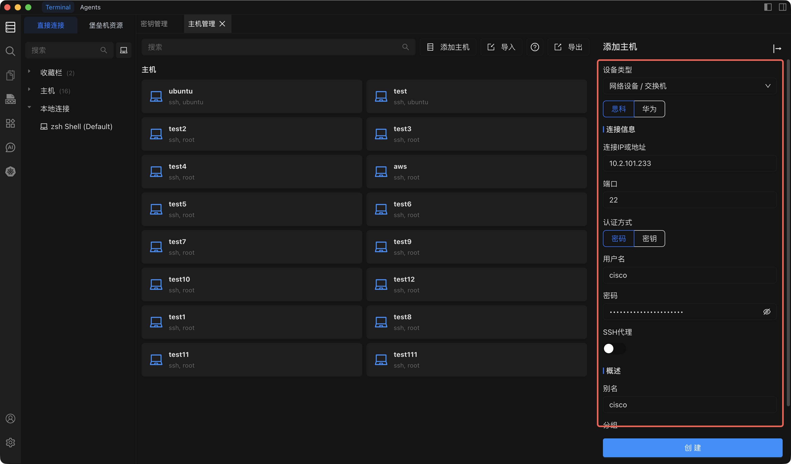

# 添加路由器

将路由器或网络设备（如交换机或防火墙）添加到 Chaterm，以便您可以通过 SSH 与服务器一起管理它们。

## 路由器与个人主机的区别

对于运行网络操作系统（如 Cisco、华为等）的硬件设备，请使用 **网络设备/交换机** 类型。这些设备的 shell 行为通常与标准 Linux/Unix 服务器不同，命令集也更为有限。

对于运行标准操作系统的通用服务器、虚拟机和云实例，请使用 **服务器/个人** 类型。详见 [添加个人主机](/docs/hosts/add-personal)。

## 前置条件

添加路由器之前，请确保您已准备好：

- **Chaterm 已安装** 并正在运行。如果尚未安装，请参阅 [下载](/docs/start/downloads/)。
- **设备凭据** -- 网络设备的密码或 SSH 私钥。
- **设备 IP 地址**（或主机名）和 SSH 端口号（默认 `22`）。
- 网络设备上已 **启用 SSH**。许多路由器和交换机出厂时默认禁用 SSH，请查阅设备文档以启用。

## 操作步骤

1. 从左侧边栏打开 **主机管理** 页面。
2. 点击主机管理页面右上角的 **添加主机** 按钮。
3. 在打开的 **添加主机** 侧边栏中，将 **设备类型** 设为 **网络设备/交换机**。
4. 填写下表所述的其余配置项。
5. 点击 **创建** 保存设备。

## 配置项说明

| 配置项             | 说明                                                                                                  | 必填 |
| ------------------ | ----------------------------------------------------------------------------------------------------- | ---- |
| **设备类型**       | 选择 **网络设备/交换机** 表示这是路由器、交换机或类似网络设备。                                       | 是   |
| **连接 IP 或地址** | 设备的管理 IP 地址或主机名（如 `10.0.0.1` 或 `core-switch.lan`）。                                    | 是   |
| **端口**           | 设备上的 SSH 服务端口，默认值为 `22`。                                                                | 是   |
| **用户名**         | 设备上配置的 SSH 登录用户名（如 `admin`、`cisco`）。                                                  | 是   |
| **认证方式**       | 选择 **密码** 或 **SSH 密钥**。参见下方提示了解详情。                                                 | 是   |
| **SSH 代理**       | 如果网络设备位于隔离的管理 VLAN 或防火墙之后，可配置 SSH 代理通过中间服务器路由连接。直接连接时留空。 | 否   |
| **别名**           | 便于在主机列表中快速识别此设备的显示名称（如 `核心交换机 - DC1`）。                                   | 是   |
| **分组**           | 将设备分配到分组以便于管理（如 `network`、`switches`、`firewalls`）。可选择现有分组或输入新名称。     | 否   |

## 认证方式说明

::: tip 选择认证方式

- **密码认证** -- 输入网络设备上配置的 SSH 密码。这是路由器和交换机最常用的方式。
- **密钥认证** -- 选择已在 [密钥管理](/docs/manage/keys/) 中导入的 SSH 密钥。许多现代网络操作系统支持基于密钥的认证，建议在支持时使用。
  :::

## 相关页面

- [添加个人主机](/docs/hosts/add-personal) -- 添加标准服务器和虚拟机。
- [添加堡垒机](/docs/hosts/add-bastion) -- 添加企业堡垒机/跳板服务器。
- [连接到主机](/docs/hosts/connect) -- 了解会话期间可用的终端功能。
- [密钥管理](/docs/manage/keys/) -- 导入和管理 SSH 密钥。
