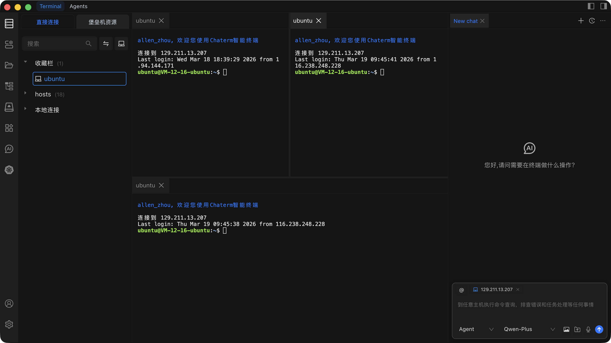

# 连接到主机

将主机添加到 Chaterm 后，您只需单击即可打开到该主机的 SSH 会话。

## 如何连接

1. 从左侧边栏打开 **主机管理** 页面，或在工作区中找到目标主机。
2. 在主机列表中点击目标主机条目。
3. Chaterm 建立 SSH 连接并为该会话打开终端窗口。

## 连接失败排查

如果连接失败或意外断开，请尝试以下步骤：

1. **验证网络可达性** -- 确保您的机器可以到达目标主机。尝试从本地终端 ping 主机 IP 地址。
2. **检查凭据** -- 确认用户名、密码或 SSH 密钥正确。您可以通过编辑主机条目来更新凭据（详见 [编辑、克隆与删除](/docs/hosts/edit-clone-delete)）。
3. **确认 SSH 服务正在运行** -- 确保目标主机上的 SSH 守护进程（如 `sshd`）正在运行并监听配置的端口。
4. **检查端口号** -- SSH 默认端口为 `22`。如果服务器使用不同端口，请确保 Chaterm 中的主机条目匹配。
5. **检查防火墙规则** -- 服务器或网络上的防火墙可能阻止了 SSH 端口。验证 SSH 端口的入站流量是否被允许。
6. **检查 SSH 代理** -- 如果配置了 SSH 代理，请确保代理服务器本身可达且配置正确。
7. **轮换或重新导入密钥** -- 如果使用密钥认证且密钥最近在服务器上更改过，请在 [密钥管理](/docs/manage/keys/) 中更新或重新导入密钥。

## 终端功能

连接后，终端窗口提供多种提高效率的功能：

### 多标签页

同时打开多台主机的连接。每个连接在终端区域顶部以独立标签页打开。点击标签页可在会话间切换，也可使用快捷键快速切换。

### 分屏

水平或垂直分割终端区域，并排查看多个会话。当您需要比较不同服务器的输出或在一台主机上运行命令同时监控另一台时非常有用。

### 右键菜单

右键点击终端标签页可访问快捷操作：

- **关闭** 当前标签页。
- **重命名** 标签页以便于识别。
- **克隆** 会话，在新标签页中打开重复连接。
- 其他取决于上下文的操作。

### 终端搜索

使用快捷键或菜单打开终端内的搜索面板。您可以在终端输出历史中搜索特定命令、日志条目或文本。

## 相关页面

- [终端操作](/docs/terminal/operations/) -- 了解高级终端功能，如代码片段、自动补全和 AI 辅助命令。
- [添加个人主机](/docs/hosts/add-personal) -- 将新服务器添加到主机列表。
- [添加堡垒机](/docs/hosts/add-bastion) -- 添加企业堡垒机/跳板服务器。
- [添加路由器](/docs/hosts/add-router) -- 添加网络设备。
- [密钥管理](/docs/manage/keys/) -- 管理用于认证的 SSH 密钥。
