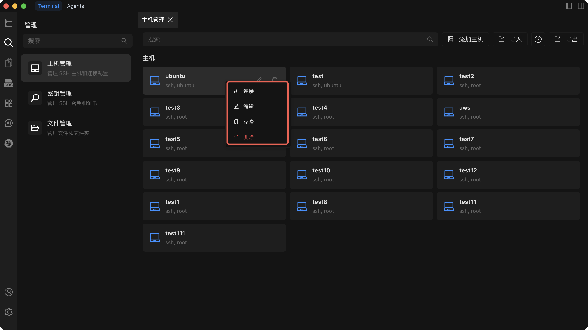

# 编辑、克隆或删除主机

通过编辑配置、将主机克隆为模板或从列表中删除来管理现有主机。

## 编辑主机

1. 在列表中右键点击主机并选择 **编辑**。
2. 修改以下任意配置项：
   - 连接 IP 或地址
   - 端口
   - 用户名
   - 认证方式（密码或 SSH 密钥）
   - SSH 代理设置（可选）
   - 别名
   - 分组
3. 点击 **保存** 应用更改。

## 克隆主机

1. 在列表中右键点击主机并选择 **克隆**。
2. 系统打开新的主机表单，预填原主机的所有配置项。别名会自动添加 `_Clone` 后缀（例如 `MyServer` 变为 `MyServer_Clone`）。
3. 根据需要调整各项配置。
4. 点击 **创建** 添加克隆的主机。

克隆会保留原主机的所有配置项，包括连接地址、端口、用户名、认证方式、SSH 代理设置、别名和分组分配。

## 删除主机

::: warning
删除主机操作不可逆。确认后，该主机的所有配置数据将被永久删除且无法恢复。
:::

1. 在列表中右键点击主机并选择 **删除**。
2. 出现确认对话框，请仔细核对主机名称。
3. 确认删除以永久移除该主机。

---

参见 [主机管理](./index) 了解所有主机操作概览。
