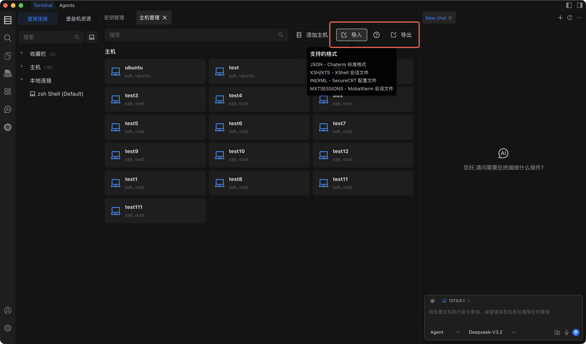

# 导入和导出主机

通过将主机导出到文件或从其他工具导入来快速迁移或备份您的主机资产。

## 导出主机

1. 打开 **资产管理** 视图。
2. 点击工具栏中的 **导出** 按钮。
3. 选择本地保存位置。
4. 主机将导出为包含所有主机配置数据的 `.json` 文件。

## 导入主机

::: tip
在执行导入之前，建议先导出当前主机列表进行备份。这样可以确保在出现问题时能恢复原始配置。
:::

1. 打开 **资产管理** 视图。
2. 点击工具栏中的 **导入** 按钮。
3. 从本地选择要导入的文件。
4. Chaterm 读取文件并将导入的主机添加到您的主机列表中。

### 支持的格式

| 格式 | 来源工具 | 备注 |
| --- | --- | --- |
| JSON | Chaterm | Chaterm 标准导出格式 |
| XSH / XTS | XShell | 会话文件 |
| INI / XML | SecureCRT | 配置文件 |
| MXTSESSIONS | MobaXterm | 会话文件 |

---

参见 [主机管理](./index) 了解所有主机操作概览。
