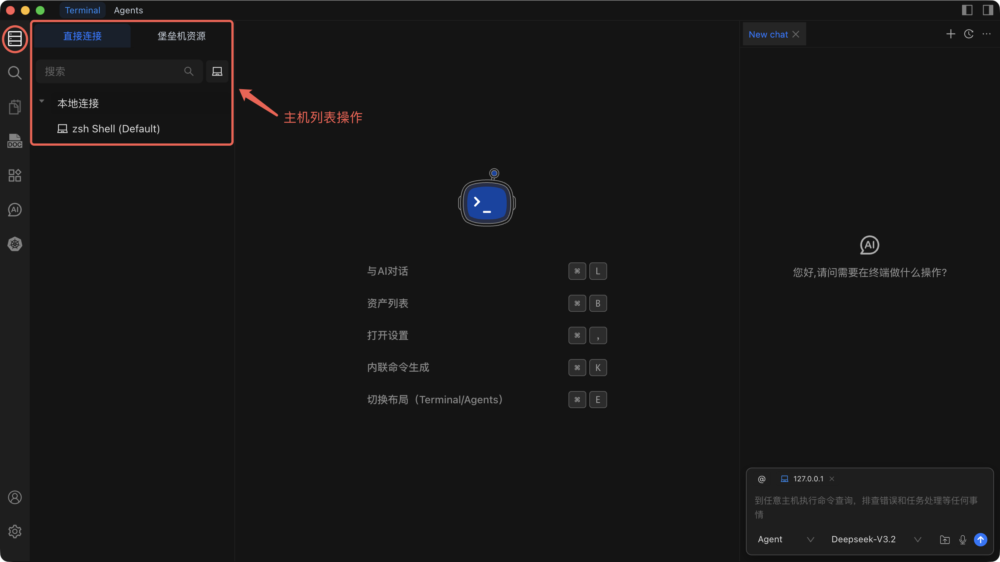

# 主机列表操作

主机列表是您集中浏览、搜索和管理所有已添加服务器的控制面板，帮助您在几秒内连接到任意主机。

## 打开主机列表

打开左侧边栏并点击 **Hosts**。主机列表提供两种视图：

- **直接连接** -- 通过网络直接连接的主机，无需中间跳转。
- **堡垒机资源** -- 仅可通过堡垒机（跳板服务器）访问的主机。点击 **堡垒机资源** 标签切换到此视图。

## 搜索与过滤

1. 点击主机列表顶部的 **搜索框**。
2. 输入 IP 地址、主机名或别名。
3. 查看实时过滤的搜索结果。

::: tip
结合搜索与堡垒机资源视图，可将结果缩小到特定的访问路径。
:::

## 收藏功能

1. 右键点击主机以打开右键菜单。
2. 选择 **添加到收藏夹** 将主机固定到收藏列表。
3. 要取消固定，再次右键点击主机并选择 **从收藏夹移除**。

收藏的主机会显示在列表顶部，让您一键访问最常用的服务器。

## 右键菜单操作

右键点击任意主机可查看可用操作：

| 操作 | 描述 |
| --- | --- |
| **连接** | 打开到该主机的 SSH 会话。 |
| **编辑** | 修改主机的连接设置。 |
| **克隆** | 以新名称复制主机条目。 |
| **删除** | 从 Chaterm 中永久删除该主机。 |
| **添加到收藏夹** | 将主机固定到列表顶部。 |
| **从收藏夹移除** | 取消主机的收藏固定。 |

## 最佳实践

- **按用途分组** -- 将主机组织到 `生产环境`、`测试环境`、`开发环境` 或 `数据库服务器` 等分组中，使列表易于管理。
- **使用 SSH 密钥** -- 优先使用密钥认证而非密码认证。详见 [密钥管理](/docs/manage/keys/) 了解设置方法。
- **添加清晰备注** -- 记录重要细节（环境、负责人、特殊端口），以便团队成员一目了然地了解主机信息。
- **定期清理** -- 定期检查列表，删除已停用或不再使用的主机。

## 相关页面

- [添加个人主机](./add-personal) -- 添加通过网络直接连接的主机。
- [添加堡垒机](./add-bastion) -- 添加通过堡垒机服务器访问的主机。
- [添加路由器](./add-router) -- 配置路由器或跳转主机条目。
- [连接到主机](./connect) -- 建立 SSH 会话并使用终端。
- [编辑、克隆或删除主机](./edit-clone-delete) -- 修改或删除现有主机条目。
- [导入和导出主机](./import-export) -- 批量导入或导出主机列表。
