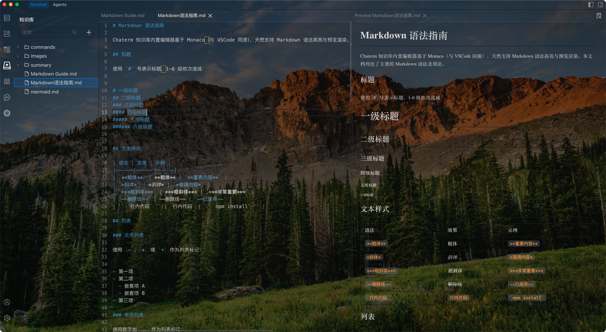
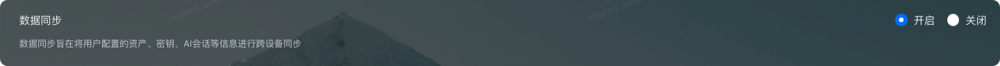

# 知识库使用指南

笔记是每个工程师工作/学习过程中不可或缺的一种方式，在过去我们可能将笔记存放于本地、笔记软件或者是公司的wiki系统中，需要时再拿出来复习或查阅。但是不知您是否碰到过这样的情况：由于更换笔记软件/更换设备，又或者仅仅是因为时间太久远了，导致笔记找不到。在AI原生应用时代，我们是否有更好的方式来编写、管理和利用笔记呢？

在 AI 原生应用场景下，更理想的笔记形态应满足两点：与业务应用紧密绑定、同时面向人类与 AI 可用。基于此，Chaterm 知识库提供一种“应用即知识载体”的管理方式：知识随应用流转与沉淀，便于长期维护与复用；同时将知识以结构化、可被模型直接消费的形式组织，使 AI 能更稳定地理解用户偏好、项目约束与最佳实践，从而提升协作效率与输出一致性。

实践表明，in-context learning 是提升模型一致性、降低幻觉的重要手段之一。将关键信息以文件形式沉淀到知识库，可作为高质量上下文载体，Agent 在执行任务时可按需检索与读取相关内容，形成可追溯、可迭代的上下文输入。

## 在 Chaterm 中编辑/管理文件

在左侧侧边栏点击  <KbDocIcon /> 进入知识库管理界面。您可以在Chaterm中获得完全类似 VS Code 的文件管理体验。支持新建文件/文件夹、重命名、移动、复制、粘贴、删除等操作，支持导入文件/文件夹到知识库。

Chaterm 采用 VScode 的Monaco编辑器为内置编辑器，天然支持 Markdown/HTML/LaTeX/Mermaid 等语法，更符合工程师写作习惯。

## 把知识库作为对话上下文

您可以把知识库里的文档附加到 AI 消息中，Agent 会在发起请求前读取它们作为上下文。Chaterm 采用动态上下文技术，不会将文件内容直接塞入对话中，从而节省 token 用量。

### 如何加入对话

将文件添加到上下文有多种方式:

1. 在 Knowledge Center 单击右键， 对文件使用 `添加到聊天`
2. 在 AI 输入框输入 **`@`** 选择文档。
3. 将打开的文件直接拖拽到 AI 输入框，

<video controls width="100%" preload="metadata">
  <source src="../image/add-to-chat-zh.mp4" type="video/mp4" />
  
您的浏览器不支持视频播放。请 <a href="../image/add-to-chat-zh.mp4" target="_blank" rel="noopener noreferrer">点击这里下载视频</a> 观看。

</video>

## /command（自定义命令）

`/command` 用于把知识库文件做成可复用的“提示词片段”，并快速插入到对话里。

自定义命令以文件形式存放于知识库的 `commands/` 目录下

### 如何使用：

- 在 AI 输入框输入 **`/`** 打开命令选择弹层。
- 选择后会插入一个 **command chip**（命令引用）到消息里。
- 点击这个 chip 可以打开对应的命令文件进行编辑。

### 命名建议：

- 命令名由文件名（去掉扩展名）生成，并自动加上前缀 `/`。
- 建议使用 **kebab-case**（例如 `deploy-guide.md` → `/deploy-guide`），避免空格带来的输入歧义。

## 总结到知识库

Chaterm 提供内置命令 `/summary-to-doc`，用于把对话总结写入知识库。

### 如何使用：

1. 每一条任务完成消息的 UI 中都有一个`总结到知识库`按钮。点击之后，模型会调用 `summarize_to_knowledge` 工具，并把总结以Markdown 格式写入知识库的summary文件夹中。

<video controls width="100%" preload="metadata">
  <source src="../image/summary-to-doc-3.mp4" type="video/mp4" />
  
您的浏览器不支持视频播放。请 <a href="../image/summary-to-doc-3.mp4" target="_blank" rel="noopener noreferrer">点击这里下载视频</a> 观看。

</video>

2. 借助自定义命令，在输入框中输入`/`，选择默认的 `/summary-to-doc` 命令。如果对总结的格式有要求，可以修改该命令的内容。

<video controls width="100%" preload="metadata">
  <source src="../image/summary-to-doc-4.mp4" type="video/mp4" />
  
您的浏览器不支持视频播放。请 <a href="../image/summary-to-doc-4.mp4" target="_blank" rel="noopener noreferrer">点击这里下载视频</a> 观看。

</video>

## 知识库同步

Chaterm 支持将知识库内容加密同步到云端，并在同一账号下的多台设备之间自动保持一致。无论是普通文档、`commands/` 自定义命令、`summary/` 里的总结内容，还是导入到知识库中的图片等资源，都可以随知识库一起同步。

### 如何使用：

1. 进入 `设置` --> `隐私` --> `数据同步`，开启 `数据同步`，并确保设备处于登录状态。

2. 在任意一台设备中编辑、导入或删除知识库内容后，系统会在后台自动同步，无需手动上传或下载。
3. 其他已登录并开启同步的设备会自动拉取最新的知识库内容，便于在不同设备间延续同一套知识沉淀。

知识库同步适合以下场景：更换电脑后快速恢复知识库、在办公电脑与个人电脑之间衔接工作、避免本地文件意外丢失导致知识中断。

## TODO

我们即将支持下列功能

- 每次发起任务时，自动检索知识库，提高模型回答准确率，让您的Chaterm越用越好用。

- 团队内共享知识库，让所有成员都使用同一个知识库。
