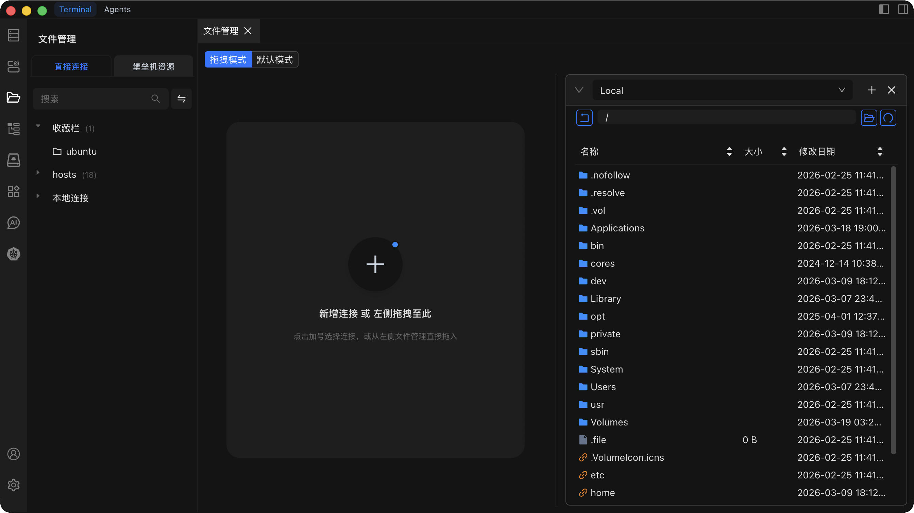

# 文件管理

通过 Chaterm 内置的基于 SFTP 的文件管理器，浏览、编辑和传输远程服务器上的文件。

## 前提条件

在使用文件管理之前，请确保：

- 你已与目标主机建立了**活跃的 SSH 连接**。如果尚未连接，请参阅[连接主机](/docs/hosts/connect)。
- 远程服务器已**启用 SFTP**。大多数 OpenSSH 安装默认启用 SFTP，但某些加固过的服务器可能会禁用它。

::: warning 需要 SFTP
文件管理完全依赖于服务器的 SFTP 子系统。如果远程服务器未启用 SFTP，浏览、编辑和传输文件将无法工作。如果在文件管理中看到连接错误，请联系服务器管理员启用 SFTP 子系统。
:::

## 浏览文件

1. 点击左侧菜单栏中的**文件管理**。
2. Chaterm 会显示当前已连接主机的远程文件树。
3. 点击**文件夹**可展开或折叠其内容。
4. **右键点击**目录，选择**刷新**可重新加载文件列表。
5. 使用文件树顶部的**搜索栏**按名称查找文件或目录。

## 编辑文件

1. **双击**文件树中的文件，在内置编辑器中打开。
2. 编辑文件内容。编辑器会根据文件类型自动检测并提供语法高亮。
3. 点击**保存**按钮（或使用快捷键）将更改写回远程服务器。

编辑器提供现代化的、类 IDE 的体验，支持多语言语法高亮。

## 上传文件

1. 在文件树中，导航到你想放置文件的**目标目录**。
2. 点击**上传**按钮，或直接将一个或多个本地文件拖放到文件树区域。
3. 选择要上传的文件或文件夹（如果你使用了按钮方式）。
4. 进度指示器会显示传输速度和百分比。等待上传完成。

## 下载文件

1. 在文件树中，找到你想下载的文件或文件夹。
2. **右键点击**该项目，选择**下载**，或选中该项目后点击**下载**按钮。
3. 在提示时选择本地保存位置。
4. 等待下载完成。进度指示器会显示传输状态。

## 文件操作

在文件树中右键点击文件或文件夹，可以执行以下操作：

| 操作 | 说明 |
| --- | --- |
| **重命名** | 修改文件或文件夹的名称。 |
| **权限** | 修改文件权限（`chmod`）。在对话框中输入新的权限模式（如 `755`）。 |
| **复制** | 将文件或文件夹复制到服务器上的其他位置。 |
| **移动** | 将文件或文件夹移动到服务器上的其他目录。 |
| **删除** | 永久删除文件或文件夹。此操作不可逆 —— 请谨慎使用。 |

## 提示

- **大文件**传输可能需要较长时间。请保持连接，在传输完成前不要离开页面。
- **系统文件**可能需要更高的权限。如果无法编辑或删除某个文件，请检查你的用户账户是否具有必要的访问权限。
- 在进行编辑之前，特别是在生产服务器上，请**备份重要文件**。
