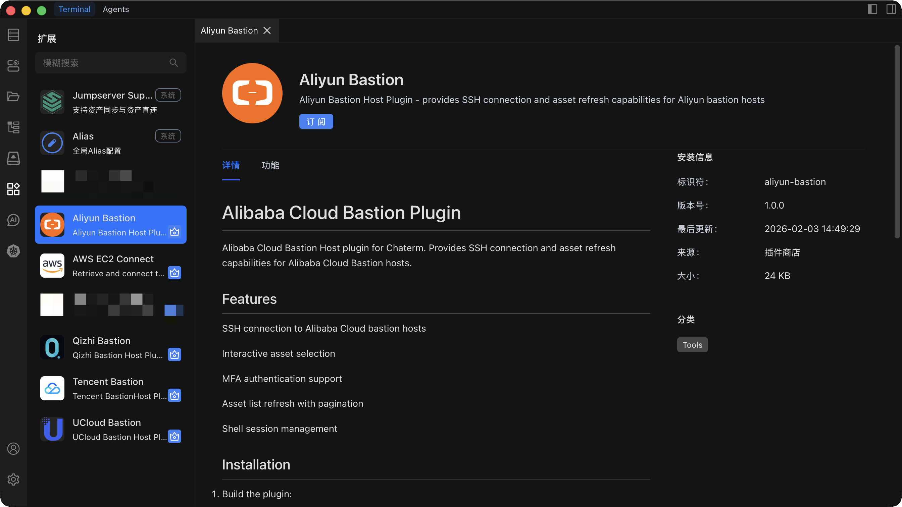

# 扩展管理

安装和管理扩展，定制和扩展 Chaterm 的功能。

## 浏览扩展

1. 点击左侧菜单栏中的**扩展**，进入扩展管理页面。
2. 选择**扩展市场**标签页查看所有可用扩展，或切换到**已安装扩展**标签页查看已安装的扩展。
3. 使用**搜索栏**按关键词过滤扩展。
4. 点击扩展卡片查看详细信息，包括完整描述、功能列表和版本信息。

## 安装扩展

**从扩展市场安装**

1. 在扩展管理页面，浏览或搜索你需要的扩展。
2. 点击扩展卡片查看详细信息。
3. 点击**安装**按钮。
4. 等待安装完成。

**从本地文件安装**

1. 点击**从文件安装**按钮。
2. 从本地选择扩展包文件（`.chaterm` 格式）。
3. Chaterm 会自动验证并安装扩展。

::: tip 安装后自动启用
扩展在安装完成后会**自动启用**。你可以立即使用新功能，并可在**已安装扩展**标签页中管理该扩展。
:::

## 启用和禁用扩展

1. 进入**已安装扩展**标签页。
2. 找到要切换状态的扩展。
3. 点击**启用**按钮激活已禁用的扩展，或点击**禁用**按钮停用已激活的扩展。
4. 更改立即生效 —— 无需重启。

::: warning 核心扩展
禁用某些核心扩展可能会影响 Chaterm 的基本功能（例如终端渲染或连接处理）。仅在确定该扩展不是你工作流所必需时才禁用。
:::

## 配置扩展

部分扩展提供了可自定义行为的设置项：

1. 在**已安装扩展**标签页中，找到要配置的扩展。
2. 点击**配置**按钮，打开设置对话框。
3. 调整可用选项。常见的配置项包括：
   - 功能开关（开启/关闭）
   - 显示选项（主题、布局）
   - 行为参数（超时时间、默认值）
   - 集成设置（API 密钥、端点）
4. 点击**保存**。新配置立即生效。

有关全局扩展偏好设置，请参阅[扩展设置](/docs/settings/extensions/)。

## 更新扩展

当已安装的扩展有新版本可用时：

1. 扩展列表中该扩展旁会显示**更新标记**。
2. 点击**更新**按钮升级到最新版本。
3. 更新后你的现有配置会被保留。

## 卸载扩展

1. 在**已安装扩展**标签页中，找到要卸载的扩展。
2. 点击**卸载**按钮。
3. 在弹出的对话框中确认操作。该扩展及其数据将从 Chaterm 中移除。
