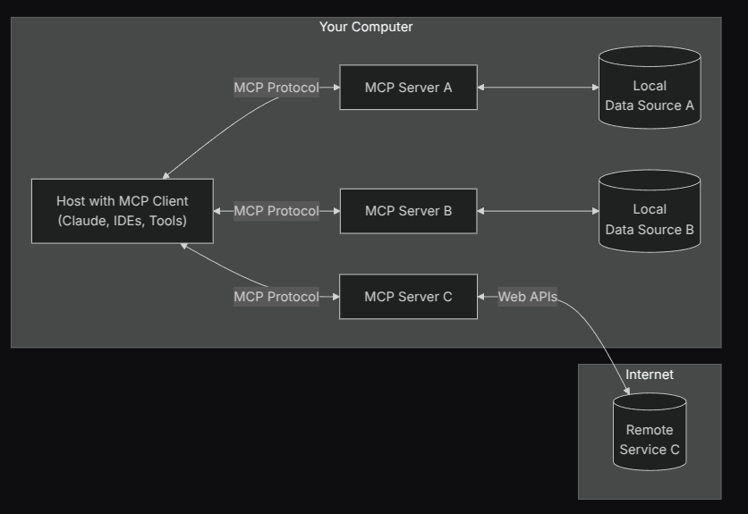
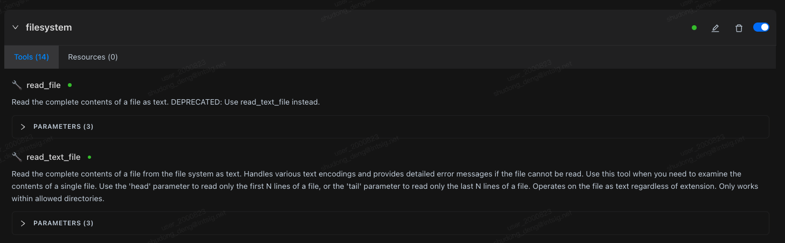

# MCP 使用指南

MCP（Model Context Protocol）允许你通过连接 MCP 服务器，为 Chaterm 的 AI 扩展外部工具、知识库和 API 能力。



## 你的第一个 MCP 服务器

五分钟内即可完成配置。

1. 在 Chaterm 中打开**设置**。
2. 进入**工具与 MCP** 标签页，点击**添加服务器** —— 系统会自动打开 `mcp_setting.json` 文件。
3. 将下面的 JSON 示例粘贴到编辑器中。
4. 保存文件。Chaterm 会自动连接该服务器。

保存后，服务器的状态徽标会从 *connecting* 变为 *connected*（或显示错误信息），工具（Tools）和资源（Resources）会自动加载。


::: tip
不确定先试哪个服务器？下方的 **filesystem** 服务器是一个很好的起点 —— 它可以让 AI 对你指定的目录进行读写访问。
:::

---

## 配置

### STDIO 服务器（本地命令行）

当 MCP 服务器以本地进程方式运行时，使用此类型。

```json
// MCP server using stdio transport
{
  "mcpServers": {
    "filesystem": {
      "command": "npx",
      "args": [
        "-y",
        "@modelcontextprotocol/server-filesystem",
        "/Users/username/Desktop",
        "/path/to/other/allowed/dir"
      ]
    }
  }
}
```

#### STDIO 配置字段

| 字段          | 必需 | 说明                                                                                          | 示例                                                |
| ------------- | ---- | --------------------------------------------------------------------------------------------- | --------------------------------------------------- |
| `type`        | 否   | 连接类型，省略时会根据 `command` 推断为 `stdio`                                               | `"stdio"`                                           |
| `command`     | 是   | 启动可执行命令。可写为完整一行（含参数），或仅可执行名                                        | `"npx"`、`"node"`、`"python"`                       |
| `args`        | 否   | 传递给命令的参数数组；当 `command` 含空格且未提供 `args` 时，系统会自动解析（支持引号与转义） | `["-y", "@modelcontextprotocol/server-filesystem"]` |
| `cwd`         | 否   | 进程工作目录                                                                                  | `"/Users/you"`                                      |
| `env`         | 否   | 进程环境变量（键值对）                                                                        | `{"API_KEY": "xxx"}`                                |
| `disabled`    | 否   | 是否禁用该服务器                                                                              | `true`/`false`                                      |
| `timeout`     | 否   | 调用超时时间（秒）                                                                            | `120`、`180`                                        |
| `autoApprove` | 否   | 自动批准工具白名单（按工具名）                                                                | `["read_file"]`                                     |

说明：

- 不支持 `envFile` 字段；若需从文件加载变量，请在启动环境中自行处理后再写入 `env`。
- 兼容字段：为向后兼容，`url?`、`headers?` 在 stdio 配置里也被允许，但不建议使用（不会将连接类型切换为 http）。

### HTTP 服务器（远程服务）

当 MCP 服务器部署在远端并暴露 Streamable HTTP 端点时，使用此类型。

```json
{
  "mcpServers": {
    "context7": {
      "url": "https://mcp.context7.com/mcp",
      "headers": {
        "CONTEXT7_API_KEY": "your-api-key"
      },
      "disabled": false
    }
  }
}
```

#### HTTP 配置字段

| 字段          | 必需 | 说明                                       | 示例                                   |
| ------------- | ---- | ------------------------------------------ | -------------------------------------- |
| `type`        | 否   | 连接类型，省略时会根据 `url` 推断为 `http` | `"http"`                               |
| `url`         | 是   | 服务器地址（支持流式 HTTP 客户端）         | `"https://your-mcp-host.example.com/"` |
| `headers`     | 否   | 请求头（如认证、代理相关）                 | `{"Authorization": "Bearer <TOKEN>"}`  |
| `disabled`    | 否   | 是否禁用该服务器                           | `true`/`false`                         |
| `timeout`     | 否   | 调用超时时间（秒）                         | `120`、`180`                           |
| `autoApprove` | 否   | 自动批准工具白名单（按工具名）             | `["search"]`                           |

说明：

- `url` 必须是合法的 URL（由 schema 强校验）。
- 兼容字段：为向后兼容，`command?`、`args?`、`env?` 在 http 配置里也被允许，仅用于旧配置迁移场景；不建议长期使用。

### 通用字段

> 参考项目中的 `schemas.ts`：
>
> - 通用字段（两类都支持）：`disabled?`、`timeout?`（秒，默认值见应用）、`autoApprove?`（字符串数组）。
> - `type` 可选：当提供了 `command`（推断为 stdio）或 `url`（推断为 http）时可省略；推荐显式填写以提高可读性。
> - 兼容字段：支持 legacy `transportType`，应用会自动转换为 `type`；不建议在新配置中继续使用。

---

## 在对话中使用 MCP

### 工具开关

在**工具**列表中点击工具名称即可启用或禁用该工具。已禁用的工具会从模型上下文中完全移除，Agent 无法再使用该工具。关闭不需要使用的工具是节省 token 的简单方法。



### 自动批准

在配置中将工具名加入 `autoApprove` 后，匹配的工具将跳过确认步骤直接执行。你也可以在对话过程中动态将工具添加到自动批准列表。


::: warning
仅将你完全信任的工具添加到 `autoApprove`。自动批准的工具会跳过确认对话框，无需用户审核即可执行。
:::

### 查看参数和资源

展开工具的 **PARAMETERS** 折叠面板可查看参数名、是否必填及描述。

在 **Resources** 标签页中可以查看资源名称、描述和 URI；在支持的入口中可直接读取资源。


---

## 开发提示

### 文件变更自动重启

如果你以构建产物运行本地 MCP 服务器（例如 `build/index.js`），Chaterm 会检测该文件的变更并自动重启对应的 stdio 服务器。这能显著加快开发迭代速度。

若自动重启未触发，可通过**禁用然后启用**该服务器来手动重连。

---

## 去哪里找 MCP 服务器

- **GitHub 仓库**：
  - [modelcontextprotocol/servers](https://github.com/modelcontextprotocol/servers)
  - [punkpeye/awesome-mcp-servers](https://github.com/punkpeye/awesome-mcp-servers)
- **在线 MCP 目录**：
  - [mcpservers.org](https://mcpservers.org/)
  - [mcp.so](https://mcp.so/)
  - [glama.ai/mcp/servers](https://glama.ai/mcp/servers)
- **PulseMCP**：[www.pulsemcp.com](https://www.pulsemcp.com/)

---

## 安全与性能建议

::: tip 安全检查清单
- 仅将信任的工具添加到 `autoApprove`。
- 谨慎在 `env` 或 `headers` 中注入凭证 —— 避免分享包含敏感信息的配置文件。
- 遵循最小权限原则：仅暴露实际需要的目录、网络和 API。
:::

- **性能**：一般网络情况下，将 `timeout` 设为 120 - 180 秒。对远端服务，优先选择就近端点，并确保代理不会中断流式连接。
- **可维护性**：使用统一的命名规范并将相关服务器分组管理。定期备份 `mcp_setting.json`。

---

## 后续阅读

- 遇到连接或调用问题？请参阅 [MCP 故障排除与最佳实践](../troubleshooting/)。
