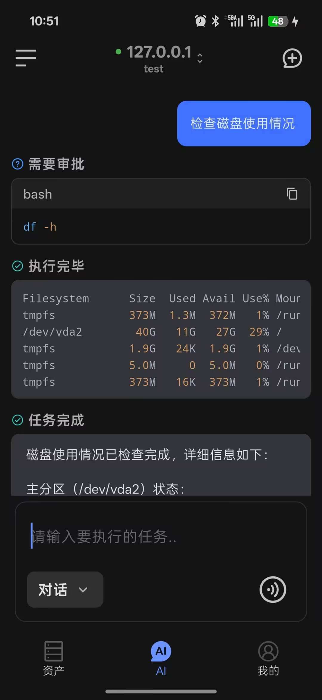
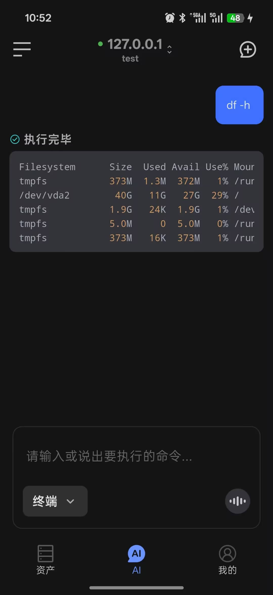
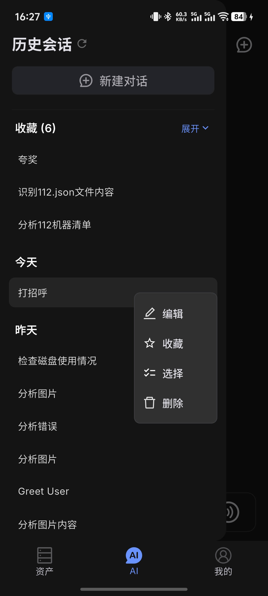
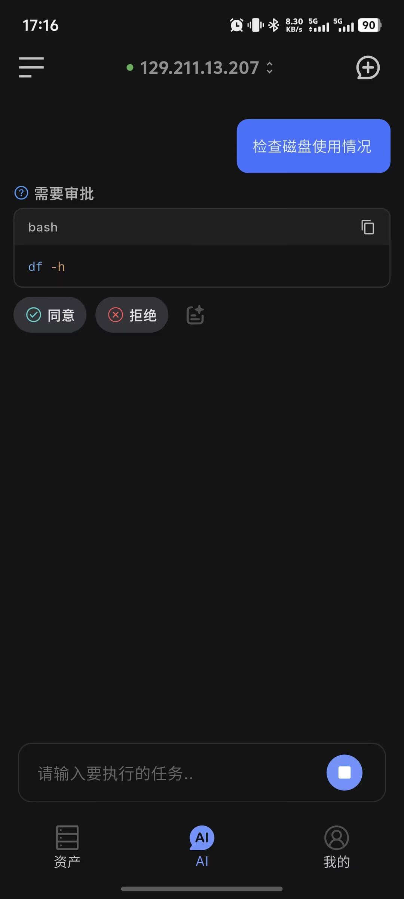
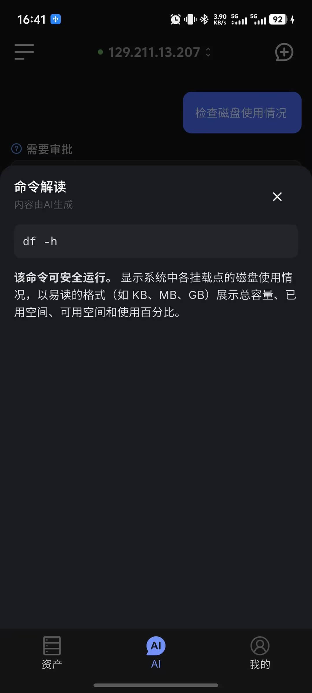
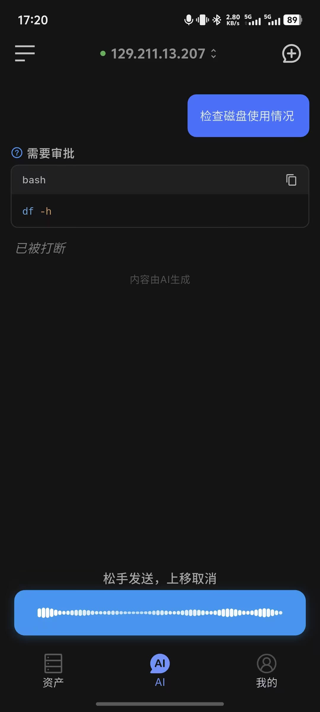
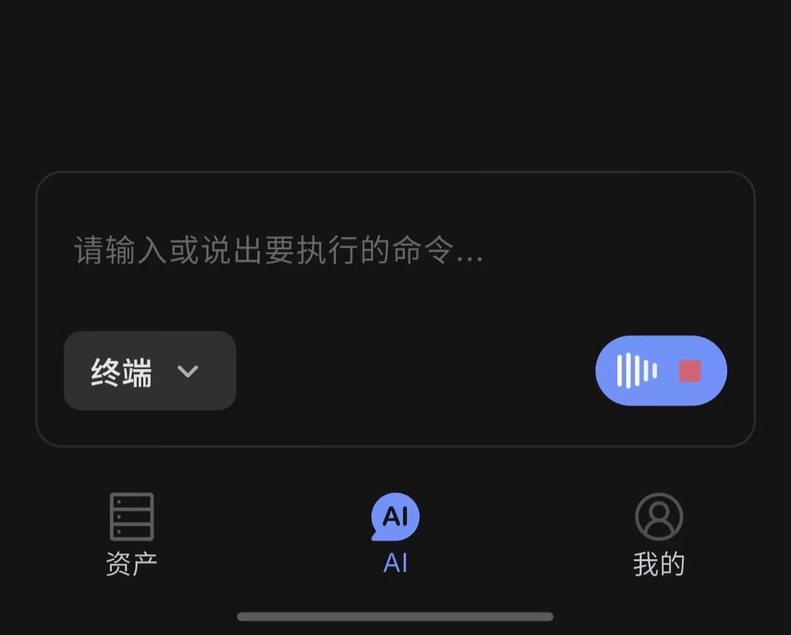

# AI 会话

AI 会话是 Chaterm 移动端的核心能力。它让你随时随地用手机处理服务器问题——不只是执行命令，而是真正有 AI 协助你思考、排查和决策。

无论是在地铁上收到告警、出差时临时排障，还是不确定某条命令该怎么写，你都可以直接在手机上通过自然语言描述问题，让 AI 帮你分析、建议并执行。语音输入则进一步解放了双手，终端与对话的无缝联动让上下文始终连贯。

移动端主要提供两种模式：`对话` 和 `终端`。你可以通过输入框底部的模式选择器在两者之间切换。

::: tip 前提条件
使用 AI 相关功能（对话模式、语音纠错、命令解释）前，需要先登录账号并在[个人中心 > AI 设置 > 模型选择](/docs/mobile/profile/#模型选择)中完成模型配置。
:::

  

## 对话模式

`对话` 模式用于与 AI 协作完成分析、解释和命令建议。

支持文字和语音输入，AI 可解析自然语言生成命令，并根据上下文持续协助排查。

适合场景：学习 Linux 命令、故障排查、脚本编写、理解配置文件、咨询运维实践。

  

## 终端模式

`终端` 模式直接执行命令，不经过 AI 处理。

需要先连接服务器，未连接时页面会显示连接入口。支持文字和语音输入，直接返回执行结果。

适合场景：临时执行命令、快速查看主机状态。

  

## 上下文联动

手机上做运维排查时，一个典型的困境是：执行了一条命令看到输出，想问 AI 是什么意思，却要手动选中文字、复制、切换输入框、粘贴——手机屏幕小，这个过程非常繁琐。更麻烦的是，如果输出内容很长，手机端根本无法完整选中。

我们的解法是让两个模式共享同一份会话上下文。在终端模式执行的命令及其输出，切换到对话模式后 AI 可以直接看到，无需复制粘贴。

**典型场景：**

1. 在**终端模式**执行命令，例如 `journalctl -n 50`，看到一段日志输出
2. 切换到**对话模式**
3. 直接输入「帮我分析上面的报错」
4. AI 基于刚才的命令输出直接给出分析

这个机制同样适用于其他场景，例如：执行 `df -h` 后问「哪个分区快满了」，执行自己的脚本 `xxx.js` 后问「当前任务进度怎样」。

::: tip
模式切换不会清空上下文，整个会话期间的终端输出都对 AI 可见。
:::

## 会话历史

点击页面左上角图标可打开会话历史侧边栏，查看所有历史会话。你可以通过点击或长按对历史会话做更多操作，比如收藏你觉得重要的会话等。

### 主要功能：

- **切换会话**：点击任意历史记录可切换到该会话
- **新建会话**：点击侧边栏顶部的新建按钮开始新会话
- **编辑标题**：长按会话记录后选择 `编辑`，可修改会话标题
- **收藏会话**：长按会话记录可收藏，收藏项显示在列表顶部
- **删除会话**：长按进入多选模式，可批量删除历史记录

  

## 命令审批

在 `对话` 模式下，AI 执行命令前默认会暂停并等待你确认（审批模式）。可在[个人中心 > AI 偏好](/docs/mobile/profile/#ai-偏好)中开启**自动执行**，让命令跳过审批直接运行。

| 模式 | 行为 |
|------|------|
| **审批模式**（默认）| 每条命令执行前暂停，显示同意 / 拒绝按钮 |
| **自动执行模式** | 命令自动执行，无需审批确认 |

::: danger 危险提示
自动执行模式下，AI 可能在不逐一确认的情况下连续执行多条命令，建议在熟悉的任务场景或者有把握后再开启。
:::

  

## 命令解释

在审批模式下，AI 展示待执行命令时，除了同意和拒绝，还可以点击**解读**图标查看命令详情。

**操作按钮说明：**

| 按钮 | 说明 |
|------|------|
| **同意** | 确认执行该命令 |
| **拒绝** | 取消执行，AI 将停止当前任务 |
| **解读**（文档图标）| 弹出底部面板，由 AI 流式解释该命令的含义和用途 |

**命令解释面板：**

点击解读图标后，底部弹框会实时显示 AI 对命令的逐步解析，包括：

- 命令整体用途与安全性
- 各参数的含义
- 可能的注意事项或副作用

命令解释不会触发命令执行，可安全查看后再决定是否同意。

  

## 对话语音输入

对话和终端模式均支持语音输入。点击输入框右侧的麦克风图标可切换到语音输入状态。

**使用方式：**

1. 点击麦克风图标，输入框切换为语音输入按钮
2. **长按**语音按钮开始录音，松手后自动识别
3. 上滑后松手可取消本次录音
4. 识别完成后，文字自动发送（对话模式）

  

## 语音输入命令

在**终端模式**中，语音识别结果会经过 AI 自动矫正并填入输入框中，通过对语音模型的微调，我们做到了精准识别 SRE 领域命令，解放了手机键盘输入命令的繁琐操作。例如：

- 按音调说「kube ctl get po」→ 自动矫正为 `kubectl get pods`
- 按音调说「docker 杠a」→ 自动矫正为 `docker ps -a`

  

## 典型使用流程

1. 打开 AI 对话页
2. 连接目标主机
3. 选择 `对话` 或 `终端`
4. 输入问题或命令，或通过语音发起请求
5. 查看返回结果，按需继续追问

## 使用建议

- 需要解释、规划和排障时，优先使用 `对话` 模式
- 不熟悉某条命令时，执行前先点击**解读**了解其含义，再决定是否同意
