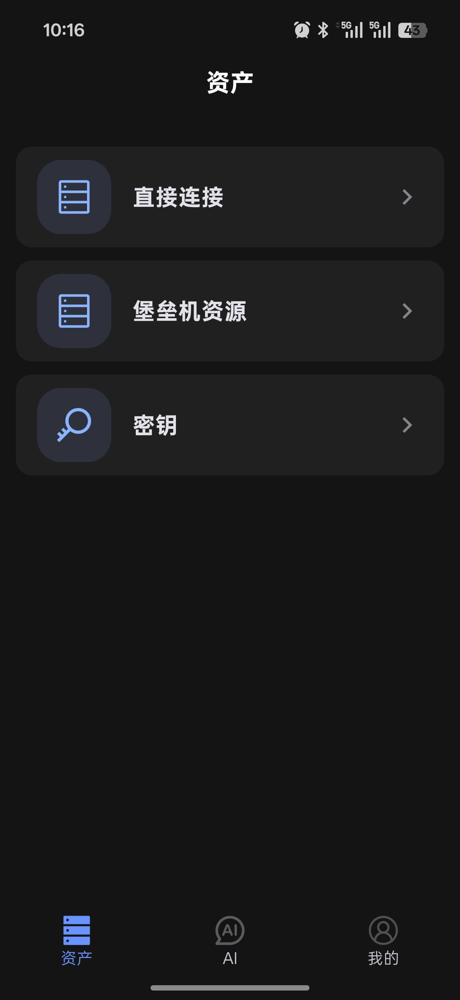

# 资产管理

资产模块是移动端管理 SSH 资源的入口，包含直接连接、堡垒机资源和密钥管理。

  

## 直接连接

直接连接用于管理个人添加的服务器资产。

### 添加新资产

点击右下角 `+` → **新建**，填写服务器信息后保存。

| 字段 | 说明 |
|------|------|
| 标签 | 便于识别的名称，如 `prod-web-01` |
| IP / 域名 | 服务器地址 |
| 端口 | 默认 `22` |
| 用户名 | 登录用户，如 `root`、`ubuntu` |
| 认证方式 | **密码**：直接输入；**密钥**：需提前在[密钥管理](#密钥管理)中导入 |

### 管理资产

- 连接：点击主机卡片即可建立 SSH 连接
- 编辑：长按卡片后选择 `编辑`
- 收藏：长按卡片后选择 `收藏`，收藏项会置顶显示
- 删除：长按卡片后选择 `删除`

### 最近连接排序

主机列表按最后连接时间自动排序，最近使用过的主机优先显示在列表顶部，方便快速找到常用服务器。

### 搜索与筛选

支持按以下字段搜索或过滤：

- 主机名
- IP 地址
- 用户名
- 分组

## 堡垒机资源

堡垒机资源用于管理通过跳板机维护的服务器资产。

### 添加堡垒机

点击 `+` → **新建**，填写堡垒机名称、地址、端口和用户名，选择密钥认证后点击**保存并同步**。

保存后，同步的服务器资产会显示在堡垒机的下拉列表中。

### 管理堡垒机

- 同步资产：点击分组标题旁的同步按钮
- 编辑：长按分组名称后选择 `编辑`
- 删除：长按分组名称后选择 `删除`

### 管理同步的服务器资产

堡垒机下同步的资产支持以下操作：

- 点击卡片建立连接
- 长按卡片编辑备注
- 长按卡片加入收藏

## 密钥管理

密钥管理用于维护 SSH 登录所需的密钥文件。

- 点击右下角 `+` 按钮添加新密钥
- 支持从本地导入密钥文件
- 每个密钥卡片上提供编辑和删除操作

::: tip 建议
如果主机较多，优先维护好收藏、分组和备注信息，检索效率会更高。
:::
