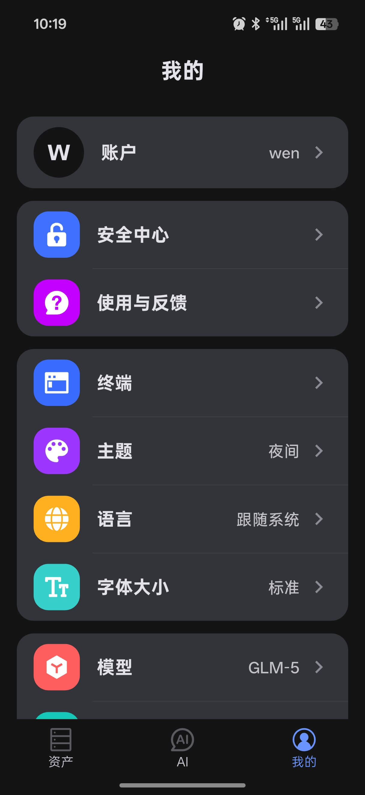
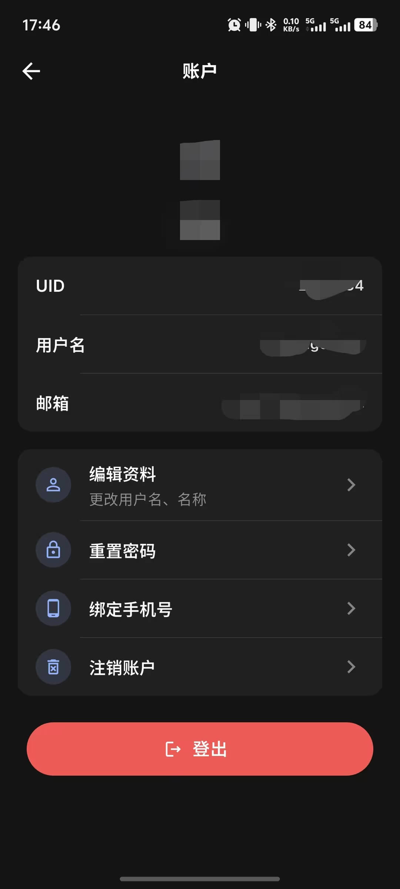
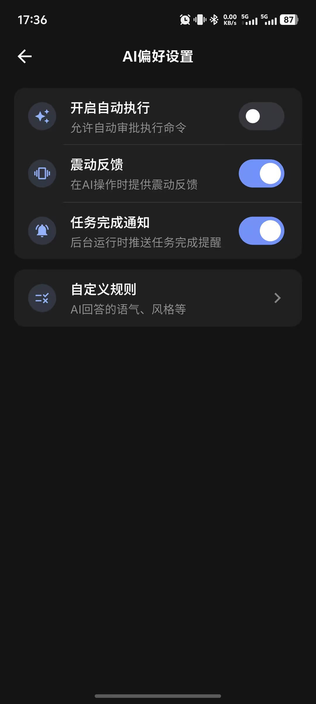
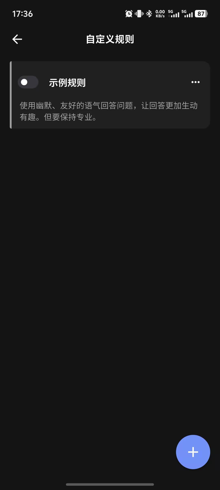

# 个人中心

个人中心用于管理账户信息、应用设置和 AI 相关偏好。

  

## 账户

你可以在这里完成以下操作：

- 查看当前登录账户信息
- 编辑个人信息
- 登出
- 重置密码
- 注销账户

  

## 安全中心

安全中心提供登录设备管理能力。

- 查看所有已登录设备
- 移除不信任的设备

## 应用设置

### 终端

- KeepAlive 心跳间隔（默认 15 秒）
- 终端执行超时时间（默认 60 秒）

### 外观与语言

- 主题：浅色 / 深色 / 跟随系统
- 语言：中文（简体）/ English / 跟随系统
- 字体大小：小 / 标准 / 大
- 消息字体大小：通过滑块独立调整 AI 对话消息的字号

## AI 设置

### 模型选择

登录后可选择应用当前提供的可用模型。

### AI 偏好

- 自动执行开关
- 震动反馈
- 任务完成通知

  

### 自定义规则

为 AI 设置语气、风格和其他个性化指令，规则会附加到每次对话的系统提示中。

进入**自定义规则** → 右下角 `+` 新建规则，保存后立即生效。每条规则可通过开关独立启用或禁用，无需删除。

**示例规则：**

- `回复时使用中文，简洁直接，不要过多解释`
- `执行命令前先简要说明目的`
- `优先使用 kubectl 而非 k8s 别名`

  

### 数据管理

- **数据同步开关**：开启后，资产数据与会话数据将加密同步到云端，多设备间保持一致
- **删除历史会话记录**：清除本地保存的全部 AI 对话历史
