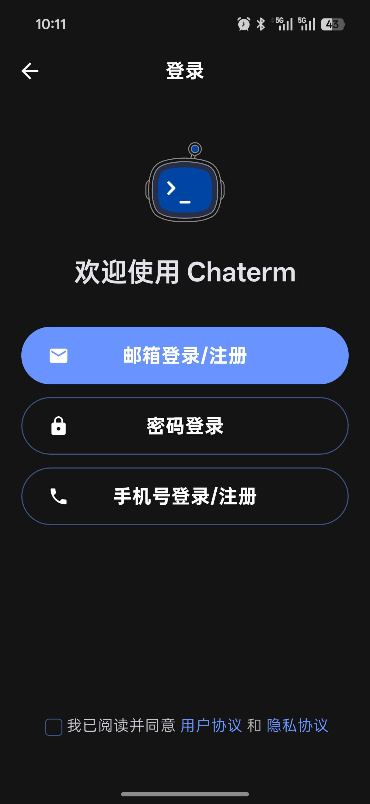
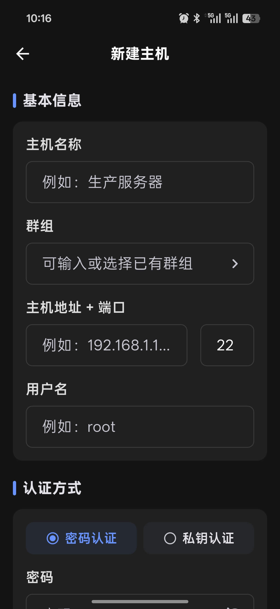
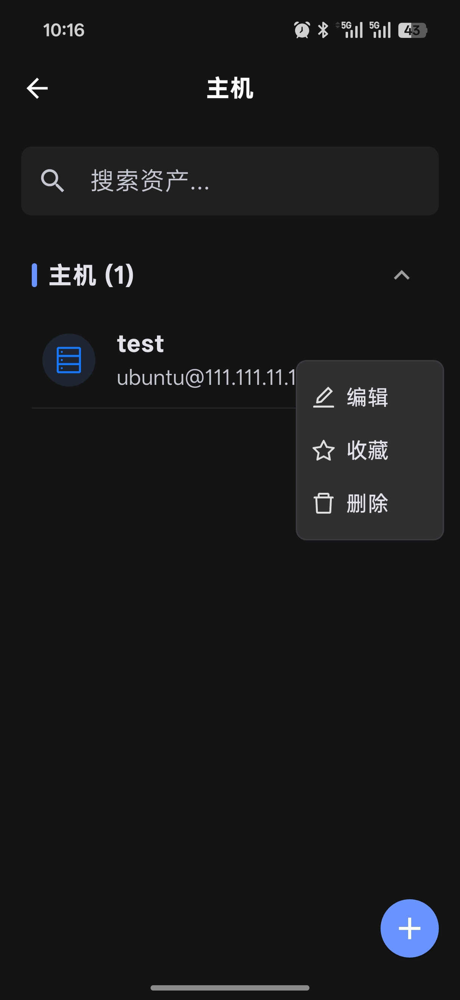
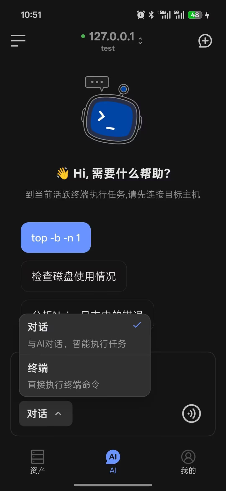

# 移动端快速上手

五步完成 Chaterm 在 iOS 或 Android 上的安装和使用。

## 第一步：安装应用

### iOS

1. 打开 [App Store](https://apps.apple.com/cn/app/chaterm/id6753935895)。
2. 搜索并安装 **Chaterm**。
3. 首次启动后按提示完成权限授权。

### Android

1. 打开[下载页](/download/)或在应用商店搜索 Chaterm。
2. 下载最新 Android APK。
3. 安装 APK 文件，并按系统提示允许安装。

::: tip 建议提前登录
如果你希望使用数据同步和完整的 AI 功能，建议登录后再开始使用。
:::

## 第二步：登录账户

Chaterm 移动端支持登录后使用完整能力，也支持先浏览应用再补充登录。可用的登录方式：

- **邮箱** -- 接收验证码登录
- **账号密码** -- 使用已有凭证登录
- **第三方登录** -- 使用**邮箱**、**密码**或**手机号**登录

  

## 第三步：添加第一台主机

1. 点击底部**资产**Tab。
2. 进入**直接连接**，点击右下角 **+** 按钮。
3. 选择**新建**。
4. 填写主机标签、IP 地址、端口、用户名等信息。
5. 选择**密码认证**或**密钥认证**。
6. 点击**保存**。

::: tip 桌面端同步
如果你在桌面端开启了数据同步，资产数据会加密同步到移动端。详情请参阅[资产管理](/docs/mobile/assets/)。
:::

  

## 第四步：建立 SSH 连接

1. 在资产列表中点击目标主机卡片。
2. Chaterm 会自动建立 SSH 连接。
3. 连接成功后进入终端界面。

常用操作：

- **点击**主机卡片直接连接。
- **长按**卡片可编辑、收藏或删除。
- **搜索**可按主机名、IP、用户名或分组快速筛选。

  

## 第五步：开始使用 AI

移动端主要提供两种交互模式：

| 模式 | 用途 |
|------|---------|
| **终端** | 直接执行你输入的命令 |
| **对话** | AI 理解你的需求并建议命令或操作 |

基本流程：

1. 打开 AI 对话页。
2. 连接目标主机或选择模型。
3. 在输入框底部切换模式。
4. 输入问题或命令，或使用语音输入。
5. 查看执行结果或 AI 返回内容。

更多详情请参阅 [AI 对话](/docs/mobile/ai-agent/)。

  

## 推荐的首次体验

1. 添加一台测试主机。
2. 发起一次 SSH 连接。
3. 在**终端**模式下执行 `pwd` 或 `uname -a`。
4. 切换到**对话**模式，询问一个 Linux 命令问题。
5. 在**个人中心**配置主题、语言和 AI 偏好。
