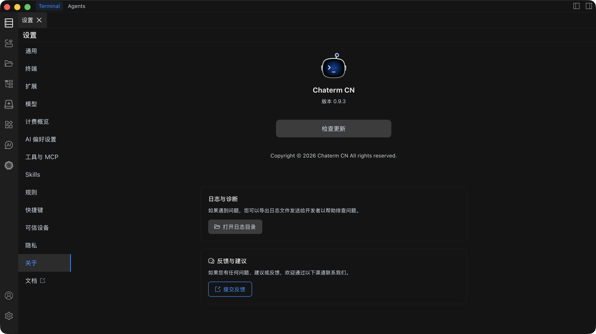

# 关于

关于页面显示 Chaterm 的版本信息，并提供版本更新检查功能。

## 查看版本信息

在关于页面中，您可以查看当前安装的 Chaterm 版本号。版本号通常显示在页面顶部，格式为 `vX.X.X`（例如：v1.0.0）。

### 版本信息说明

- **当前版本**：显示您当前使用的 Chaterm 版本号
- **更新状态**：显示是否有可用更新

## 检查更新

Chaterm 提供自动和手动两种方式检查更新。

### 自动检查更新

Chaterm 会在以下情况自动检查更新：

- 应用启动时

### 手动检查更新

1. 打开 **设置** → **关于**
2. 点击 **检查更新** 按钮
3. 系统会连接到更新服务器检查是否有新版本

### 更新流程

当检测到新版本时：

1. **提示通知**：系统会显示更新提示，告知有新版本可用
2. **查看更新日志**：可以查看新版本的更新内容和改进
3. **下载更新**：点击下载按钮开始下载新版本安装包
4. **安装更新**：下载完成后，按照提示完成安装
