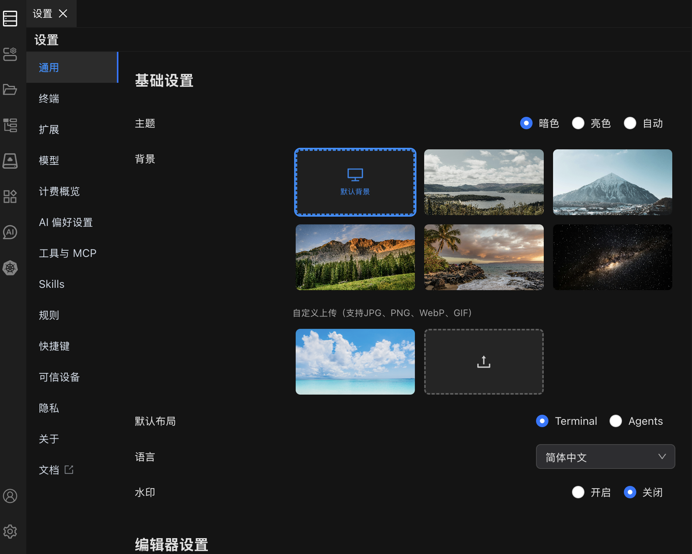

# 通用设置

在通用设置中自定义 Chaterm 的外观、语言、布局和编辑器行为。

## 通用设置

| 设置项 | 选项 | 默认值 | 说明 |
| --- | --- | --- | --- |
| **主题** | 暗色、亮色、跟随系统 | 跟随系统 | 控制界面配色方案。暗色模式可在低光环境下减轻眼部疲劳；亮色模式适合明亮环境。 |
| **背景** | 开启 / 关闭 | 关闭 | 开启后，您可以上传自定义背景图片或选择系统预设背景。 |
| **布局** | Terminal 布局、Agents 布局 | Terminal 布局 | Terminal 布局采用传统终端优先视图。Agents 布局优先展示 AI 面板。 |
| **语言** | English、简体中文、繁體中文、Deutsch、Francais、Italiano、Portugues、Russian、Japanese、Korean、Arabic | English | 设置界面语言。更改后立即生效，无需重启。 |
| **水印** | 开启 / 关闭 | 关闭 | 开启后在界面上显示水印。 |

## 编辑器设置

以下设置控制内置代码和文本编辑器的行为。

| 设置项 | 选项 | 默认值 | 说明 |
| --- | --- | --- | --- |
| **字体大小** | 8 -- 32 px | 14 | 编辑器中使用的字体大小。 |
| **行高** | 0 -- 48 | 0（自动） | 行间距。设置为 0 时由编辑器自动计算。 |
| **字体** | 预设等宽字体 | Cascadia Mono | 编辑器中使用的等宽字体。 |
| **制表符大小** | 1 -- 8 空格 | 4 | 按 Tab 键时插入的空格数量。 |
| **自动换行** | 开启 / 关闭 | 关闭 | 开启后，长行会自动换行以适应编辑器宽度，而非水平滚动。 |
| **小地图** | 开启 / 关闭 | 开启 | 在编辑器右侧显示文件的缩略概览图。 |
| **鼠标滚轮缩放** | 开启 / 关闭 | 关闭 | 开启后，可使用 `Ctrl` + 鼠标滚轮（macOS 上为 `Cmd` + 鼠标滚轮）缩放编辑器字体。 |

## 另请参阅

- [终端设置](/docs/settings/terminal/) -- 配置终端仿真、字体和光标样式
- [快捷键设置](/docs/settings/shortcuts/) -- 查看和自定义键盘快捷键
