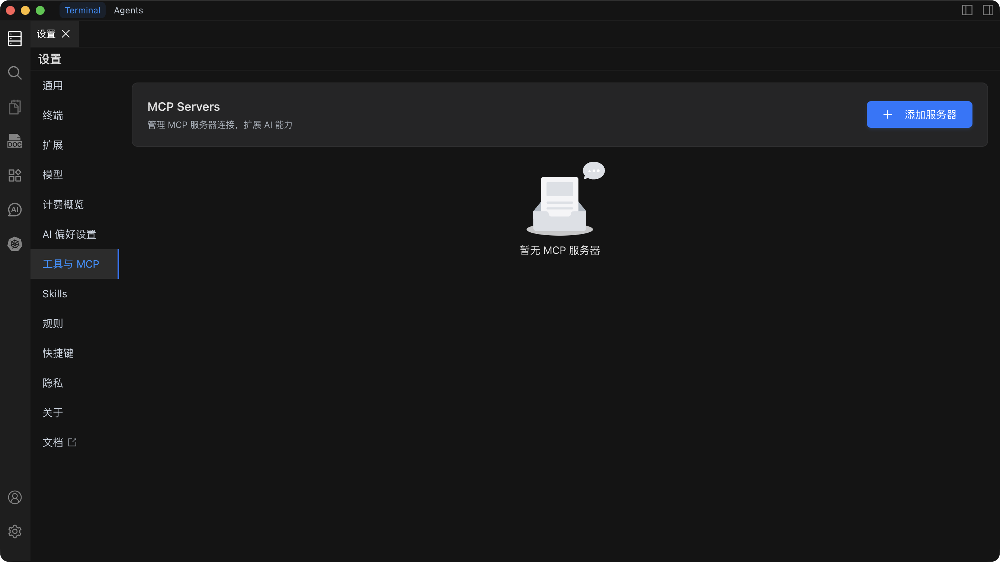

# MCP 设置

MCP（Model Context Protocol）设置用于配置和管理 MCP 服务器，让 AI 能够访问外部数据源和工具，扩展 AI 的能力边界。

## 功能概述

MCP 设置页面提供以下核心功能：

- **添加 MCP 服务器**：连接企业知识库（如 Notion、GitHub 等）或第三方服务
- **服务器配置**：配置 MCP 服务器的连接信息、认证参数等
- **启用/禁用控制**：灵活控制 MCP 服务器的启用状态
- **工具和资源管理**：查看和管理 MCP 服务器提供的工具和资源
- **自动批准设置**：配置工具自动执行白名单，提升使用效率

## 快速开始

### 添加 MCP 服务器

1. 在设置页面找到左侧 `工具与MCP` Tab
2. 点击 `添加服务器`，系统会自动打开 `mcp_setting.json` 文件
3. 在编辑器中新增服务器配置（JSON 格式）
4. 保存后，Chaterm 会自动读取并尝试连接该服务器

### 服务器类型

MCP 支持两种类型的服务器：

- **STDIO 服务器**：本地命令行服务器，通过标准输入输出通信
- **HTTP 服务器**：远程服务，通过 HTTP/HTTPS 协议连接

## 主要功能

### 服务器管理

- **连接状态监控**：实时查看服务器连接状态（connecting/connected/error）
- **配置编辑**：直接在 JSON 文件中编辑服务器配置
- **快速启用/禁用**：通过开关快速控制服务器状态

### 工具管理

- **工具列表**：查看服务器提供的所有工具
- **工具开关**：按需启用/禁用特定工具，节省 token 消耗
- **参数查看**：查看工具的参数说明和使用方法
- **自动批准**：为可信工具配置自动批准，跳过确认步骤

### 资源管理

- **资源浏览**：查看服务器提供的资源列表
- **资源描述**：了解每个资源的用途和 URI
- **直接访问**：在支持的入口中直接读取资源

## 配置说明

### 基本配置项

- **type**：连接类型（stdio/http），可省略（系统会自动推断）
- **disabled**：是否禁用该服务器
- **timeout**：调用超时时间（秒）
- **autoApprove**：自动批准工具白名单（按工具名）

### STDIO 服务器配置

需要配置 `command` 和可选的 `args`、`cwd`、`env` 等参数。

### HTTP 服务器配置

需要配置 `url` 和可选的 `headers`（用于认证）等参数。

## 使用建议

- **安全性**：仅为信任的工具添加到 `autoApprove`，谨慎处理含凭证的配置
- **性能优化**：根据网络情况设置合适的 `timeout` 值（建议 120-180 秒）
- **资源管理**：合理关闭不需要使用的工具，减少 token 消耗
- **配置备份**：定期备份 `mcp_setting.json` 配置文件

## 相关文档

详细配置说明、故障排除和最佳实践，请参考 [MCP 使用指南](/docs/mcp/usage/) 文档。
