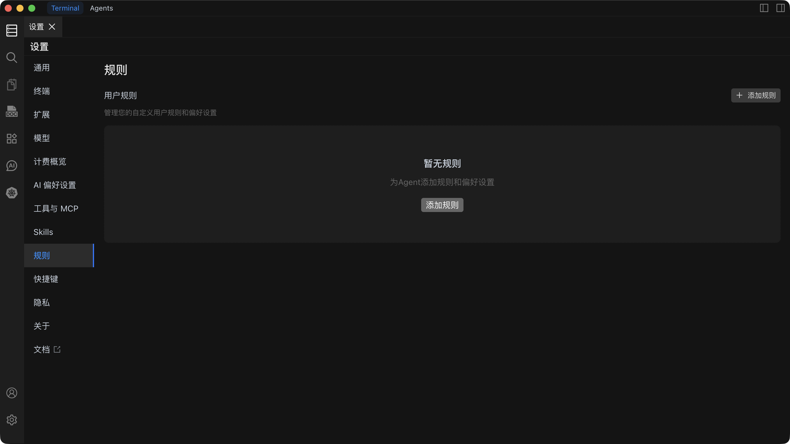

# 规则

规则功能管理您的自定义用户规则和偏好设置，提升 Chaterm 的智能化程度和工作效率。通过配置个性化规则，您可以定制 AI 助手的行为模式，使其更符合您的工作习惯和需求。



## 功能概述

规则系统是 Chaterm 的核心功能之一，它允许您：

- **自定义 AI 行为**：设置 AI 助手的响应风格和工作模式
- **提升工作效率**：通过规则配置优化 AI 助手的输出质量
- **个性化体验**：根据个人偏好定制 AI 交互方式
- **场景适配**：为不同工作场景配置专门的规则集

## 规则配置

### 基本设置

#### 响应语言设置

配置 AI 助手的默认响应语言：

| 选项 | 说明 | 适用场景 |
| --- | --- | --- |
| **中文** | 中文响应 | 中文工作环境 |
| **英文** | 英文响应 | 国际化项目 |
| **自动检测** | 根据输入自动选择 | 多语言环境 |

#### 语调风格配置

设置 AI 助手的沟通风格：

- **专业型**：正式、严谨的商务语调
- **友好型**：轻松、亲切的交流方式
- **技术型**：专业、精确的技术表达
- **简洁型**：直接、高效的信息传达

#### 输出格式要求

定制 AI 响应的格式规范：

- **代码风格**：指定代码缩进、命名规范等
- **文档格式**：设置 Markdown、HTML 等格式偏好
- **结构化输出**：配置列表、表格等结构化展示

### 安全规则设置

配置安全相关的行为限制：

- **命令执行限制**：禁止执行危险命令
- **文件访问控制**：限制敏感文件访问
- **网络操作规范**：控制网络请求行为

## 规则管理

### 创建新规则

1. **进入规则设置页面**
   - 点击侧边栏中的"规则"选项
   - 选择"添加规则"按钮

2. **配置规则内容**
   - 输入规则内容
   - 设置规则开启/关闭状态
   - 保存并测试规则效果

3. **规则操作**
   - **编辑**：修改现有规则内容
   - **删除**：移除不需要的规则
   - **启用/禁用**：控制规则的生效状态

## 使用示例

### 项目管理规则

```markdown
# 项目管理规则

- 任务分解：将复杂任务分解为可管理的小任务
- 进度跟踪：定期更新项目进度状态
- 风险评估：识别和评估项目风险
```

### 开发团队规则

```markdown
# 开发团队规则

- 代码审查：所有代码必须经过审查
- 提交规范：使用统一的提交信息格式
- 文档要求：重要功能必须提供文档说明
```

## 最佳实践

### 规则编写建议

1. **明确具体**：规则描述要清晰明确，避免歧义
2. **适度配置**：不要设置过多冲突的规则
3. **定期优化**：根据使用效果调整规则配置
4. **测试验证**：新规则配置后要进行充分测试

## 故障排除

### 常见问题

<details>
<summary><strong>Q: 规则配置后没有生效？</strong></summary>

A: 检查规则优先级设置，确保规则处于启用状态，重启应用后再次测试。

</details>

<details>
<summary><strong>Q: 如何删除不需要的规则？</strong></summary>

A: 在规则管理页面选择要删除的规则，点击删除按钮并确认操作。

</details>

<details>
<summary><strong>Q: 规则冲突如何处理？</strong></summary>

A: 系统会按照优先级顺序执行规则，高优先级规则会覆盖低优先级规则。

</details>

---

> **提示**：规则功能是 Chaterm 的高级特性，建议在使用前先熟悉基本功能，然后逐步配置个性化规则。
