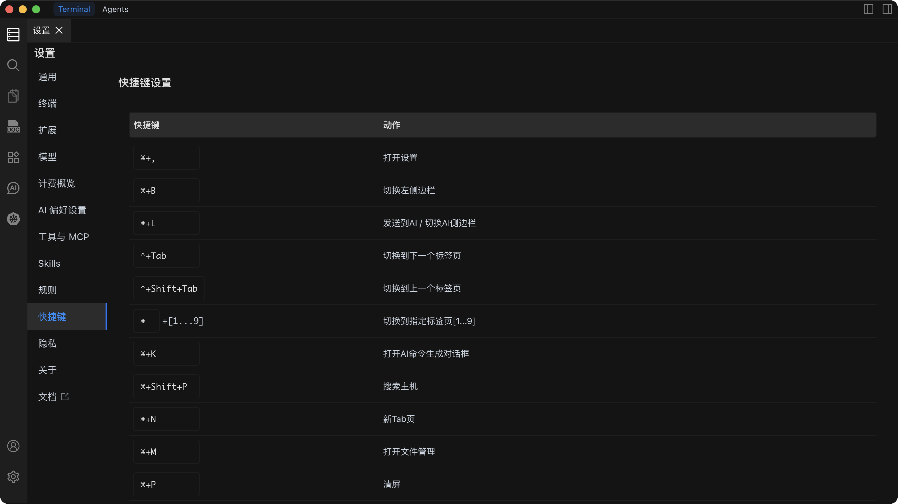

# 快捷键设置

查看、自定义和重置键盘快捷键，以加速您的工作流程。

## 默认快捷键

### 界面控制

| 功能 | macOS | Windows / Linux |
| --- | --- | --- |
| 打开设置 | `Command + ,` | `Ctrl + ,` |
| 切换左侧边栏 | `Command + B` | `Ctrl + B` |
| 切换右侧边栏 | `Command + Option + B` | `Ctrl + Alt + B` |
| 发送到 AI / 切换 AI 侧边栏 | `Command + L` | `Ctrl + L` |
| 切换布局（Terminal / Agents） | `Command + E` | `Ctrl + E` |
| 切换 Agents 布局左侧边栏 | `Command + Shift + S` | `Ctrl + Shift + S` |
| 切换 AI 模式 | `Shift + Tab` | `Shift + Tab` |

### 终端操作

| 功能 | macOS | Windows / Linux |
| --- | --- | --- |
| 打开 AI 命令生成对话框 | `Command + K` | `Ctrl + K` |
| 打开文件管理 | `Command + M` | `Ctrl + M` |
| 清屏 | `Command + P` | `Ctrl + P` |
| 终端搜索 | `Command + F` | `Ctrl + F` |
| 复制 | `Command + C` | `Ctrl + C` |
| 粘贴 | `Command + V` | `Ctrl + V` |

### 标签页管理

| 功能 | macOS | Windows / Linux |
| --- | --- | --- |
| 切换到下一个标签页 | `Control + Tab` | `Ctrl + Tab` |
| 切换到上一个标签页 | `Control + Shift + Tab` | `Ctrl + Shift + Tab` |
| 切换到指定标签页 [1-9] | `Command + [1-9]` | `Ctrl + [1-9]` |
| 新建标签页 | `Command + N` | `Ctrl + N` |

### 字体控制

| 功能 | macOS | Windows / Linux |
| --- | --- | --- |
| 字体放大 | `Command + =` | `Ctrl + =` |
| 字体缩小 | `Command + -` | `Ctrl + -` |

## 自定义快捷键

1. 打开**设置**并导航到**快捷键设置**。
2. 找到要重新绑定的功能。
3. 点击旁边的快捷键输入框。
4. 按下您想要设置的新快捷键组合。
5. 如果该组合与其他功能冲突，Chaterm 会显示冲突警告 -- 请选择其他组合或先重新分配冲突的快捷键。
6. 新快捷键会自动保存。

::: tip
建议选择不常用的快捷键组合，以避免与操作系统快捷键冲突。自定义快捷键会覆盖上述默认值。
:::

## 重置快捷键

1. 打开**设置**并导航到**快捷键设置**。
2. 点击**重置全部快捷键**。
3. 在对话框中确认重置操作。

所有快捷键将恢复为默认值。

::: warning
重置快捷键操作不可撤销。所有自定义的快捷键分配都将丢失。
:::

## 另请参阅

- [通用设置](/docs/settings/general/) -- 主题、语言、布局和编辑器选项
- [终端操作](/docs/terminal/operations/) -- 终端功能的详细指南
