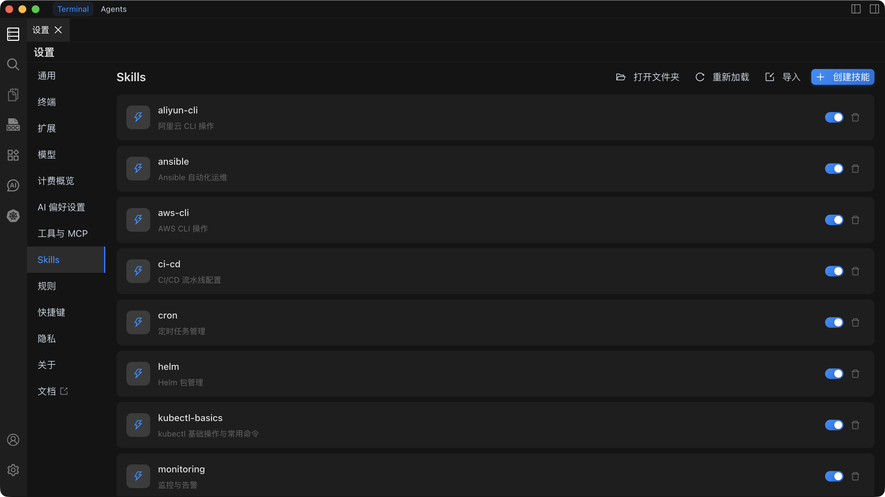
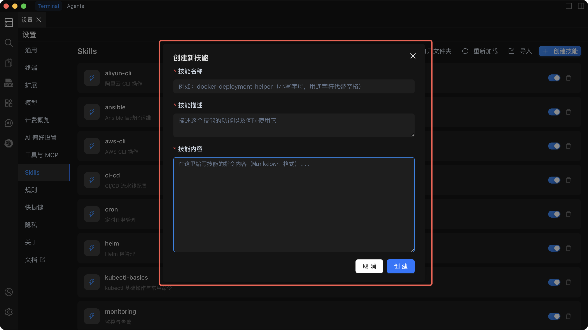

# Skills 设置

Skills 设置用于配置和管理自定义 Skills，让 AI 能够按照您预定义的工作流程和指令执行任务 -- 从"通用助手"转变为"专属专家"。



## 功能概述

Skills 设置页面提供以下核心功能：

- **创建 Skill**：定义自定义的操作流程和指令集合。
- **导入 Skill**：从现有的 `.zip` 包导入 Skill。
- **Skill 管理**：启用/禁用、编辑和删除 Skills。

## 快速开始

### 创建新 Skill



1. 在设置页面中，打开 `Skills` 标签页。
2. 点击**创建技能**按钮。
3. 填写 Skill 信息：
   - **名称**：Skill 的显示名称。
   - **描述**：说明 Skill 的用途和适用场景。
   - **Skill 内容**：详细的操作流程和指令。
   - **资源文件**（可选）：关联的脚本、模板或其他文件。
4. 点击**保存**。Skill 会自动启用并注入到 AI 上下文中。

### 导入 Skill

#### 方式一：从 ZIP 文件导入

1. 在 `Skills` 标签页中，点击**导入**。
2. 选择包含 `SKILL.md` 文件的 `.zip` 文件。
3. 确认导入。Skill 会自动添加到列表并启用。

#### 方式二：从文件夹导入

1. 在 `Skills` 标签页中，点击**打开文件夹**。
2. 将包含 `SKILL.md` 文件的文件夹移动到打开的 `skills` 目录中。
3. 回到 `Skills` 标签页，点击**重新加载**。Skill 会自动添加到列表并启用。

## SKILL.md 格式

### 基本结构

一个标准的 `SKILL.md` 应包含以下结构：

```markdown
# Skill 名称

## 描述

简要说明 Skill 的用途和适用场景。

## 操作步骤

1. 第一步操作
2. 第二步操作
3. ...
```

## 相关文档

详细使用说明、故障排除和最佳实践，请参考：

- [Skills 使用指南](/docs/skills/usage/) -- 完整的使用说明和示例。
- [Skills 故障排除](/docs/skills/troubleshooting/) -- 常见问题和解决方案。
