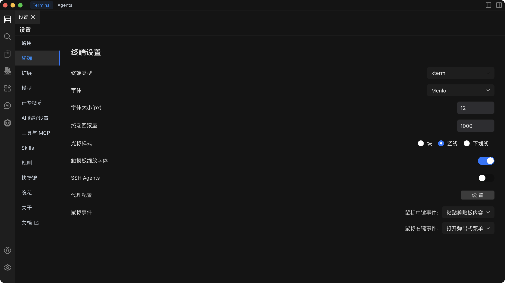

# 终端设置

配置终端仿真、字体、光标样式、回滚量和输入行为。

## 设置概览

| 设置项 | 默认值 | 说明 |
| --- | --- | --- |
| **终端类型** | xterm | 终端模拟器类型。可选项包括 xterm、vt100 等。 |
| **字体** | Monaco / Menlo | 终端使用的等宽字体。 |
| **字体大小** | 14 px | 终端文本的字体大小。 |
| **回滚量** | 1000 行 | 终端历史记录保留的行数。 |
| **光标样式** | 块状 | 光标形状：块状（Block）、下划线（Underline）或竖线（Bar）。 |
| **触摸板缩放** | 关闭 | 开启捏合缩放手势以调整终端字体大小。 |
| **SSH Agents** | -- | SSH 密钥代理和转发配置。 |
| **代理** | -- | 终端连接的网络代理。 |
| **鼠标中键** | 粘贴 | 在终端中点击鼠标中键触发的操作。 |
| **鼠标右键** | 上下文菜单 | 在终端中点击鼠标右键触发的操作。 |

::: tip 字体建议
使用等宽字体（如 Monaco、Menlo、Consolas、JetBrains Mono）以确保代码和命令输出对齐整齐。12--14 px 的字体大小在大多数显示器上效果良好。
:::

::: warning 回滚量内存占用
较高的回滚量会消耗更多内存。对于大多数工作场景，1000--5000 行已经足够。如果您需要经常查看大量日志输出，建议将输出重定向到文件或使用终端搜索（`Cmd + F` / `Ctrl + F`）代替。
:::

## SSH Agents

SSH Agent 设置用于管理密钥和启用代理转发，适用于跳板机等场景。

- **SSH Agent 转发** -- 通过远程连接转发本地 SSH Agent，使您无需复制密钥即可在第二台主机上进行认证。
- **密钥管理** -- 添加、删除或调整用于连接的 SSH 密钥顺序。
- **自动认证** -- 配置后，Chaterm 在连接时会自动使用相应的密钥进行认证。

## 代理配置

通过网络代理路由终端连接。

| 字段 | 说明 |
| --- | --- |
| **协议** | HTTP、HTTPS 或 SOCKS5。 |
| **地址** | 代理服务器的主机名或 IP 地址。 |
| **端口** | 代理服务器的端口号。 |
| **用户名 / 密码** | 如果代理需要认证，提供相应凭证。 |

::: warning
代理设置适用于所有终端连接。配置错误可能导致连接失败。保存前请确认代理地址和端口的正确性。
:::

## 另请参阅

- [通用设置](/docs/settings/general/) -- 主题、语言、布局和编辑器选项
- [快捷键设置](/docs/settings/shortcuts/) -- 终端操作等功能的键盘快捷键
