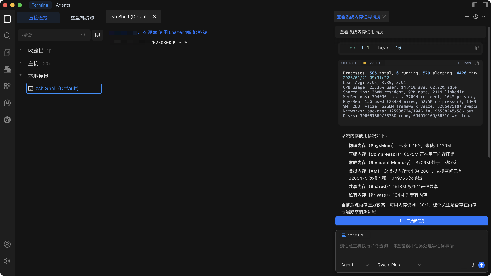

# 快速上手

::: info 你将学到

- 如何安装 Chaterm 并登录账户
- 如何添加远程主机并通过 SSH 连接
- 如何使用 AI 驱动的 Command 和 Agent 模式
- 如何执行系统监控和日志分析等实际任务
  :::

## 第一步：安装与登录

### 安装 Chaterm

下载适合你操作系统的安装程序。下方按钮会自动检测你的平台。

<div id="smart-download-section" class="smart-download-container">
  <a id="smart-download-btn" href="/download/" class="smart-download-btn" style="display: none;">
    <span class="download-icon">⤓</span>
    <span id="download-btn-text">下载 Chaterm</span>
  </a>
</div>

<script>
(function() {
  const URLS = {
    win: 'https://static-download8.chaterm.net/chaterm-latest-cn-setup-x64.exe',
    mac_arm: 'https://static-download8.chaterm.net/chaterm-latest-cn-macos-arm64.dmg',
    mac_x64: 'https://static-download8.chaterm.net/chaterm-latest-cn-macos-x64.dmg',
    linux_deb: 'https://static-download8.chaterm.net/chaterm-latest-cn-linux-amd64.deb',
    linux_universal: 'https://static-download8.chaterm.net/chaterm-latest-cn-linux-x86_64.AppImage',
  }

  function detectOS() {
    if (typeof window === 'undefined') return null

    const uaData = navigator.userAgentData
    const ua = (navigator.userAgent || '').toLowerCase()
    const platform = (navigator.platform || '').toLowerCase()

    if (uaData?.platform) {
      const p = uaData.platform.toLowerCase()
      if (p.includes('android')) return 'Android'
      if (p.includes('ios')) return 'iOS'
    }
    if (/android/i.test(ua)) return 'Android'

    const isIPad =
      platform === 'macintel' && typeof navigator.maxTouchPoints === 'number' && navigator.maxTouchPoints > 1
    if (/iphone|ipod|ipad/i.test(ua) || isIPad) return 'iOS'

    if (/windows|win32|win64|wow64/i.test(ua)) return 'Windows'

    if (!isIPad && (/mac|macintosh|darwin/i.test(ua) || platform.includes('mac'))) return 'macOS'

    if (/linux|x11/i.test(ua) && !/android/i.test(ua)) return 'Linux'

    return null
  }

  async function detectMacArch() {
    if (typeof window === 'undefined') return 'arm64'

    if (navigator.userAgentData?.getHighEntropyValues) {
      try {
        const { architecture } = await navigator.userAgentData.getHighEntropyValues(['architecture'])
        if (architecture === 'arm') return 'arm64'
        if (architecture) return 'x64'
      } catch {}
    }

    const ua = navigator.userAgent.toLowerCase()
    if (ua.includes('arm') || ua.includes('aarch64')) return 'arm64'
    if (ua.includes('x86_64') || ua.includes('amd64') || ua.includes('intel')) return 'x64'

    return 'arm64'
  }

  async function updateSmartDownload() {
    if (typeof window === 'undefined') return

    const os = detectOS()
    const downloadBtn = document.getElementById('smart-download-btn')
    const downloadBtnText = document.getElementById('download-btn-text')

    if (!os) {
      if (downloadBtn) downloadBtn.style.display = 'none'
      return
    }

    let label = os
    let url = null

    if (os === 'Windows') {
      label = 'Windows'
      url = URLS.win
    } else if (os === 'macOS') {
      const arch = await detectMacArch()
      if (arch === 'x64') {
        label = 'macOS (Intel)'
        url = URLS.mac_x64
      } else {
        label = 'macOS (Apple Silicon)'
        url = URLS.mac_arm
      }
    } else if (os === 'Linux') {
      label = 'Linux'
      url = URLS.linux_deb
    } else {
      // Android/iOS - redirect to download page
      label = os
      url = '/download/'
    }

    if (downloadBtn && url) {
      downloadBtn.href = url
      downloadBtn.target = '_blank'
      downloadBtn.style.display = 'inline-flex'
    }
    if (downloadBtnText) {
      downloadBtnText.textContent = '下载 ' + label + ' 版本'
    }
  }

  // Initialize when DOM is ready
  if (typeof window !== 'undefined' && typeof document !== 'undefined') {
    if (document.readyState === 'loading') {
      document.addEventListener('DOMContentLoaded', function() {
        setTimeout(updateSmartDownload, 100)
      })
    } else {
      setTimeout(updateSmartDownload, 100)
    }
  }
})()
</script>

<style>
.smart-download-container {
  text-align: left;
  margin: 1rem 0;
}

.smart-download-btn {
  display: inline-flex;
  align-items: center;
  justify-content: center;
  gap: 0.5rem;
  padding: 0.5rem 1.25rem;
  background: #374151;
  color: #ffffff !important;
  border-radius: 6px;
  text-decoration: none !important;
  font-weight: 500;
  font-size: 0.9rem;
  transition: all 0.2s ease;
  border: none;
  cursor: pointer;
}

.smart-download-btn:hover {
  background: #1f2937;
  color: #ffffff !important;
  transform: translateY(-1px);
}

.smart-download-btn span {
  color: #ffffff !important;
}

.download-icon {
  font-size: 1rem;
  line-height: 1;
  color: #ffffff !important;
}

@media (max-width: 768px) {
  .smart-download-btn {
    padding: 0.5rem 1rem;
    font-size: 0.85rem;
  }
}
</style>

没有看到你的平台？访问[下载页面](/docs/start/downloads/)获取所有可用安装包。

打开下载的安装程序，按照屏幕提示完成安装。安装完成后启动 Chaterm。

### 登录账户

选择以下登录方式之一：

- **邮箱验证码** -- 输入邮箱地址，然后输入发送到收件箱的一次性验证码。
- **手机验证码** -- 输入手机号码，获取验证码登录。
- **账号密码** -- 输入已有的账户凭证。
- **第三方登录** -- 点击 QQ、Google、GitHub 或 Apple ID 按钮进行认证。

::: tip 首次用户
首次使用邮箱登录时，Chaterm 会自动为你创建新账户。无需单独的注册步骤。
:::

::: warning 跳过登录
你可以点击**跳过**按钮在未登录状态下使用 Chaterm，但内置的 AI 模型需要登录后才能使用。
:::

## 第二步：添加主机

打开主机管理面板，添加你的第一台远程服务器。以下是关键字段说明。

| 字段         | 说明            | 示例            |
| ------------ | --------------- | --------------- |
| **标签**     | 主机的名称      | `my-web-server` |
| **主机**     | IP 地址或主机名 | `192.168.1.100` |
| **端口**     | SSH 端口号      | `22`            |
| **用户名**   | SSH 登录用户    | `root`          |
| **认证方式** | 密码或私钥      | 密码            |

有关完整的操作说明和截图，请参阅[添加个人主机](/docs/hosts/add-personal)。

### 连接主机

在主机列表中点击任意主机即可建立 SSH 连接。连接成功后会自动打开一个新的终端标签页。

## 第三步：体验 AI 功能



### 打开 AI 对话面板

有两种方式可以打开 AI 对话：

1. **点击左侧菜单栏中的 AI 图标**。
2. **在终端中使用快捷键**：
   - macOS：`Cmd + L`
   - Windows/Linux：`Ctrl + L`

### 选择交互模式

点击**新建对话**，然后选择适合你任务的模式：

| 模式        | 适用场景                   | 是否执行命令？          |
| ----------- | -------------------------- | ----------------------- |
| **Command** | 在当前活跃终端执行命令     | 是（当前终端）          |
| **Agent**   | 直接对话或连接主机执行操作 | 是（通过 `@` 选择主机） |

从模型下拉菜单中选择一个模型，输入你的提示并按回车。

### 使用终端内 AI 快捷键

在终端会话中工作时，你有两种快速使用 AI 的方式：

- **`Ctrl+K` / `Cmd+K`** -- 弹出内联提示对话框。输入你的需求，AI 会生成相应命令。
- **`Ctrl+L` / `Cmd+L`** -- 打开 AI 对话面板，当前终端上下文会自动附加。

::: tip Ctrl+K 使用示例
按 `Cmd+K`，输入"按大小排序显示磁盘使用情况"，AI 会返回：

```bash
du -sh /* 2>/dev/null | sort -rh | head -20
```

按回车即可在终端中直接执行。
:::

## 立即体验

将以下提示复制粘贴到 AI 对话面板中，体验 Chaterm 的实际效果。

### 跨主机监控系统资源

```
@my-web-server 检查 CPU 和内存使用情况。标记超过 80% 的项目。
```

**预期输出：** AI 会执行 `top`、`free -h` 等命令，然后汇总资源使用情况，并对超过 80% 的指标给出清晰的告警。

### 分析最近的错误日志

```
@my-web-server 查找 /var/log/syslog 中最近 2 小时的 ERROR 行，并按来源分组。
```

**预期输出：** AI 会使用适当的时间过滤器执行 `journalctl` 或 `grep`，然后呈现按来源分组的错误汇总，包含计数和时间戳。

### 清理旧的临时文件

```
@my-web-server 列出 /tmp 中超过 7 天的所有文件，显示总大小，然后在确认后删除。
```

**预期输出：** AI 会先执行 `find /tmp -mtime +7` 列出匹配的文件，显示文件列表和总磁盘占用，然后在执行删除前请求你的确认。

::: warning 执行前务必审查
在 Command 和 Agent 模式下，AI 可以在你的服务器上执行真实命令。在确认执行前请审查每条命令，特别是 `rm`、`drop` 或 `truncate` 等破坏性操作。
:::

## 后续探索

现在你已经完成了 Chaterm 的安装和基本体验，可以深入探索以下领域：

- **[AI 对话](/docs/ai/dialogs/)** -- 了解对话历史、上下文管理和多轮工作流。
- **[AI 模型设置](/docs/ai/llms/)** -- 配置使用的模型并添加自己的 API 密钥。
- **[主机管理](/docs/hosts/)** -- 组织主机、设置堡垒机/跳板服务器、导入导出配置。
- **[终端操作](/docs/terminal/operations/)** -- 掌握分屏、标签页、代码片段等终端功能。
- **[MCP 集成](/docs/mcp/usage/)** -- 使用 MCP 工具和服务器扩展 Chaterm。
- **[快捷键](/docs/settings/shortcuts/)** -- 自定义键绑定以实现更快的操作。
- **[计费与方案](/docs/settings/billing/)** -- 了解使用限制、升级选项和团队方案。
