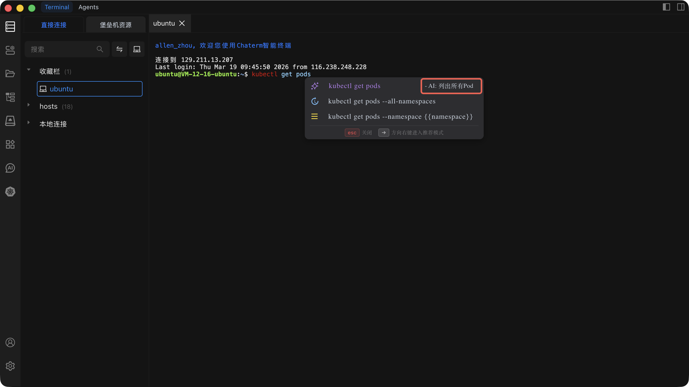

# 命令补全

Chaterm 在终端输入时自动提供命令建议，通过历史记录、内置命令库和可选的 AI 建议帮助您更快地工作并减少输入错误。

## 工作原理

命令补全综合以下三个来源生成建议：

- **历史命令** -- 优先推荐当前服务器使用过的命令，同时补充您在其他服务器上常用的命令（跨主机推荐）。
- **内置命令库** -- 常见的 Linux 和 Shell 命令始终作为建议可用。
- **AI 智能建议（可选）** -- 基于当前输入生成上下文感知的命令补全。

跨主机推荐会优先匹配当前服务器的使用习惯，再补充您在其他服务器上常用的相关命令。

## 使用方式

1. 在终端中开始输入命令，补全面板会自动出现。
2. 按 `→`（右箭头）进入选择模式。
3. 按 `↑` / `↓` 在建议之间切换。
4. 按 `Enter` 确认并插入选中的命令。
5. 按 `Esc` 或 `←`（左箭头）退出选择模式或关闭面板。

| 按键       | 操作                     |
| ---------- | ------------------------ |
| `→`        | 进入选择模式             |
| `↑` / `↓`  | 在建议之间切换           |
| `Enter`    | 确认并插入选中的命令     |
| `Esc`      | 关闭补全面板             |
| `←`        | 退出选择模式             |

## 配置

您可以在 **设置 > 扩展设置** 中开启或关闭自动补全：

- **开启**（推荐） -- 输入时显示补全建议。
- **关闭** -- 完全隐藏补全面板，手动输入命令。

有关此设置的详细位置，请参阅 [扩展设置](/docs/settings/extensions/)。

## 常见问题

### 补全面板没有出现

- 确认已在 **设置 > 扩展设置** 中开启 **自动补全**。
- 至少输入一个字符并稍等片刻，等待建议出现。
- 如果面板仍未出现，请尝试重启终端会话。

### AI 建议没有出现

- AI 建议需要网络连接。本地补全（历史记录和内置命令）在离线状态下仍可正常工作。
- 检查设置中是否已启用 AI 功能。

### 建议似乎不相关

- 命令补全会随着您的使用逐渐学习，历史记录越多建议越准确。
- 跨主机推荐可能会显示来自其他服务器的命令。如果建议不适用，忽略它并继续输入即可。
