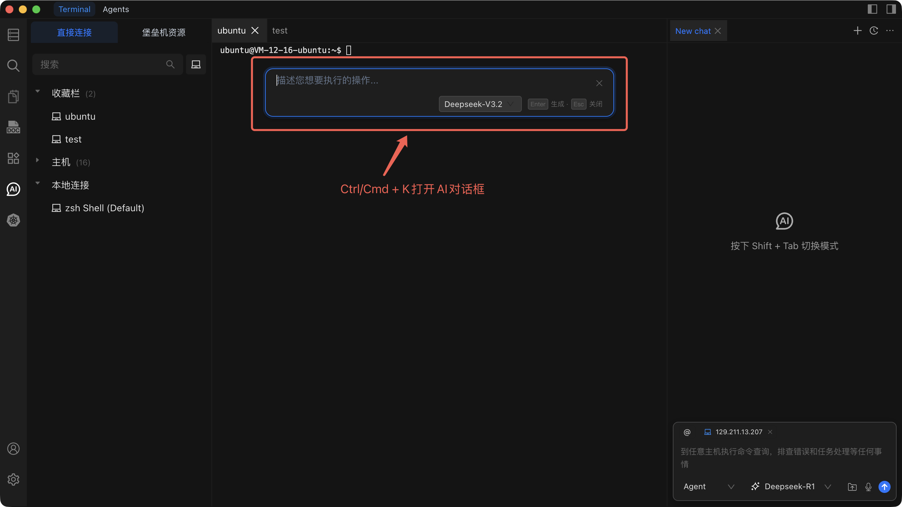
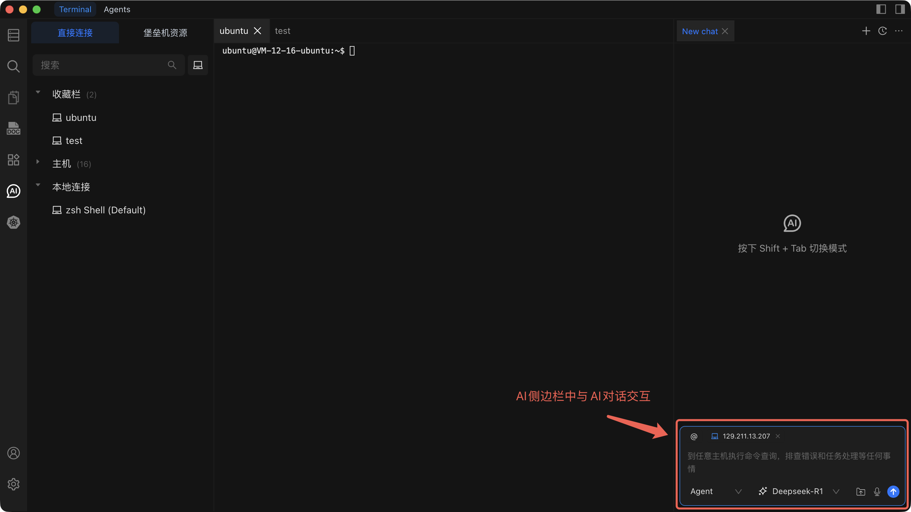

# Chat to AI

Chat to AI 让您在终端中直接与 AI 交互，生成命令、排查问题并规划复杂任务。

Chaterm 提供两种不同的 AI 交互模式，根据您的任务选择合适的方式：

| 模式               | 快捷键                      | 适用场景                               |
| ------------------ | --------------------------- | -------------------------------------- |
| AI 命令对话框      | `Cmd + K` / `Ctrl + K`     | 快速生成单个命令                       |
| AI 侧边栏         | `Cmd + L` / `Ctrl + L`     | 需要上下文和多轮对话的复杂任务         |

## 模式一：AI 命令对话框（`Cmd + K` / `Ctrl + K`）

轻量级弹窗，将自然语言描述转换为可直接运行的命令。当您知道想做什么但不确定具体语法时使用。

### 操作步骤

1. 在终端中按 `Cmd + K`（macOS）或 `Ctrl + K`（Windows/Linux）。
2. 用自然语言输入您想要完成的操作。
3. AI 生成对应的命令。
4. 检查命令后，按回车键将其插入终端。

### 适用场景

- 需要执行某个命令但记不住参数或语法。
- 想要执行单个简单的操作。
- 查询特定工具的使用方法。

### 示例

| 您输入的内容                         | AI 生成的命令                                      |
| ------------------------------------ | -------------------------------------------------- |
| "查找所有大于 100MB 的 `.log` 文件"  | `find / -name "*.log" -size +100M`                 |
| "按大小排序显示磁盘使用情况"         | `du -sh /* \| sort -rh`                            |
| "重启 nginx 服务"                    | `sudo systemctl restart nginx`                     |
| "压缩 `/var/log` 目录"              | `tar -czf /tmp/var-log-backup.tar.gz /var/log`     |

## 模式二：AI 侧边栏（`Cmd + L` / `Ctrl + L`）

常驻侧边栏，能够读取终端的上下文 -- 输出历史、工作目录和环境信息 -- 并支持与 AI 进行多轮对话。适用于需要规划、排查或迭代的场景。

### 操作步骤

1. 在终端中按 `Cmd + L`（macOS）或 `Ctrl + L`（Windows/Linux）。
2. 侧边栏打开并自动捕获当前终端上下文。
3. 描述您的任务或提出问题。
4. AI 分析上下文并给出建议或命令。
5. 继续对话以完善方案，然后逐步执行命令。

### AI 读取的上下文

- 当前终端输出和滚动历史记录。
- 当前工作目录。
- 终端会话环境信息。

### 适用场景

- 任务需要多个步骤（例如：部署应用程序）。
- 需要排查终端输出中可见的错误。
- 想在执行命令前讨论不同方案的优劣。
- 需要 AI 理解会话中刚发生的事情。

### 示例：排查服务启动失败

**之前（手动操作）：**
您在终端中看到 `nginx.service: Failed`。您手动运行 `journalctl`，查看日志，编辑配置文件，然后重启 -- 一路靠猜测。

**之后（使用 AI 侧边栏）：**
1. 按 `Cmd + L` 打开侧边栏。AI 自动读取错误输出。
2. 输入："nginx 为什么启动失败了？"
3. AI 读取终端输出，识别配置语法错误，并建议修复方法。
4. 您应用修复后问 AI："检查一下 nginx 配置现在是否有效。"
5. AI 生成 `nginx -t`，您运行后 AI 确认成功。

## 快捷键

| 功能                        | macOS         | Windows/Linux |
| --------------------------- | ------------- | ------------- |
| 打开 AI 命令对话框          | `Cmd + K`     | `Ctrl + K`    |
| 打开 / 切换 AI 侧边栏      | `Cmd + L`     | `Ctrl + L`    |

## 使用技巧

- **描述要具体。** 与其说"修复这个"，不如说"nginx 配置第 42 行有语法错误 -- 请建议修复方法。"
- **复杂任务使用侧边栏。** 让 AI 规划步骤，然后逐一执行。
- **保存有用的命令。** AI 生成的常用命令可以保存为[快捷命令](/docs/terminal/snippets/)，以便日后一键执行。
- **执行前务必检查。** 始终在运行 AI 生成的命令前仔细阅读，特别是在生产服务器上。

::: warning 安全提示

- 不要在未经检查的情况下执行可能造成数据丢失的 AI 生成命令。
- 对于敏感操作，务必手动确认。
- 在生产环境运行前，先在测试环境中验证有风险的命令。

:::

## 相关文档

- [AI 对话](/docs/ai/dialogs/) -- AI 对话配置和功能的更多详情。
- [快捷命令](/docs/terminal/snippets/) -- 保存和复用 AI 生成的命令。
