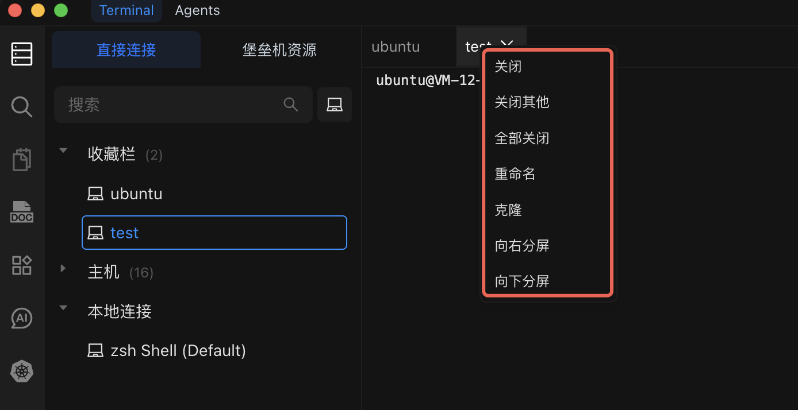

# 终端管理

管理多个终端会话，通过标签页和分屏组织您的工作区，保持工作流高效运转。

## 标签菜单栏操作

右键点击标签或使用标签菜单栏可以执行以下操作：

| 操作         | 功能                               | 使用场景                                           |
| ------------ | ---------------------------------- | -------------------------------------------------- |
| **关闭**     | 关闭当前终端会话                   | 任务完成后不再需要该会话时                         |
| **关闭其他** | 关闭除当前焦点之外的所有会话       | 工作区杂乱，只想保留当前会话时                     |
| **全部关闭** | 关闭所有打开的终端会话             | 切换工作场景或结束工作时                           |
| **克隆**     | 将当前会话复制到新标签页           | 需要在同一主机上开启第二个会话时                   |
| **向右分屏** | 在右侧创建水平分屏窗格             | 需要并排终端时（例如：日志 + 命令）                |
| **向下分屏** | 在下方创建垂直分屏窗格             | 需要上下叠放终端时（例如：监控 + 操作）            |

## 右键菜单功能

在终端任意位置右键点击可访问上下文菜单，包含以下选项：

### 基础操作

| 功能         | 描述                                         |
| ------------ | -------------------------------------------- |
| **复制**     | 将选中的文本复制到剪贴板                     |
| **粘贴**     | 将剪贴板内容粘贴到终端                       |
| **搜索**     | 打开搜索栏，在终端输出中查找文本             |
| **清屏**     | 清除当前终端中所有可见输出                   |
| **文件管理** | 打开以终端工作目录为根目录的文件管理器       |
| **字体大小** | 放大或缩小终端字体                           |

### 连接管理

| 功能         | 描述                           |
| ------------ | ------------------------------ |
| **断开连接** | 断开当前终端的 SSH 连接        |
| **新终端**   | 打开全新的终端会话             |
| **关闭终端** | 关闭当前终端会话               |

### 分屏操作

| 功能         | 描述               |
| ------------ | ------------------ |
| **向右分屏** | 创建水平分屏窗格   |
| **向下分屏** | 创建垂直分屏窗格   |

## 终端管理技巧

1. **将分屏用于相关任务** -- 一侧查看日志，另一侧执行命令。详情请参阅[终端操作](/docs/terminal/operations/)。
2. **重命名标签页** -- 右键点击标签并重命名，以便快速识别会话。
3. **关闭不需要的会话** -- 未使用的会话会占用资源。使用 **关闭其他** 或 **全部关闭** 来整理工作区。
4. **借助 AI** -- 让 [Chat to AI](/docs/terminal/chattoai/) 生成命令，这样您可以专注于结果而非语法。

::: warning 重要提示

- 终端操作需要在远程主机上拥有相应权限。
- 执行命令前请仔细检查，特别是在生产服务器上。
- 请先在测试环境中验证有风险的操作。

:::
