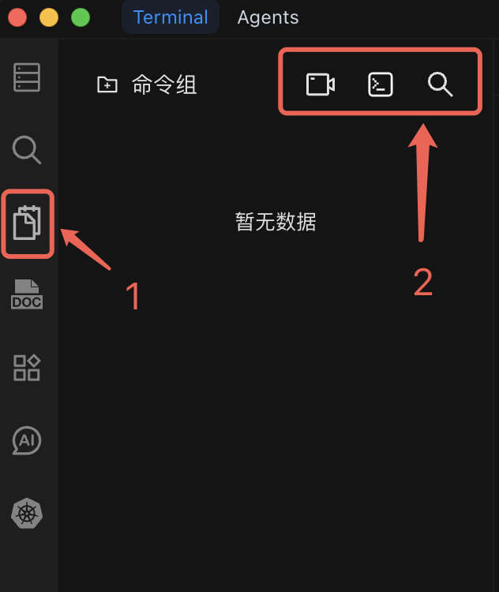

# 快捷命令

将常用命令保存为可复用的快捷命令，在终端的快捷命令栏中一键执行。

## 工作原理

快捷命令栏显示在终端输入区域上方。每个快捷命令显示名称和执行按钮。点击按钮将命令插入终端，然后按回车键执行。

## 创建快捷命令

### 操作步骤

1. 从快捷命令栏打开快捷命令管理器。
2. 点击 **创建快捷命令**（或"+"按钮）。
3. 填写以下字段：
   - **名称** -- 简短的描述性标签（例如："检查磁盘使用"）。
   - **分组** -- 将快捷命令分配到一个组以便组织（例如："监控"、"部署"）。
   - **命令** -- 要执行的 Shell 命令或多命令脚本。
4. 保存快捷命令。它会出现在快捷命令栏中。

### 快捷命令示例

以下是值得创建的实用快捷命令：

| 名称               | 命令                                                         | 用途                               |
| ------------------ | ------------------------------------------------------------ | ---------------------------------- |
| 磁盘使用           | `df -h`                                                      | 快速检查文件系统使用情况           |
| 高内存进程         | `ps aux --sort=-%mem \| head -20`                            | 查找内存占用最高的 20 个进程       |
| 实时日志           | `tail -f /var/log/app/application.log`                       | 实时跟踪应用日志                   |
| 重启 Nginx         | `sudo systemctl restart nginx && sudo systemctl status nginx`| 重启并验证 nginx 状态              |
| 备份配置           | `cp /etc/nginx/nginx.conf /etc/nginx/nginx.conf.bak`         | 编辑前备份配置文件                 |
| Docker 清理        | `docker system prune -af --volumes`                          | 删除未使用的 Docker 镜像、容器和卷 |

## 宏录制

您可以录制一系列终端操作，自动将其保存为快捷命令，而无需手动输入命令。

### 如何录制宏

1. 点击快捷命令栏中的 **录制** 按钮开始录制。
2. 在终端中正常执行您想要捕获的命令。
3. 完成后点击 **停止录制**。
4. Chaterm 会根据录制的命令生成快捷命令。
5. 为快捷命令命名并选择分组，然后保存。

宏录制特别适合捕获您经常执行的多步骤工作流，例如部署流程或环境配置步骤。

## 管理快捷命令

### 命令分组

将快捷命令组织到不同分组中，便于管理：

- **监控** -- 系统状态、日志、资源使用。
- **部署** -- 构建、部署、回滚命令。
- **数据库** -- 备份、恢复、查询命令。
- **网络** -- 连通性检查、防火墙规则。

### 编辑和删除

- 点击快捷命令可以编辑其名称、分组或命令内容。
- 删除不再需要的快捷命令，保持快捷命令栏整洁。

## 使用技巧

- **结合 AI 使用。** 使用 [Chat to AI](/docs/terminal/chattoai/) 生成命令，然后将其保存为快捷命令以便日后使用。
- **使用多命令快捷命令。** 用 `&&` 连接多个命令，创建可靠的多步骤操作（链中任一命令失败则停止执行）。
- **命名要清晰。** 使用描述性名称，以便在快捷命令栏中一目了然。
- **避免存储敏感信息。** 切勿在快捷命令中直接存放密码、令牌或 API 密钥。请使用环境变量或密钥管理器。

::: warning 安全提示

- 执行前请检查快捷命令内容，特别是编辑后的命令。
- 避免在快捷命令中包含敏感信息（密码、令牌）。
- 在生产环境运行前，先在测试环境中验证有风险的命令。
- 定期审查快捷命令，删除不再需要的命令。

:::
